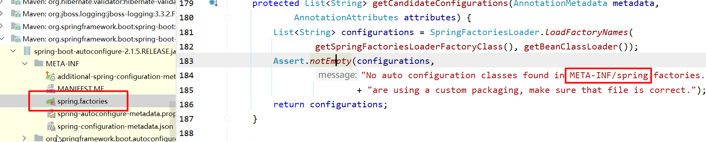

这里记录该项目中重要的点


# 单体电商的核心功能

* 注册和登录

* cookie和session
* 集成swapper2 api, 接口文档
* 分类的设计与实现
* 首页商品推荐 -> 首页懒加载
* 商品搜索与分页
* 商品详情和评论渲染
* 购物车和订单. 电商核心. 购物车的多种实现方式; 订单全局id? 订单唯一(刷新只会有一个); 控制库存, 超卖
* 支付. 电商核心. 微信和支付宝. 时序图讲解支付节点


# 数据库外键


数据库外键:

* 性能影响. 三范式. -> 移除物理外键
* 热更新. 分布式场景下, 项目绝大多数情况下进行热更新, 不停机维护. 外键可能导致新更新的无法运行, 需要重启服务器. 外键强依赖性
* 降低耦合度. 删除外键并不是真的全都删除, 而是删除物理外键, 物理的一层关系不需要了. 
  * 物理和逻辑. 逻辑: 用户地址和用户表, userId为外键, 关联两张表, 不需要设置物理外键, 依赖关系还是存在的

* 数据分库分表. 外键关联难以做分库分表, 


# 面试题: Spring Boot自动装配, 如何启动内置Tomcat的?

1. 跟踪源代码, 查看SpringApplication.run方法源代码

```java
/**
	 * Static helper that can be used to run a {@link SpringApplication} from the
	 * specified source using default settings.
	 * @param primarySource the primary source to load
	 * @param args the application arguments (usually passed from a Java main method)
	 * @return the running {@link ApplicationContext}
	 */
public static ConfigurableApplicationContext run(Class<?> primarySource,
                                                 String... args) {
    return run(new Class<?>[] { primarySource }, args);
}
```

primarySource就是要加载的source.

其中提到`using default settings`, 这里的默认配置是在注解@SpringBootApplication中的

最后返回一个`running ApplicationContext`

2. 查看@SpringBootApplication注解

```java
@Target(ElementType.TYPE)
@Retention(RetentionPolicy.RUNTIME)
@Documented
@Inherited
@SpringBootConfiguration
@EnableAutoConfiguration
@ComponentScan(excludeFilters = {
		@Filter(type = FilterType.CUSTOM, classes = TypeExcludeFilter.class),
		@Filter(type = FilterType.CUSTOM,
				classes = AutoConfigurationExcludeFilter.class) })
public @interface SpringBootApplication {}
```

重点是@SpringBootConfiguration, @EnableAutoConfiguration, @ComponentScan

* @ComponentScan扫描, 默认是在当前包和子包中的类, 例如这的Application所在的com.imooc包下的子包controller中的@RESTController就被加载到了容器中

* SpringBootConfiguration

```java
@Target(ElementType.TYPE)
@Retention(RetentionPolicy.RUNTIME)
@Documented
@Configuration
public @interface SpringBootConfiguration {}
```

其中的@Configuration注解 -> 就是一个容器, 类似Spring中写xml配置的beans包含了一个个bean, IOC容器

* @EnableAutoConfiguration

用来开启自动装配

```java
@Target(ElementType.TYPE)
@Retention(RetentionPolicy.RUNTIME)
@Documented
@Inherited
@AutoConfigurationPackage
@Import(AutoConfigurationImportSelector.class)
public @interface EnableAutoConfiguration {}
```

其中的@Import

```java
Indicates one or more {@link Configuration @Configuration} classes to import.
```

AutoConfigurationImportSelector.class, 自动装配导入的选择器

```java
@Override
public String[] selectImports(AnnotationMetadata annotationMetadata) {
    if (!isEnabled(annotationMetadata)) {
        return NO_IMPORTS;
    }
    AutoConfigurationMetadata autoConfigurationMetadata = AutoConfigurationMetadataLoader
        .loadMetadata(this.beanClassLoader);
    AutoConfigurationEntry autoConfigurationEntry = getAutoConfigurationEntry(
        autoConfigurationMetadata, annotationMetadata);
    return StringUtils.toStringArray(autoConfigurationEntry.getConfigurations());
}
```

选择要导入的类, 其中的getAutoConfigurationEntry:

```java
protected AutoConfigurationEntry getAutoConfigurationEntry(
    AutoConfigurationMetadata autoConfigurationMetadata,
    AnnotationMetadata annotationMetadata) {
    if (!isEnabled(annotationMetadata)) {
        return EMPTY_ENTRY;
    }
    AnnotationAttributes attributes = getAttributes(annotationMetadata);
    List<String> configurations = getCandidateConfigurations(annotationMetadata,
                                                             attributes);
    configurations = removeDuplicates(configurations);
    Set<String> exclusions = getExclusions(annotationMetadata, attributes);
    checkExcludedClasses(configurations, exclusions);
    configurations.removeAll(exclusions);
    configurations = filter(configurations, autoConfigurationMetadata);
    fireAutoConfigurationImportEvents(configurations, exclusions);
    return new AutoConfigurationEntry(configurations, exclusions);
}
```

关注其中的`List<String> configurations`, 就是配置. 再看其中的getCandidateConfigurations方法

```java
protected List<String> getCandidateConfigurations(AnnotationMetadata metadata,
                                                  AnnotationAttributes attributes) {
    List<String> configurations = SpringFactoriesLoader.loadFactoryNames(
        getSpringFactoriesLoaderFactoryClass(), getBeanClassLoader());
    Assert.notEmpty(configurations,
                    "No auto configuration classes found in META-INF/spring.factories. If you "
                    + "are using a custom packaging, make sure that file is correct.");
    return configurations;
}
```



其中的spring.factories中就是自动装配的类

```
org.springframework.boot.autoconfigure.web.embedded.EmbeddedWebServerFactoryCustomizerAutoConfiguration,\
```

点击查看类

```java
@Configuration
@ConditionalOnClass({ Tomcat.class, UpgradeProtocol.class })
public static class TomcatWebServerFactoryCustomizerConfiguration {

    @Bean
    public TomcatWebServerFactoryCustomizer tomcatWebServerFactoryCustomizer(
        Environment environment, ServerProperties serverProperties) {
        return new TomcatWebServerFactoryCustomizer(environment, serverProperties);
    }

}
```

Tomcat.class: SpringBoot内置的tomcat, 点入看到, 默认端口8080, 默认hostname: localhost

---

```
org.springframework.boot.autoconfigure.web.servlet.WebMvcAutoConfiguration,\
```

自动装配web mvc

```java
/**
 * {@link EnableAutoConfiguration Auto-configuration} for {@link EnableWebMvc Web MVC}.
 */
```

---

```
org.springframework.boot.autoconfigure.web.servlet.ServletWebServerFactoryAutoConfiguration,\
```

```java
/**
 * {@link EnableAutoConfiguration Auto-configuration} for servlet web servers. */
```

```java
@Bean
@ConditionalOnClass(name = "org.apache.catalina.startup.Tomcat")
public TomcatServletWebServerFactoryCustomizer tomcatServletWebServerFactoryCustomizer(
    ServerProperties serverProperties) {
    return new TomcatServletWebServerFactoryCustomizer(serverProperties);
}
```

运行Application, 内置的tomcat也随之启动

在spring.factories中包含了许多自动转配的类

---

@SpringBootApplication -> @EnableAutoConfiguration ->  @Import(AutoConfigurationImportSelector.class) -> AutoConfigurationImportSelector.class -> selectImports -> getAutoConfigurationEntry -> getCandidateConfigurations -> loadFactoryNames


```java
/**
	 * Load the fully qualified class names of factory implementations of the
	 * given type from {@value #FACTORIES_RESOURCE_LOCATION}, using the given
	 * class loader.
	 * @param factoryClass the interface or abstract class representing the factory
	 * @param classLoader the ClassLoader to use for loading resources; can be
	 * {@code null} to use the default
	 * @throws IllegalArgumentException if an error occurs while loading factory names
	 * @see #loadFactories
	 */
public static List<String> loadFactoryNames(Class<?> factoryClass, @Nullable ClassLoader classLoader) {
    String factoryClassName = factoryClass.getName();
    return loadSpringFactories(classLoader).getOrDefault(factoryClassName, Collections.emptyList());
}
```

其中:

```java
public static final String FACTORIES_RESOURCE_LOCATION = "META-INF/spring.factories";
```


# 购物车

## 购物车的存储形式

看中的商品放入购物车, 最后一起结算. 那么购物车就需要存储下来. 

购物车存储的形式: 重点

1. cookie存储形式: 购物车数据保存到Cookie中, 在客户端上的缓存, *cookie大小不超过4KB*: 

* 无须登录、无须查库、保存在浏览器端
* 优点: 性能好、访问快, 没有和数据库交互

* 缺点: 换电脑购物车数据会丢失(未登录的情况下). 隐私安全问题

2. session存储形式: 用户会话, 在登陆后产生

- 用户登录后, 购物车数据放入用户会话

* 优点: 基于服务器内存. 初期性能较好, 访问快

* 缺点: session基于内存, 用户量庞大影响服务器性能.
* 缺点: 用户和session相关联, 只能存在与当前会话, 用户换了电脑或者服务器集群或者分布式扩展, session只会在同一个服务器上, 不会同步到其他的集群中. 不适用集群与分布式系统. 

-> 虽然现在项目时单体, 但是后续会发展到分布式, 所以不会使用有状态的会话session

3. 数据库存储形式: 用户登录后, 加入购物车的数据存储db

* 用户登录后, 购物车数据存入数据库.

* 优点: 数据持久化, 可在任何地点任何时间访问

* 缺点: 频繁添加删除商品, 也就是频繁读写数据库, 造成数据库压力 -> 不适合

4. Redis存储形式: 会话把内容存储到内存, 这里使用Redis把数据持久化到磁盘中 -> 重启后不会丢失, 并且存储在磁盘中的查询速度比数据库中快 -> Redis作为购物车内容的载体. ps: 分布式会话也可以依靠Redis来实现. 后续可以把购物车整合到Redis中, 分布式购物车

* 用户登录后, 购物车数据存入redis缓存.

* 优点: 数据持久化, 可在任何地点任何时间访问 -> 注意这里要区别于数据库. 数据库也可以持久化, 但是性能更低. -> 数据库一般会成为网站的瓶颈, 能使用缓存就使用缓存
* 优点: 频繁读写只基于缓存, 不会造成数据库压力
* 优点: 适用于集群与分布式系统, 可扩展性强. 如果使用http的session, 每一个服务器都是独立的会话, 那么集群和分布式中每一个服务器的都不一样. Redis可以实现统一. 可扩展性强

---

此处会用Cookie+Redis的方式:

* 用户未登录的情况下使用cookie
* 用户已登陆的情况下使用cookie + Redis. -> todo: Redis的部分预留, 等分布式学习结束后加上 -> **第六周: 2-02 SpringBoot整合Redis实战**. 之后整合Redis到会话和购物车业务中


