# 介绍

前端懒加载模式, 滑动到对应区域再进行加载, 减少压力

## 技术选型

### Spring boot还是Spring MVC

* Spring MVC是框架, Spring Boot是工具, 需要什么工具引入依赖

* 从xml繁琐配置到零配置yml

* Spring boot集成了多样化中间件(`*-starter*`)

* tomcat内置

Struts: MVC框架, 老项目中使用. 

* 有安全漏洞, 
* 请求变量共享(线程安全问题), 
* Filter拦截类拦截. SpringMVC和Springboot是基于AOP的filter
* 非Spring官方

### 前端选型

MVVM开发模式: Model–view–viewmode. [MVC，MVP 和 MVVM 的图示](https://www.ruanyifeng.com/blog/2015/02/mvcmvp_mvvm.html)

JQuery, Vue.js(渐进式开发模式)

html, css. 界面样式

### 技术选型需要考虑的

切合业务, 社区活跃度, 团队技术经验, 版本更新迭代周期(dubbo的停更), 试错, 安全性(Struts), 成功案例, 开源

## 前后端分离开发模式

### 传统Java web模式

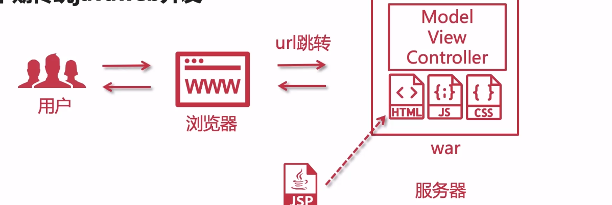

jsp渲染过程也是在后端处理, 对服务器压力大.

### 前后端单页面交互, MVVM

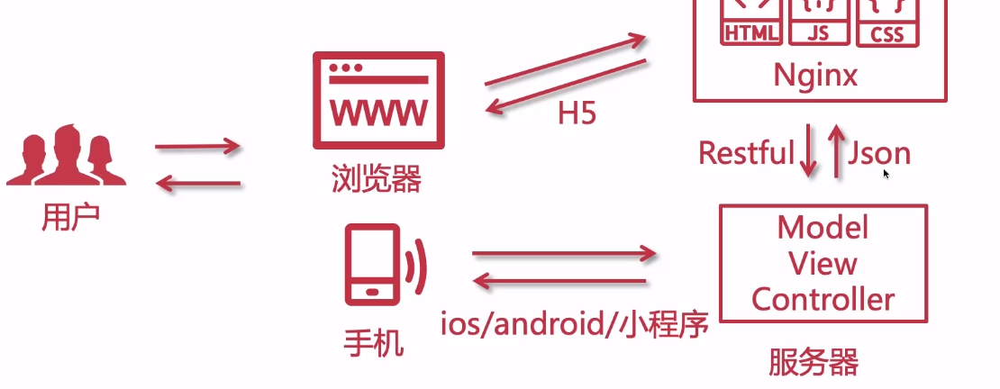

* 静态资源存储在静态资源服务器Nginx中,返回H5

* 可以进行并行开发

## 后台项目拆分和聚合

最终的war包或者jar包, 由其他jar聚合而成

maven聚合拆分项目, 将项目拆成子模块, 按需给其他项目提供依赖

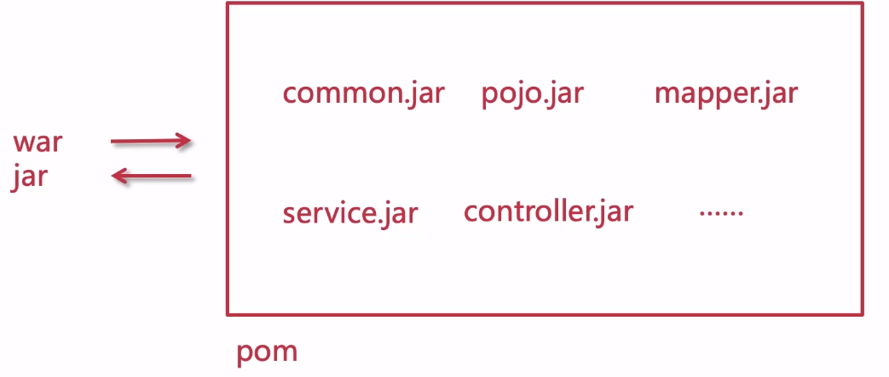


# 项目构建

## 新建maven工程

1. 因为是聚合项目, 在最外层中添加packaging, 打包方式, 默认是jar

```xml
<?xml version="1.0" encoding="UTF-8"?>
<project xmlns="http://maven.apache.org/POM/4.0.0"
         xmlns:xsi="http://www.w3.org/2001/XMLSchema-instance"
         xsi:schemaLocation="http://maven.apache.org/POM/4.0.0 http://maven.apache.org/xsd/maven-4.0.0.xsd">
    <modelVersion>4.0.0</modelVersion>

    <groupId>org.example</groupId>
    <artifactId>foodie-dev</artifactId>
    <version>1.0-SNAPSHOT</version>

    <properties>
        <maven.compiler.source>8</maven.compiler.source>
        <maven.compiler.target>8</maven.compiler.target>
    </properties>

    <packaging>pom</packaging>

</project>
```

2. 添加子项目foodie-dev-common

右键新增module, 当前项目的子工程foodie-dev-common

所有子模块的打包方式都是jar包(默认)

```
1. 聚合工程里可以分为顶级项目(顶级工程、父工程)与子工程, 这两者的关系就是父子继承的关系. 
子工程在maven里称之为模块(module), 模块之间是平级, 是可以相互依赖的。
2. 子模块可以使用顶级工程里所有的资源(依赖), 子模块之间如果要使用资源, 必须构建依赖(构建关系)
3. 一个顶级工程是可以由多个不同的子工程共同组合而成。
```

3. 添加子项目foodie-dev-pojo

entity

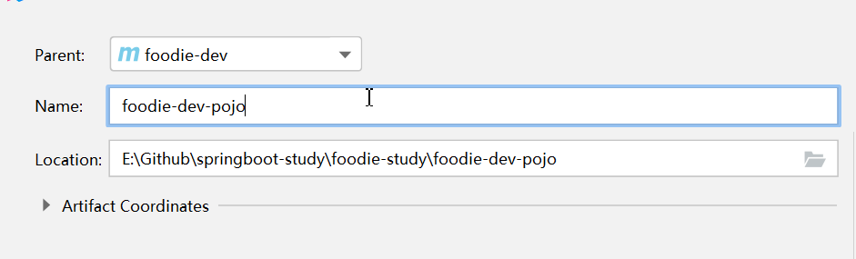

让pojo依赖common, foodie-dev-pojo中的pom文件中添加依赖

```hxml
<dependencies>
    <dependency>
        <groupId>org.example</groupId>
        <artifactId>foodie-dev-common</artifactId>
        <version>1.0-SNAPSHOT</version>
    </dependency>
</dependencies>
```

4. 添加数据层子项目foodie-dev-mapper

数据层中对应生成接口, 与mapper.xml做映射一一对应.

在resources下新建mapper文件夹, 其中的xml文件与数据库一一对应 -> 数据层foodie-dev-api的application.yml中配置数据源和mybatis

mapper中依赖pojo, 同时注意, 因为pojo依赖common. 所以mapper可以通过pojo使用common中对应方法

```xml
<!-- mapper -> pojo -> common
            所以mapper通过pojo可以使用common中对应方法
         -->
<dependency>
    <groupId>org.example</groupId>
    <artifactId>foodie-dev-pojo</artifactId>
    <version>1.0-SNAPSHOT</version>
</dependency>
```

5. 添加子项目foodie-dev-service, service中调用mapper

service -> mapper -> pojo -> common

```xml
<dependency>
    <groupId>org.example</groupId>
    <artifactId>foodie-dev-mapper</artifactId>
    <version>1.0-SNAPSHOT</version>
</dependency>
```

6. 接口层, 添加子项目foodie-dev-api, 提供接口(controller)

```xml
<!-- api -> service -> mapper -> pojo -> common -->
<dependency>
    <groupId>org.example</groupId>
    <artifactId>foodie-dev-service</artifactId>
    <version>1.0-SNAPSHOT</version>
</dependency>
```

api不应该直接调用mapper, 应该通过service去操作数据

7. 建立依赖关系

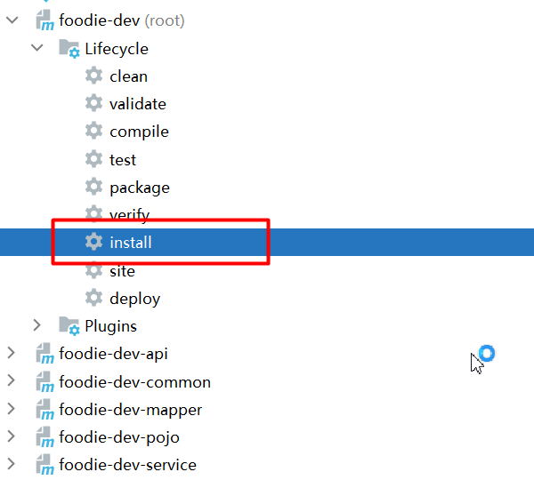

务必在根目录下点击install安装操作, 才会存在子模块之间的依赖关系, 可以真正使用子模块调用相关方法

类比汽车子零件安装使用

---

* package命令完成了项目编译、单元测试、打包功能，但没有把打好的可执行jar包（war包或其它形式的包）布署到本地maven仓库和远程maven私服仓库
* install命令完成了项目编译、单元测试、打包功能，同时把打好的可执行jar包（war包或其它形式的包）布署到本地maven仓库，但没有布署到远程maven私服仓库
* deploy命令完成了项目编译、单元测试、打包功能，同时把打好的可执行jar包（war包或其它形式的包）布署到本地maven仓库和远程maven私服仓库

## 修改启动项目前务必install

修改代码后需要在foodie-dev中重新install. 类比汽车零件修改后要重新安装

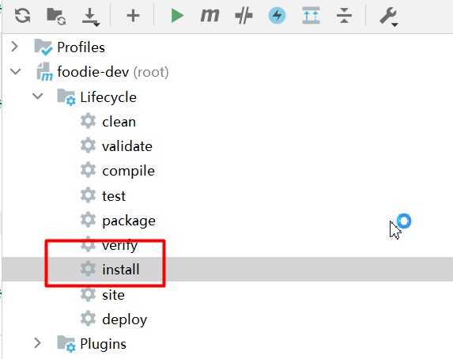

## 设计数据库

[PDMan](http://www.pdman.cn/#/), 元数据建模工具. foodie-dev.pdman.json. 项目: foodie-dev.pdman.json

增量同步: 修改表

全量同步: drop旧表, 新建新表

---

数据库外键:

* 性能影响. 三范式. -> 移除物理外键
* 热更新. 分布式场景下, 项目绝大多数情况下进行热更新, 不停机维护. 外键可能导致新更新的无法运行, 需要重启服务器. 外键强依赖性
* 降低耦合度. 删除外键并不是真的全都删除, 而是删除物理外键, 物理的一层关系不需要了. 
  * 物理和逻辑. 逻辑: 用户地址和用户表, userId为外键, 关联两张表, 不需要设置物理外键, 依赖关系还是存在的

* 数据分库分表. 外键关联难以做分库分表, 

## 聚合工程整合

启动springboot

### 在根项目的pom中引入

1. 引入依赖parent

```xml
<parent>
    <groupId>org.springframework.boot</groupId>
    <artifactId>spring-boot</artifactId>
    <version>2.1.5.RELEASE</version>
    <relativePath/>
</parent>
```

2. 设置资源属性

```xml
<properties>
    <maven.compiler.source>8</maven.compiler.source>
    <maven.compiler.target>8</maven.compiler.target>

    <project.build.sourceEncoding>UTF-8</project.build.sourceEncoding>
    <project.reporting.outputEncoding>UTF-8</project.reporting.outputEncoding>
    <java.version>1.8</java.version>
</properties>
```

3. 引入依赖

````xml
<dependencies>
    <dependency>
        <groupId>org.springframework.boot</groupId>
        <artifactId>spring-boot-starter</artifactId>
        <exclusions>
            <exclusion>
                <groupId>org.springframework.boot</groupId>
                <artifactId>spring-boot-starter-logging</artifactId>
            </exclusion>
        </exclusions>
    </dependency>

    <dependency>
        <groupId>org.springframework.boot</groupId>
        <artifactId>spring-boot-starter-web</artifactId>
    </dependency>
    
	<!-- 默认解析yml, 引入该依赖可以解析其他格式的配置文件 -->
    <dependency>
        <groupId>org.springframework.boot</groupId>
        <artifactId>spring-boot-configuration-processor</artifactId>
        <optional>true</optional>
    </dependency>
</dependencies>
````

这里不需要写版本是因为在``<parent>``的依赖中的

```xml
<parent>
    <groupId>org.springframework.boot</groupId>
    <artifactId>spring-boot-dependencies</artifactId>
    <version>2.1.5.RELEASE</version>
    <relativePath>../../spring-boot-dependencies</relativePath>
</parent>
```

其中的spring-boot-dependencies中已经声明了依赖

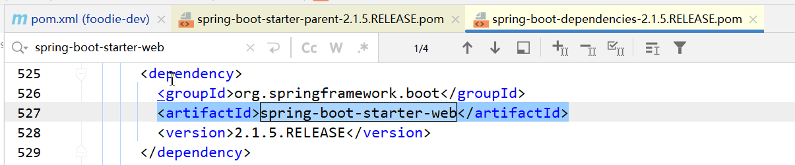

### foodie-dev-api 101

创建yml配置文件

* foodie-dev-api中

1.resources新增配置文件application.yml

2.新增启动类

```java
package com.imooc;

import org.springframework.boot.SpringApplication;
import org.springframework.boot.autoconfigure.SpringBootApplication;

@SpringBootApplication
public class Application {
    public static void main(String[] args) {
        SpringApplication.run(Application.class, args);
    }
}
```

3. 新增controller, hello程序

```java
package com.imooc.controller;

import org.springframework.web.bind.annotation.GetMapping;
import org.springframework.web.bind.annotation.RestController;

@RestController
public class HelloController {

    @GetMapping("/hello")
    public Object hello() {
        return "hello world";
    }
}
```


# 面试题: Spring Boot自动装配, 如何启动内置Tomcat的?

1. 跟踪源代码, 查看SpringApplication.run方法源代码

```java
/**
	 * Static helper that can be used to run a {@link SpringApplication} from the
	 * specified source using default settings.
	 * @param primarySource the primary source to load
	 * @param args the application arguments (usually passed from a Java main method)
	 * @return the running {@link ApplicationContext}
	 */
public static ConfigurableApplicationContext run(Class<?> primarySource,
                                                 String... args) {
    return run(new Class<?>[] { primarySource }, args);
}
```

primarySource就是要加载的source.

其中提到`using default settings`, 这里的默认配置是在注解@SpringBootApplication中的

最后返回一个`running ApplicationContext`

2. 查看@SpringBootApplication注解

```java
@Target(ElementType.TYPE)
@Retention(RetentionPolicy.RUNTIME)
@Documented
@Inherited
@SpringBootConfiguration
@EnableAutoConfiguration
@ComponentScan(excludeFilters = {
		@Filter(type = FilterType.CUSTOM, classes = TypeExcludeFilter.class),
		@Filter(type = FilterType.CUSTOM,
				classes = AutoConfigurationExcludeFilter.class) })
public @interface SpringBootApplication {}
```

重点是@SpringBootConfiguration, @EnableAutoConfiguration, @ComponentScan

* @ComponentScan扫描, 默认是在当前包和子包中的类, 例如这的Application所在的com.imooc包下的子包controller中的@RESTController就被加载到了容器中

* SpringBootConfiguration

```java
@Target(ElementType.TYPE)
@Retention(RetentionPolicy.RUNTIME)
@Documented
@Configuration
public @interface SpringBootConfiguration {}
```

其中的@Configuration注解 -> 就是一个容器, 类似Spring中写xml配置的beans包含了一个个bean, IOC容器

* @EnableAutoConfiguration

用来开启自动装配

```java
@Target(ElementType.TYPE)
@Retention(RetentionPolicy.RUNTIME)
@Documented
@Inherited
@AutoConfigurationPackage
@Import(AutoConfigurationImportSelector.class)
public @interface EnableAutoConfiguration {}
```

其中的@Import

```java
Indicates one or more {@link Configuration @Configuration} classes to import.
```

AutoConfigurationImportSelector.class, 自动装配导入的选择器

```java
@Override
public String[] selectImports(AnnotationMetadata annotationMetadata) {
    if (!isEnabled(annotationMetadata)) {
        return NO_IMPORTS;
    }
    AutoConfigurationMetadata autoConfigurationMetadata = AutoConfigurationMetadataLoader
        .loadMetadata(this.beanClassLoader);
    AutoConfigurationEntry autoConfigurationEntry = getAutoConfigurationEntry(
        autoConfigurationMetadata, annotationMetadata);
    return StringUtils.toStringArray(autoConfigurationEntry.getConfigurations());
}
```

选择要导入的类, 其中的getAutoConfigurationEntry:

```java
protected AutoConfigurationEntry getAutoConfigurationEntry(
    AutoConfigurationMetadata autoConfigurationMetadata,
    AnnotationMetadata annotationMetadata) {
    if (!isEnabled(annotationMetadata)) {
        return EMPTY_ENTRY;
    }
    AnnotationAttributes attributes = getAttributes(annotationMetadata);
    List<String> configurations = getCandidateConfigurations(annotationMetadata,
                                                             attributes);
    configurations = removeDuplicates(configurations);
    Set<String> exclusions = getExclusions(annotationMetadata, attributes);
    checkExcludedClasses(configurations, exclusions);
    configurations.removeAll(exclusions);
    configurations = filter(configurations, autoConfigurationMetadata);
    fireAutoConfigurationImportEvents(configurations, exclusions);
    return new AutoConfigurationEntry(configurations, exclusions);
}
```

关注其中的`List<String> configurations`, 就是配置. 再看其中的getCandidateConfigurations方法

```java
protected List<String> getCandidateConfigurations(AnnotationMetadata metadata,
                                                  AnnotationAttributes attributes) {
    List<String> configurations = SpringFactoriesLoader.loadFactoryNames(
        getSpringFactoriesLoaderFactoryClass(), getBeanClassLoader());
    Assert.notEmpty(configurations,
                    "No auto configuration classes found in META-INF/spring.factories. If you "
                    + "are using a custom packaging, make sure that file is correct.");
    return configurations;
}
```

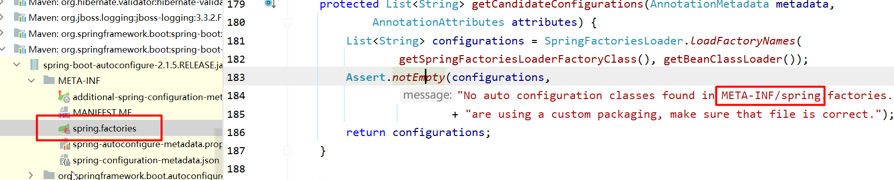

其中的spring.factories中就是自动装配的类

```
org.springframework.boot.autoconfigure.web.embedded.EmbeddedWebServerFactoryCustomizerAutoConfiguration,\
```

点击查看类

```java
@Configuration
@ConditionalOnClass({ Tomcat.class, UpgradeProtocol.class })
public static class TomcatWebServerFactoryCustomizerConfiguration {

    @Bean
    public TomcatWebServerFactoryCustomizer tomcatWebServerFactoryCustomizer(
        Environment environment, ServerProperties serverProperties) {
        return new TomcatWebServerFactoryCustomizer(environment, serverProperties);
    }

}
```

Tomcat.class: SpringBoot内置的tomcat, 点入看到, 默认端口8080, 默认hostname: localhost

---

```
org.springframework.boot.autoconfigure.web.servlet.WebMvcAutoConfiguration,\
```

自动装配web mvc

```java
/**
 * {@link EnableAutoConfiguration Auto-configuration} for {@link EnableWebMvc Web MVC}.
 */
```

---
```
org.springframework.boot.autoconfigure.web.servlet.ServletWebServerFactoryAutoConfiguration,\
```

```java
/**
 * {@link EnableAutoConfiguration Auto-configuration} for servlet web servers. */
```

```java
@Bean
@ConditionalOnClass(name = "org.apache.catalina.startup.Tomcat")
public TomcatServletWebServerFactoryCustomizer tomcatServletWebServerFactoryCustomizer(
    ServerProperties serverProperties) {
    return new TomcatServletWebServerFactoryCustomizer(serverProperties);
}
```

运行Application, 内置的tomcat也随之启动

在spring.factories中包含了许多自动转配的类

---

@SpringBootApplication -> @EnableAutoConfiguration ->  @Import(AutoConfigurationImportSelector.class) -> AutoConfigurationImportSelector.class -> selectImports -> getAutoConfigurationEntry -> getCandidateConfigurations -> loadFactoryNames


```java
/**
	 * Load the fully qualified class names of factory implementations of the
	 * given type from {@value #FACTORIES_RESOURCE_LOCATION}, using the given
	 * class loader.
	 * @param factoryClass the interface or abstract class representing the factory
	 * @param classLoader the ClassLoader to use for loading resources; can be
	 * {@code null} to use the default
	 * @throws IllegalArgumentException if an error occurs while loading factory names
	 * @see #loadFactories
	 */
public static List<String> loadFactoryNames(Class<?> factoryClass, @Nullable ClassLoader classLoader) {
    String factoryClassName = factoryClass.getName();
    return loadSpringFactories(classLoader).getOrDefault(factoryClassName, Collections.emptyList());
}
```

其中:

```java
public static final String FACTORIES_RESOURCE_LOCATION = "META-INF/spring.factories";
```

# 数据层

foodie-shop-dev.sql -> mysql5.7 run sql script

## HikariCP数据源

### 简述

HikariCP: SpringBoot2.x的默认数据源(默认数据库连接池). 速度快


[为什么HikariCP快](https://github.com/brettwooldridge/HikariCP/wiki/Down-the-Rabbit-Hole)

ali: Durid

### 整合HikariCP

数据层HikariCP与MyBatis整合

1. pom中引入数据源驱动与mybatis依赖

foodie-dev的pom中

```xml
<!-- 数据库驱动 -->
<dependency>
    <groupId>mysql</groupId>
    <artifactId>mysql-connector-java</artifactId>
    <version>5.1.41</version>
</dependency>

<!-- mybatis -->
<dependency>
    <groupId>org.mybatis.spring.boot</groupId>
    <artifactId>mybatis-spring-boot-starter</artifactId>
    <version>2.1.0</version>
</dependency>
```

2. foodie-dev-api的application.yml中配置数据源和mybatis

```yaml
############################################################
#
#
# 配置数据源信息
#
############################################################
spring:
  datasource: # 数据源的相关配置
    type: com.zaxxer.hikari.HikariDataSource   # 数据源类型: HikariCP
    driver-class-name: com.mysql.jdbc.Driver   # mysql驱动
    url: jdbc:mysql://114.55.64.149:3306/foodie-shop-dev?useUnicode=true&characterEncoding=UTF-8&autoReconnect
    username: root
    password:

    hikari:
      connection-timeout: 30000 # 等待连接池分配连接的最大时长(毫秒), 超过这个时长还没可用的连接则发生SQLException, 默认:30秒
      minimum-idle: 5 # 最小连接数
      maximum-pool-size: 20 # 最大连接数
      auto-commit: true # 自动提交
      idle-timeout: 600000 # 连接超时的最大时长(毫秒), 超时则被释放(retired),默认:10分钟
      pool-name: DataSourceHikariCP # 连接池名称
      max-lifetime: 1800000 # 连接的生命时长(毫秒),超时而且没被使用则被释放(retired), 默认:30分钟 1800000ms
      connection-test-query: select 1


############################################################
#
# mybatis 配置
#
############################################################
mybatis:
  type-aliases-package: com.imooc.pojo # 所有pojo类(entity)所在的包路径
  mapper-locations: classpath:mapper/*.xml # mapper映射文件
```

其中在foodie-dev-pojo的java目录下新建包com.imooc.pojo以便扫描

在foodie-dev-mapper的resources下新建mapper文件夹, 后续的文件就是放在xml下的

classpath就是所有的resources

todo: 为什么这里不同包下的文件可以配置到

---

内置tomcat配置:

foodie-dev-api的application.yml中

```yaml
#
# 内置tomcat, web访问端口号  约定：8088
#
############################################################
server:
  port: 8088
  tomcat:
    uri-encoding: UTF-8
  max-http-header-size: 80KB
```

8080端口后续给静态资源服务器

浏览器访问: `localhost:8088/hello`

---

hikari:
      minimum-idle: 5 # 最小连接数
      maximum-pool-size: 20 # 最大连接数

默认最大连接数10. 最大连接数和服务器配置有关, 同时并不是越大越好. 四核->10, 八核->20

作者的观点希望最大最小一致, 固定连接池大小, 系统一般不会出现闲置情况

## MyBatis逆向生成工具

生成Pojo, Mapper.xml, mapperxml对接接口映射类

Mybatis-generator工具, 其中集成MyMapper工具

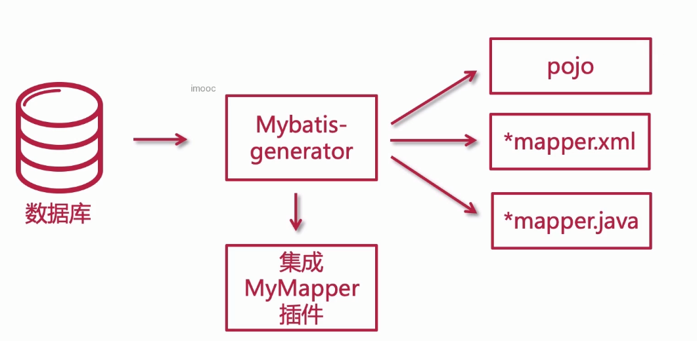

工具项目: mybatis-generator-for-imooc

generatorConfig.xml文件中设置table

```xml
<table tableName="carousel"/>
<table tableName="category"/>
<table tableName="items"/>
<table tableName="items_comments"/>
<table tableName="items_img"/>
<table tableName="items_param"/>
<table tableName="items_spec"/>
<table tableName="order_items"/>
<table tableName="order_status"/>
<table tableName="orders"/>
<table tableName="user_address"/>
<table tableName="users"/>
```

生成文件后拷贝到自己的项目中

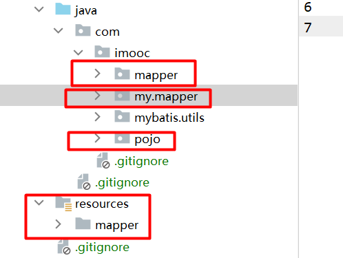

---

使用工具

1. 在根pom中添加通用mapper工具

foodie-dev.pom中添加

```xml
<!-- 通用mapper逆向工具 -->
<dependency>
    <groupId>tk.mybatis</groupId>
    <artifactId>mapper-spring-boot-starter</artifactId>
    <version>2.1.5</version>
</dependency>
```

2. 在yml中引入通用mapper配置

在api层中, foodie-dev-api中添加

```yaml
############################################################
#
# mybatis mapper 配置
#
############################################################
# 通用Mapper配置
mapper:
  mappers: com.imooc.my.mapper.MyMapper
  not-empty: false # 在进行数据库操作的的时候，判断表达式 username != null, 是否追加 username != ''
  identity: MYSQL
```

not-empty: 做更新等操作判断属性是否为空,  

在进行数据库操作的的时候，判断表达式 username != null, 是否追加 username != ''

建议自己手写, 不要依赖框架 


3. 引入MyMapper接口类

```java
/*
 * The MIT License (MIT)
 *
 * Copyright (c) 2014-2016 abel533@gmail.com
 *
 * Permission is hereby granted, free of charge, to any person obtaining a copy
 * of this software and associated documentation files (the "Software"), to deal
 * in the Software without restriction, including without limitation the rights
 * to use, copy, modify, merge, publish, distribute, sublicense, and/or sell
 * copies of the Software, and to permit persons to whom the Software is
 * furnished to do so, subject to the following conditions:
 *
 * The above copyright notice and this permission notice shall be included in
 * all copies or substantial portions of the Software.
 *
 * THE SOFTWARE IS PROVIDED "AS IS", WITHOUT WARRANTY OF ANY KIND, EXPRESS OR
 * IMPLIED, INCLUDING BUT NOT LIMITED TO THE WARRANTIES OF MERCHANTABILITY,
 * FITNESS FOR A PARTICULAR PURPOSE AND NONINFRINGEMENT. IN NO EVENT SHALL THE
 * AUTHORS OR COPYRIGHT HOLDERS BE LIABLE FOR ANY CLAIM, DAMAGES OR OTHER
 * LIABILITY, WHETHER IN AN ACTION OF CONTRACT, TORT OR OTHERWISE, ARISING FROM,
 * OUT OF OR IN CONNECTION WITH THE SOFTWARE OR THE USE OR OTHER DEALINGS IN
 * THE SOFTWARE.
 */

package com.imooc.my.mapper;

import tk.mybatis.mapper.common.Mapper;
import tk.mybatis.mapper.common.MySqlMapper;

/**
 * 继承自己的MyMapper
 */
public interface MyMapper<T> extends Mapper<T>, MySqlMapper<T> {
}
```

4. 验证

maven install

运行后访问/hello查看是否出错

## 通过mapper基于RESTful编写api接口
### RESTful Web Service

* 一种通信方式, 
* 信息传递, 现在流行json传输
* 无状态: RESTful Web Service的特点, 服务器接收客户端请求, 对于服务器无需了解request之前做了什么, 接下来可能做什么. -> 后续的分布式会话. session会话(单机中存在, 有状态)

* 独立性. 系统与系统之间解耦

---

设计规范: -> Spring MVC中

GET -> /order/{id} -> /getOrder?id=1001

POST -> /order . 其他的构建JSON对象给后端 -> /saveOrder

PUT -> /order/{id} -> modifyOrder

DELETE -> /order/{id} -> deleteOrder?id=1001

最右侧的url直观, 降低沟通成本

### 编写api接口

基于webservice的CRUD -> Stu表来做demo

get请求: getStu

post请求:saveStu, updateStu, deleteStu

1. Controller层

foodie-dev-api中

```java
package com.imooc.controller;

import com.imooc.service.StuService;
import org.springframework.beans.factory.annotation.Autowired;
import org.springframework.web.bind.annotation.GetMapping;
import org.springframework.web.bind.annotation.PostMapping;
import org.springframework.web.bind.annotation.RestController;

@RestController
public class StuDemoController {

    @Autowired
    private StuService stuService;

    @GetMapping("/getStu")
    public Object getStu(Integer id) {
        return stuService.getStuInfo(id);
    }

    @PostMapping("/saveStu")
    public Object saveStu() {
        stuService.saveStu();
        return "saveStu OK";
    }

    @PostMapping("/updateStu")
    public Object updateStu(int id) {
        stuService.updateStu(id);
        return "updateStu OK";
    }

    @PostMapping("/deleteStu")
    public Object deleteStu(int id) {
        stuService.deleteStu(id);
        return "deleteStu OK";
    }
}
```

2. service层

foodie-dev-service

```java
package com.imooc.service;

import com.imooc.pojo.Stu;

public interface StuService {

    /**
     * 根据id获取student info
     *
     * @param id
     * @return
     */
    public Stu getStuInfo(Integer id);

    /**
     * 保存学生数据, 一般由前端穿来, 这边直接写死
     */
    public void saveStu();

    /**
     * update
     *
     * @param id
     */
    public void updateStu(Integer id);

    /**
     * delete
     *
     * @param id
     */
    public void deleteStu(Integer id);
    public void saveParent();
    public void saveChildren();
}
```

impl:

```java
package com.imooc.service.impl;

import com.imooc.mapper.StuMapper;
import com.imooc.pojo.Stu;
import com.imooc.service.StuService;
import org.springframework.beans.factory.annotation.Autowired;
import org.springframework.stereotype.Service;
import org.springframework.transaction.annotation.Propagation;
import org.springframework.transaction.annotation.Transactional;

import javax.swing.*;

@Service
public class StuServiceImpl implements StuService {

    @Autowired
    private StuMapper stuMapper;


    @Transactional(propagation = Propagation.SUPPORTS)
    @Override
    public Stu getStuInfo(Integer id) {
        return stuMapper.selectByPrimaryKey(id);
    }

    @Transactional(propagation = Propagation.REQUIRED)
    @Override
    public void saveStu() {
        Stu stu = new Stu();
        stu.setName("jack");
        stu.setAge(19);
        stuMapper.insert(stu);
    }


    @Transactional(propagation = Propagation.REQUIRED)
    @Override
    public void updateStu(Integer id) {
        Stu stu = new Stu();
        stu.setId(id);
        stu.setName("lucy");
        stu.setAge(20);
        stuMapper.updateByPrimaryKey(stu);
    }


    @Transactional(propagation = Propagation.REQUIRED)
    @Override
    public void deleteStu(Integer id) {
        stuMapper.deleteByPrimaryKey(id);
    }

    @Override
    public void saveParent() {

    }

    @Override
    public void saveChildren() {

    }
}
```

stuMapper中的方法由之前生成的类提供

其中的

```java
@Autowired
private StuMapper stuMapper;
```

会报错

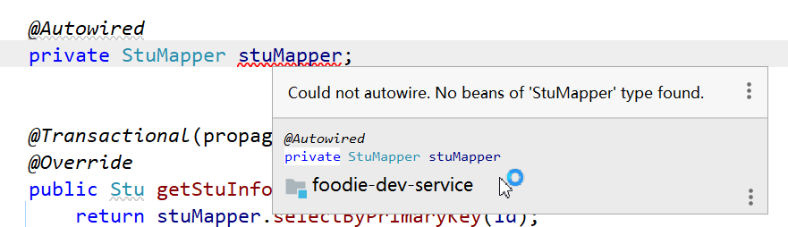

解决报错:

首先需要让spring扫描mapper

在foodie-dev-api的Application启动类中, 添加扫描注解@MapperScan(basePackages = "com.imooc.mapper"), 扫描对应包下的类

```java
package com.imooc;

import org.springframework.boot.SpringApplication;
import org.springframework.boot.autoconfigure.SpringBootApplication;
import tk.mybatis.spring.annotation.MapperScan;

@SpringBootApplication
// 扫描 mybatis 通用 mapper 所在的包
@MapperScan(basePackages = "com.imooc.mapper")
public class Application {
    public static void main(String[] args) {
        SpringApplication.run(Application.class, args);
    }
}

```

此时已经将类添加到了容器中, 但是还是红色下划线, 需要取消此类提示, 如下所示: setting -> inspections -> spring -> spring core -> code -> 

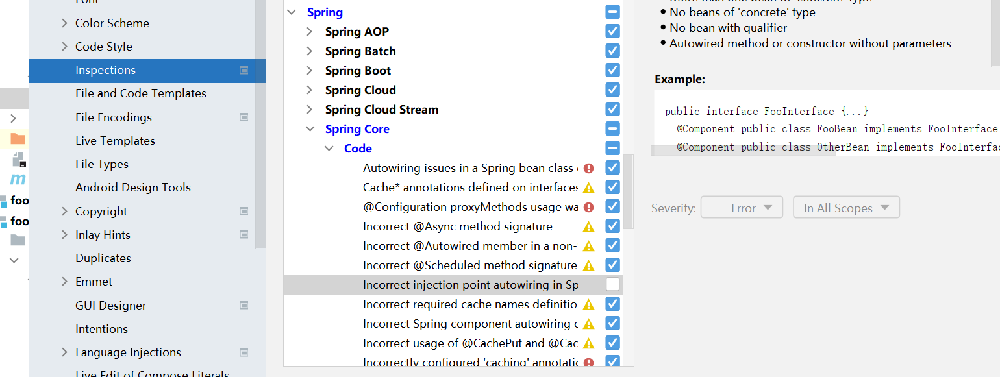

---

幂等性说明: 

这里的一系列接口, 例如: save接口, 暂时不保证幂等性 -> 后续课程中调整幂等性

---

Problem: 

ThinkPad运行后, 报错:

```
2022-01-13 09:27:24.903 ERROR 7608 --- [nio-8088-exec-1] com.zaxxer.hikari.pool.HikariPool        : DataSourceHikariCP - Exception during pool initialization.

com.mysql.jdbc.exceptions.jdbc4.CommunicationsException: Communications link failure

The last packet successfully received from the server was 597 milliseconds ago.  The last packet sent successfully to the server was 592 milliseconds ago.
...
Caused by: javax.net.ssl.SSLHandshakeException: No appropriate protocol (protocol is disabled or cipher suites are inappropriate)
	...
2022-01-13 09:27:24.922 ERROR 7608 --- [nio-8088-exec-1] o.a.c.c.C.[.[.[/].[dispatcherServlet]    : Servlet.service() for servlet [dispatcherServlet] in context with path [] threw exception [Request processing failed; nested exception is org.mybatis.spring.MyBatisSystemException: nested exception is org.apache.ibatis.exceptions.PersistenceException: 
### Error querying database.  Cause: org.springframework.jdbc.CannotGetJdbcConnectionException: Failed to obtain JDBC Connection; nested exception is com.mysql.jdbc.exceptions.jdbc4.CommunicationsException: Communications link failure

The last packet successfully received from the server was 597 milliseconds ago.  The last packet sent successfully to the server was 592 milliseconds ago.
### The error may exist in com/imooc/mapper/StuMapper.java (best guess)
### The error may involve com.imooc.mapper.StuMapper.selectByPrimaryKey
### The error occurred while executing a query
### Cause: org.springframework.jdbc.CannotGetJdbcConnectionException: Failed to obtain JDBC Connection; nested exception is com.mysql.jdbc.exceptions.jdbc4.CommunicationsException: Communications link failure

The last packet successfully received from the server was 597 milliseconds ago.  The last packet sent successfully to the server was 592 milliseconds ago.] with root cause

javax.net.ssl.SSLHandshakeException: No appropriate protocol (protocol is disabled or cipher suites are inappropriate)
...
```

Solution: [jdk1.8版本导致SSL调用权限上有问题](https://blog.csdn.net/weixin_38111957/article/details/80577688)

ThinkPad jdk8版本:

```
java version "1.8.0_301"
Java(TM) SE Runtime Environment (build 1.8.0_301-b09)
Java HotSpot(TM) 64-Bit Server VM (build 25.301-b09, mixed mode)
```

jdk安装目录下, C:\jdk\jdk_1.8\jre\lib\security\java.security中找到并删除SSLv3, 删掉SSLv3就是允许SSL调用

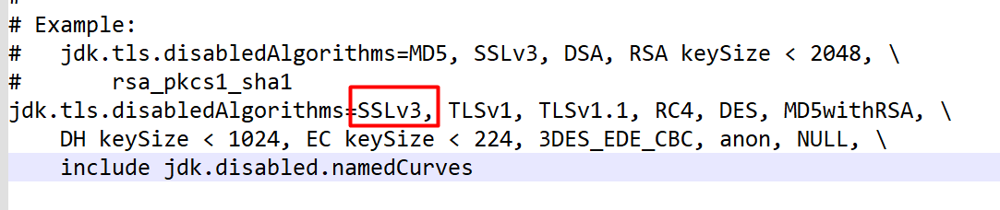

但运行还是出错. 最后发现SSLv3后面有两个和它后缀一样的算法, **将它们一起删掉后重启项目**, 成功解决问题

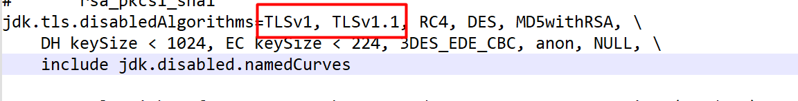

最后的文件内容:

```
jdk.tls.disabledAlgorithms=RC4, DES, MD5withRSA, \
    DH keySize < 1024, EC keySize < 224, 3DES_EDE_CBC, anon, NULL, \
    include jdk.disabled.namedCurves
```

---

或者直接url中添加useSSL=false即可

```yaml
spring:
  datasource: # 数据源的相关配置
    type: com.zaxxer.hikari.HikariDataSource   # 数据源类型: HikariCP
    driver-class-name: com.mysql.jdbc.Driver   # mysql驱动
    url: jdbc:mysql://114.55.64.149:3306/foodie-shop-dev?useUnicode=true&characterEncoding=UTF-8&autoReconnect&useSSL=false
    username: root
    password: mypwd
```

---

浏览器访问get接口, 成功调用: `http://localhost:8088/getStu?id=1203`

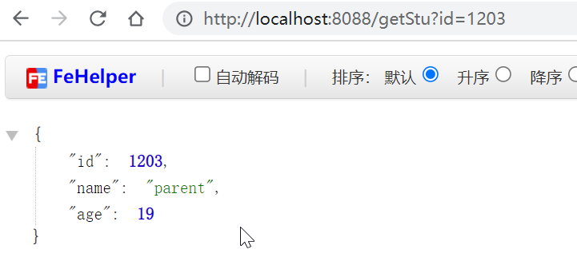


### postman测试Restful接口

postman调用后端api即可

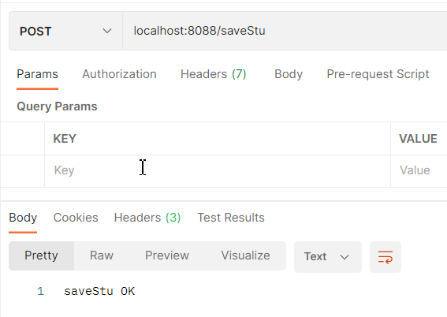

saveorder


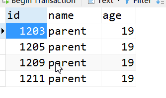

运行代码后:

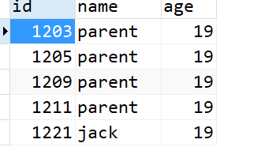

其他接口类似的测试

## 事务的传播propagation

2-24 -> 2-26


### 为何不使用@EnableTransactionManagement就能使用事务

@SpringApplication -> @EnableAutoConfiguration -> @Import(AutoConfigurationImportSelector.class) -> AutoConfigurationImportSelector.class -> selectImports -> getAutoConfigurationEntry -> getCandidateConfigurations -> spring.factories

```
org.springframework.boot.autoconfigure.transaction.TransactionAutoConfiguration,\
```

也就是在Spring启动的时候会自动加载

```java
/**
 * {@link org.springframework.boot.autoconfigure.EnableAutoConfiguration
 * Auto-configuration} for Spring transaction.
 *
 * @author Stephane Nicoll
 * @since 1.3.0
 */
@Configuration
@ConditionalOnClass(PlatformTransactionManager.class)
@AutoConfigureAfter({ JtaAutoConfiguration.class, HibernateJpaAutoConfiguration.class,
		DataSourceTransactionManagerAutoConfiguration.class,
		Neo4jDataAutoConfiguration.class })
@EnableConfigurationProperties(TransactionProperties.class)
public class TransactionAutoConfiguration {}
```

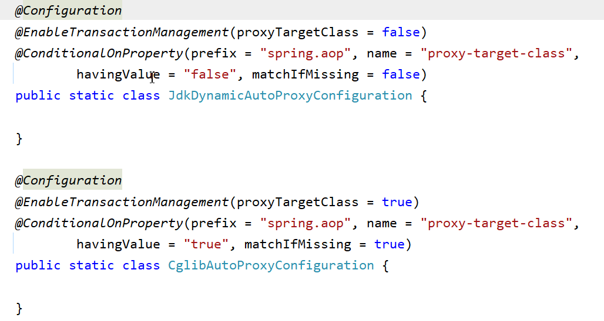

其中已经@EnableTransactionManagement开启事务管理. 基于spring aop: 动态代理和cglib

所以启动类中对于注解@EnableTransactionManagement可加可不加

# 单体电商的核心功能

* 注册和登录

* cookie和session
* 集成swapper2 api, 接口文档
* 分类的设计与实现
* 首页商品推荐 -> 首页懒加载
* 商品搜索与分页
* 商品详情和评论渲染
* 购物车和订单. 电商核心. 购物车的多种实现方式; 订单全局id? 订单唯一(刷新只会有一个); 控制库存, 超卖
* 支付. 电商核心. 微信和支付宝. 时序图讲解支付节点

# 注册与登陆

## 流程

* 用户名流程

用户 -> 输入用户名密码(前提注册) -> 校验(失败重新输入) -> 注册/登录成功

* 邮箱注册流程

用户 -> 输入用户名邮箱密码 -> 发送激活邮件(token), token有时效性 -> 用户点击链接 -> 注册成功

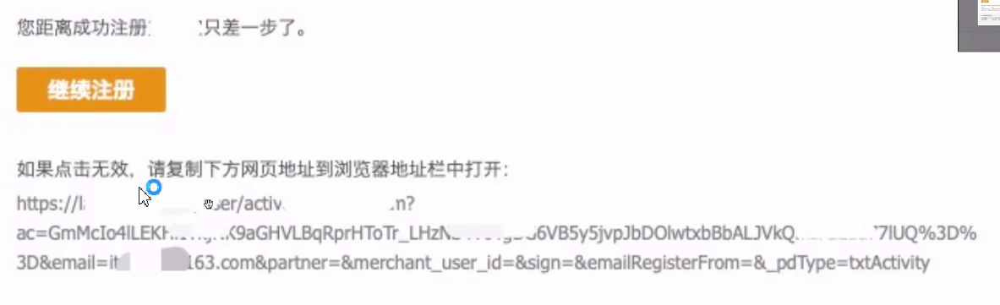

很长的参数, ac=, 就是token. 重要的参数.

对于注册来说, 只需要关注token和email就可以. -> 后台接收到地址后, 校验token和邮箱是否匹配, 如果匹配则激活成功.

* 手机号注册登陆流程

用户 -> 输入手机号 -> 发送验证码 -> 校验验证码(时效性) -> 注册成功

---

这里使用用户名密码方式. 基于风控和信任的考虑

## 用户注册

校验: 前后端都要做, 前端校验可以降低后端压力, 后端校验预防绕过前端的攻击

### 校验用户名是否存在queryUserNameIsExisted

第一步, 校验用户名是否存在, 避免重复注册

开发步骤: 从下往上, 数据层 -> service -> 接口层. mapper已经提供了, 写service层

1. service层

UserService接口

```java
package com.imooc.service;

public interface UserService {

    /**
     * 判断用户名是否存在
     */
    public boolean queryUserNameIsExisted(String userName);

}
```

impl, 这里使用Example查询条件的方式来做查询

UserServiceImpl

```java
package com.imooc.service.impl;

import com.imooc.mapper.UsersMapper;
import com.imooc.pojo.Users;
import com.imooc.service.UserService;
import org.springframework.beans.factory.annotation.Autowired;
import org.springframework.stereotype.Service;
import org.springframework.transaction.annotation.Propagation;
import org.springframework.transaction.annotation.Transactional;
import tk.mybatis.mapper.entity.Example;


@Service
public class UserServiceImpl implements UserService {

    @Autowired
    private UsersMapper usersMapper;

    @Transactional(propagation = Propagation.SUPPORTS)
    @Override
    public boolean queryUserNameIsExisted(String userName) {
        // 根据条件查询
        Example example = new Example(Users.class);
        Example.Criteria userCriteria = example.createCriteria();
        userCriteria.andEqualTo("username", userName);

        Users users = usersMapper.selectOneByExample(example);
        return null != users;
    }
}
```

2. controller层

PassportController

```java
package com.imooc.controller;

import com.imooc.service.UserService;
import org.apache.commons.lang3.StringUtils;
import org.springframework.beans.factory.annotation.Autowired;
import org.springframework.web.bind.annotation.GetMapping;
import org.springframework.web.bind.annotation.RequestMapping;
import org.springframework.web.bind.annotation.RequestParam;
import org.springframework.web.bind.annotation.RestController;

@RestController
@RequestMapping("passport")
public class PassportController {

    @Autowired
    private UserService userService;

    /**
     * 用户名是否存在
     *
     * @param userName
     * @return 状态码
     */
    @GetMapping("/userNameIsExisted")
    public int userNameIsExisted(@RequestParam String userName) {
        // 判空
        if (StringUtils.isBlank(userName)) {
            return 500;
        }

        // 是否注册过
        if (userService.queryUserNameIsExisted(userName)) {
            // 注册过
            return 500;
        }

        // 成功
        return 200;
    }
}
```

字符串处理方法, 添加依赖

foodie-dev的pom中, 添加后续要用到的apache工具类依赖

```xml
<dependency>
    <groupId>commons-codec</groupId>
    <artifactId>commons-codec</artifactId>
    <version>1.11</version>
</dependency>
<dependency>
    <groupId>org.apache.commons</groupId>
    <artifactId>commons-lang3</artifactId>
    <version>3.4</version>
</dependency>
<dependency>
    <groupId>org.apache.commons</groupId>
    <artifactId>commons-io</artifactId>
    <version>1.3.2</version>
</dependency>
```

### 自定义响应JSONResult

原始是httpstatus. 按照规范

查看jd的recommend返回json格式

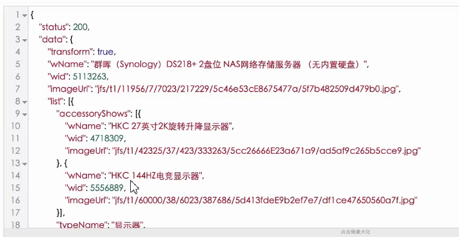

本身就是一个实体类, 包含了各种属性, 可以将这些内容做封装

JSONResult.java -> foodie-dev-common中, 

```java
package com.imooc.utils;

import com.fasterxml.jackson.annotation.JsonIgnore;
import com.fasterxml.jackson.databind.ObjectMapper;

/**
 *
 * @Title: IMOOCJSONResult.java
 * @Package com.imooc.utils
 * @Description: 自定义响应数据结构
 * 				本类可提供给 H5/ios/安卓/公众号/小程序 使用
 * 				前端接受此类数据（json object)后，可自行根据业务去实现相关功能
 *
 * 				200：表示成功
 * 				500：表示错误，错误信息在msg字段中
 * 				501：bean验证错误，不管多少个错误都以map形式返回
 * 				502：拦截器拦截到用户token出错
 * 				555：异常抛出信息
 * 				556: 用户qq校验异常
 * @Copyright: Copyright (c) 2020
 * @Company: www.imooc.com
 * @author 慕课网 - 风间影月
 * @version V1.0
 */
public class JSONResult {

    // 定义jackson对象
    private static final ObjectMapper MAPPER = new ObjectMapper();

    // 响应业务状态
    private Integer status;

    // 响应消息
    private String msg;

    // 响应中的数据
    private Object data;

    @JsonIgnore
    private String ok;	// 不使用

    public static JSONResult build(Integer status, String msg, Object data) {
        return new JSONResult(status, msg, data);
    }

    public static JSONResult build(Integer status, String msg, Object data, String ok) {
        return new JSONResult(status, msg, data, ok);
    }

    public static JSONResult ok(Object data) {
        return new JSONResult(data);
    }

    public static JSONResult ok() {
        return new JSONResult(null);
    }

    public static JSONResult errorMsg(String msg) {
        return new JSONResult(500, msg, null);
    }

    public static JSONResult errorMap(Object data) {
        return new JSONResult(501, "error", data);
    }

    public static JSONResult errorTokenMsg(String msg) {
        return new JSONResult(502, msg, null);
    }

    public static JSONResult errorException(String msg) {
        return new JSONResult(555, msg, null);
    }

    public static JSONResult errorUserQQ(String msg) {
        return new JSONResult(556, msg, null);
    }

    public JSONResult() {

    }

    public JSONResult(Integer status, String msg, Object data) {
        this.status = status;
        this.msg = msg;
        this.data = data;
    }

    public JSONResult(Integer status, String msg, Object data, String ok) {
        this.status = status;
        this.msg = msg;
        this.data = data;
        this.ok = ok;
    }

    public JSONResult(Object data) {
        this.status = 200;
        this.msg = "OK";
        this.data = data;
    }

    public Boolean isOK() {
        return this.status == 200;
    }

    public Integer getStatus() {
        return status;
    }

    public void setStatus(Integer status) {
        this.status = status;
    }

    public String getMsg() {
        return msg;
    }

    public void setMsg(String msg) {
        this.msg = msg;
    }

    public Object getData() {
        return data;
    }

    public void setData(Object data) {
        this.data = data;
    }

    public String getOk() {
        return ok;
    }

    public void setOk(String ok) {
        this.ok = ok;
    }
}
```

改变Controller的返回

```java
package com.imooc.controller;

import com.imooc.service.UserService;
import com.imooc.utils.JSONResult;
import org.apache.commons.lang3.StringUtils;
import org.springframework.beans.factory.annotation.Autowired;
import org.springframework.http.HttpStatus;
import org.springframework.web.bind.annotation.GetMapping;
import org.springframework.web.bind.annotation.RequestMapping;
import org.springframework.web.bind.annotation.RequestParam;
import org.springframework.web.bind.annotation.RestController;

@RestController
@RequestMapping("passport")
public class PassportController {

    @Autowired
    private UserService userService;

    /**
     * 用户名是否存在
     *
     * @param userName
     * @return 状态码
     */
    @GetMapping("/userNameIsExisted")
    public JSONResult userNameIsExisted(@RequestParam String userName) {
        // 判空
        if (StringUtils.isBlank(userName)) {
            return JSONResult.errorMsg("user name cannot be empty");
        }

        // 是否注册过
        if (userService.queryUserNameIsExisted(userName)) {
            // 注册过
            return JSONResult.errorMsg("user name already exists");
        }

        // 成功
        return JSONResult.ok();
        // return HttpStatus.OK.value();
    }
}
```

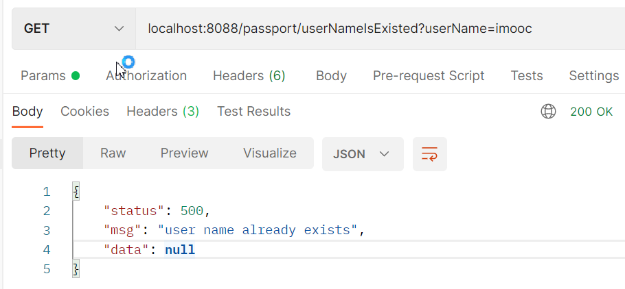

### 创建用户

#### UserBO

前端传过来的数据, 一张表单, 将前端页面中的用户名, 密码, 确认密码等数据包装成一个JSON发到后端, 一个偏向业务类型的数据包, 所以这里统一定义为BO对象. 用来接收前端传递的数据体.

foodie-dev-pojo中定义UserBO

```java
package com.imooc.pojo.bo;

import lombok.Getter;
import lombok.Setter;
import lombok.ToString;

@Getter
@Setter
@ToString
public class UserBO {
    private String userName;

    private String password;

    private String confirmedPassword;
}
```

#### Service

1. 接口中

```java
/**
     * 创建用户
     */
public Users createUser(UserBO userBO);
```

2. impl中

```java
// 默认头像
private static final String DEFAULT_USER_FACE = "http://122.152.205.72:88/group1/M00/00/05/CpoxxFw_8_qAIlFXAAAcIhVPdSg994.png";


@Autowired
private Sid sid;
```

```java
/**
     * 创建用户
     *
     * @param userBO 前台传入的业务对象
     *
     * @return Users
     */
@Transactional(propagation = Propagation.REQUIRED)
@Override
public Users createUser(UserBO userBO) {
    Users user = new Users();

    user.setId(sid.nextShort());

    user.setUsername(userBO.getUserName());

    try {
        // 密码使用md5加密
        user.setPassword(MD5Utils.getMD5Str(userBO.getPassword()));
    } catch(Exception e) {
        e.printStackTrace();
    }

    // 默认用户昵称同用户名
    user.setNickname(userBO.getUserName());
    user.setFace(DEFAULT_USER_FACE);
    user.setSex(Sex.secret.type);
    // 设置默认生日
    user.setBirthday(DateUtil.stringToDate("1900-01-01"));


    user.setCreatedTime(new Date());
    user.setUpdatedTime(new Date());

    usersMapper.insert(user);

    return user;
}
```

* userId, 主键, 全局唯一. -> 后续讲解全局唯一的多种方式

这里直接使用组件idworker中的工具类Sid, 有些类似腾讯新闻中生成id的格式

* 密码需要MD5加密, foodie-dev-common中添加MD5Utils

* 生日使用日期处理工具类, foodie-dev-common中添加DateUtil

* 性别的枚举类, foodie-dev-common中添加Sex

```java
package com.imooc.enums;

public enum Sex {
    woman(0, "woman"),
    man(1, "man"),
    secret(2, "secret");

    public final Integer type;

    public final String value;

    Sex(Integer type, String value) {
        this.type = type;
        this.value = value;
    }
}
```

---

3. Controller的启动类中添加扫描

因为common中增加了idworker, 需要在启动的时候扫描到spring容器中, 所以添加注解@ComponentScan

@ComponentScan(basePackages = {"com.imooc", "org.n3r.idworker"})

```java
package com.imooc;

import org.springframework.boot.SpringApplication;
import org.springframework.boot.autoconfigure.SpringBootApplication;
import org.springframework.context.annotation.ComponentScan;
import tk.mybatis.spring.annotation.MapperScan;

@SpringBootApplication
// 扫描所有包以及相关组件包, com.imooc是默认的
@ComponentScan(basePackages = {"com.imooc", "org.n3r.idworker"})
// 扫描 mybatis 通用 mapper 所在的包
@MapperScan(basePackages = "com.imooc.mapper")
public class Application {
    public static void main(String[] args) {
        SpringApplication.run(Application.class, args);
    }
}
```

#### controller

foodie-dev-api中写创建用户接口regist

```java
/**
     * 创建用户
     *
     * @param userBO 前端输入数据
     * @return users
     */
@PostMapping("/regist")
public JSONResult regist(@RequestBody UserBO userBO) {
    // ------------------------ 校验 ------------------------
    // 元素不能为空
    if (StringUtils.isBlank(userBO.getUserName()) ||
        StringUtils.isBlank(userBO.getPassword()) ||
        StringUtils.isBlank(userBO.getConfirmedPassword())) {
        return JSONResult.errorMsg("error, empty paramter");
    }

    // 查询用户名是否存在
    if (userService.queryUserNameIsExisted(userBO.getUserName())) {
        return JSONResult.errorMsg("user name already exists");
    }

    // 密码长度
    if (StringUtils.length(userBO.getPassword()) < 6) {
        return JSONResult.errorMsg("the length of pwd is too short");
    }

    // 两次输入密码一致
    if (!StringUtils.equals(userBO.getPassword(), userBO.getConfirmedPassword())) {
        return JSONResult.errorMsg("inconsistent password");
    }

    // ------------------------ 注册 ------------------------
    Users user = userService.createUser(userBO);

    // null properties
    user.setPassword(null);
    user.setMobile(null);
    user.setEmail(null);
    user.setCreatedTime(null);
    user.setUpdatedTime(null);
    user.setBirthday(null);

    // ------------------------ return ------------------------
    return JSONResult.ok(user);
}
```

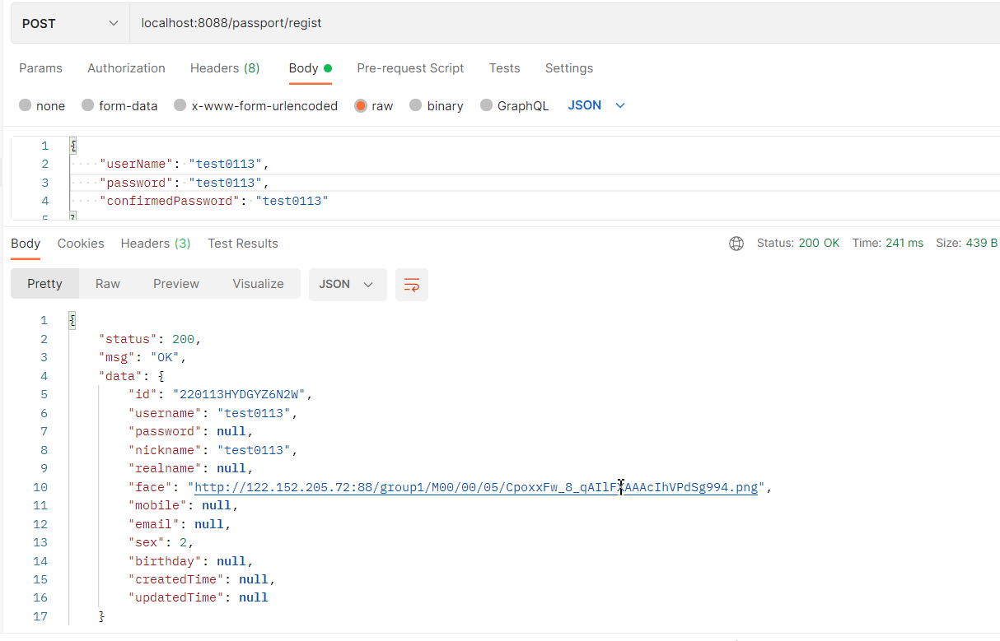

````
localhost:8088/passport/regist

{
    "userName": "test0113",
    "password": "test0113",
    "confirmedPassword": "test0113"
}
````

## 基于Swagger2的API文档

降低编写接口文档的时间, 通过代码生成文档API提供给前端人员

ps: Apifox: postman + swagger + mock

---

1. 引入pom依赖, foodie-dev中

```xml
<!-- swagger2 配置 -->
<dependency>
    <groupId>io.springfox</groupId>
    <artifactId>springfox-swagger2</artifactId>
    <version>2.4.0</version>
</dependency>
<dependency>
    <groupId>io.springfox</groupId>
    <artifactId>springfox-swagger-ui</artifactId>
    <version>2.4.0</version>
</dependency>
<dependency>
    <groupId>com.github.xiaoymin</groupId>
    <artifactId>swagger-bootstrap-ui</artifactId>
    <version>1.6</version>
</dependency>
```

2. 配置类

foodie-dev-api中

```java
package com.imooc.config;

import org.springframework.context.annotation.Bean;
import org.springframework.context.annotation.Configuration;
import springfox.documentation.builders.ApiInfoBuilder;
import springfox.documentation.builders.PathSelectors;
import springfox.documentation.builders.RequestHandlerSelectors;
import springfox.documentation.service.ApiInfo;
import springfox.documentation.service.Contact;
import springfox.documentation.spi.DocumentationType;
import springfox.documentation.spring.web.plugins.Docket;
import springfox.documentation.swagger2.annotations.EnableSwagger2;

/**
 * swagger2相关配置
 *
 * http://localhost:8088/swagger-ui.html     原路径
 * http://localhost:8088/doc.html     原路径
 */
@Configuration
// 开启swagger2
@EnableSwagger2
public class Swagger2Config {


    // 配置swagger2核心配置, docket
    @Bean
    public Docket createRestApi() {
        // 响应式编程风格

        return new Docket(DocumentationType.SWAGGER_2) // 指定api类型为swagger2
                // 定义api文档汇总信息
                .apiInfo(apiInfo())
                .select()
                // 扫描包所在地址指定controller包. 选择器
                .apis(RequestHandlerSelectors.basePackage("com.imooc.controller"))
                // 所有controller
                .paths(PathSelectors.any())
                .build();
    }

    /**
     * 定义api文档汇总信息
     *
     * @return ApiInfo
     */
    private ApiInfo apiInfo() {
        return new ApiInfoBuilder()
                .title("foodie-dev api")        // 文档页标题
                .contact(new Contact("imooc",
                        "https://www.imooc.com",
                        "abc@imooc.com"))        // 联系人信息
                .description("foodie-dev api dec")  // 详细信息
                .version("1.0.1")   // 文档版本号
                .termsOfServiceUrl("https://www.imooc.com") // 网站地址
                .build();
    }
}
```

浏览器访问: `http://localhost:8088/swagger-ui.html`, 官方提供的网址


xml中依赖了github自定义的swagger2, -> `http://localhost:8088/doc.html`, 修改页面风格

---

自定义优化swagger2显示

1. @ApiIgnore忽略不需要显示的类

```java
@RestController
@ApiIgnore
public class StuDemoController {}
```

```java
@RestController
@ApiIgnore
public class HelloController {}
```

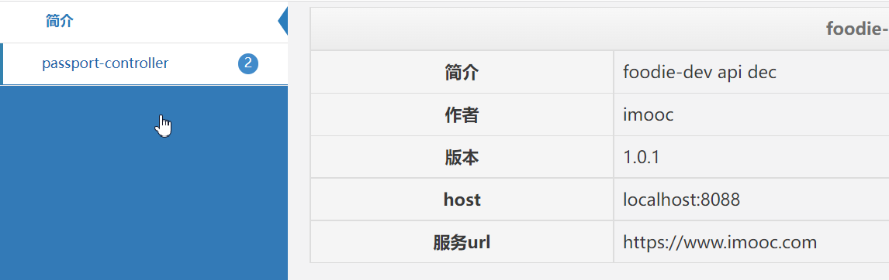


2.@Api用在请求类上做说明

```java
@Api(value = "register and login", tags = {"apis for register and login"})
@RestController
@RequestMapping("passport")
public class PassportController {}
```

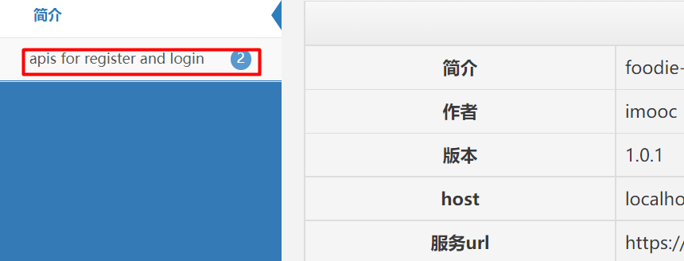

3. @ApiOperation用在请求的方法上，说明方法的用途、作用

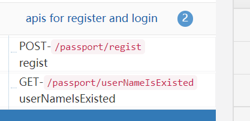

路由名称修改.

```java
@ApiOperation(value = "whether user name is existed",
              notes = "whether user name is existed", httpMethod = "GET")
@GetMapping("/userNameIsExisted")
public JSONResult userNameIsExisted(@RequestParam String userName) {}
```

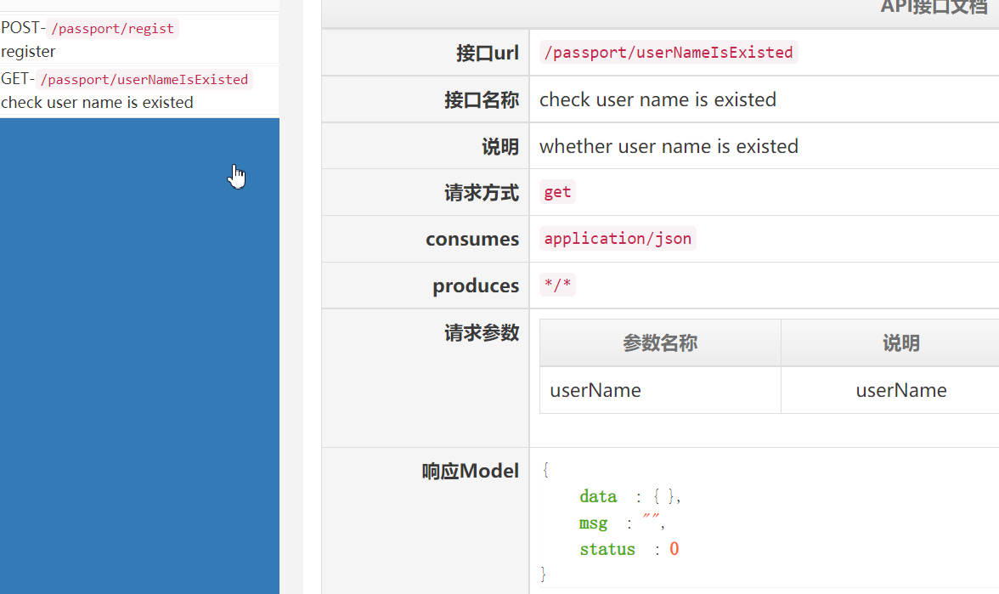

```java
@ApiOperation(value = "register", notes = "register user", httpMethod = "POST")
@PostMapping("/regist")
public JSONResult regist(@RequestBody UserBO userBO) {}
```

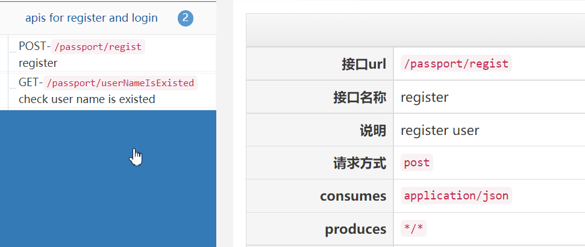

4. @ApiModel和@ApiModelProperty

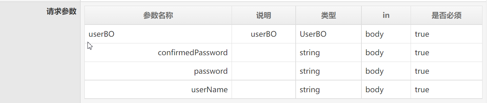

```java
@ApiModel(value = "user business object",
        description = "From client, the data passed in by the user is formed in this entity")
public class UserBO {
    @ApiModelProperty(value = "user name", name = "userName",
            example = "imooc", required = true)
    private String userName;

    @ApiModelProperty(value = "password", name = "password, md5",
            example = "imooc", required = true)
    private String password;

    @ApiModelProperty(value = "confirmed password", name = "confirmedPassword, md5",
            example = "123456", required = true)
    private String confirmedPassword;
}
```

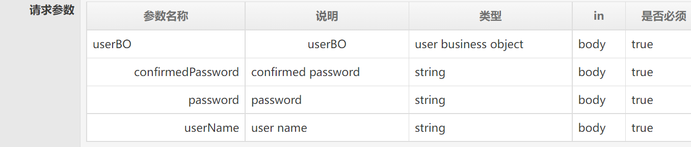

---

总结: 

```
@Api：用在请求的类上，表示对类的说明
    tags="说明该类的作用，可以在UI界面上看到的注解"
    value="该参数没什么意义，在UI界面上也看到，所以不需要配置"

@ApiOperation：用在请求的方法上，说明方法的用途、作用
    value="说明方法的用途、作用"
    notes="方法的备注说明"

@ApiImplicitParams：用在请求的方法上，表示一组参数说明
    @ApiImplicitParam：用在@ApiImplicitParams注解中，指定一个请求参数的各个方面
        name：参数名
        value：参数的汉字说明、解释
        required：参数是否必须传
        paramType：参数放在哪个地方
            · header --> 请求参数的获取：@RequestHeader
            · query --> 请求参数的获取：@RequestParam
            · path（用于restful接口）--> 请求参数的获取：@PathVariable
            · body（不常用）
            · form（不常用）    
        dataType：参数类型，默认String，其它值dataType="Integer"       
        defaultValue：参数的默认值

@ApiResponses：用在请求的方法上，表示一组响应
    @ApiResponse：用在@ApiResponses中，一般用于表达一个错误的响应信息
        code：数字，例如400
        message：信息，例如"请求参数没填好"
        response：抛出异常的类

@ApiModel：用于响应类上，表示一个返回响应数据的信息
            （这种一般用在post创建的时候，使用@RequestBody这样的场景，
            请求参数无法使用@ApiImplicitParam注解进行描述的时候）
    @ApiModelProperty：用在属性上，描述响应类的属性
    
@ApiIgnore: 当前类不需要显示
```


## 前后端联调

### tomcat运行前端

静态资源服务器, 后续会使用nginx发布前端代码, 这里先使用tomcat

内置的tomcat版本

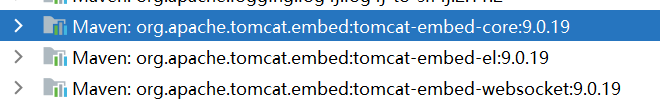

tomcat9版本

1. 将foodie-shop拷贝到apache-tomcat-9.0.13\webapps中

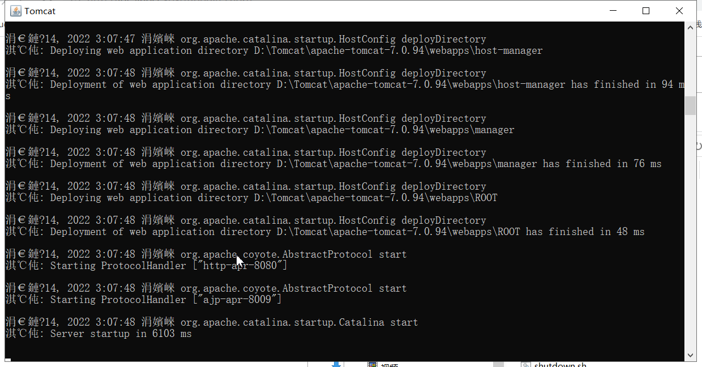

实际运行的tomcat是按照配置的环境变量来的

[windows下配置两个或多个Tomcat启动的方法](https://blog.51cto.com/beyang/3271017)

2. bin中启动tomcat

```
startup.bat
```

3. 浏览器访问

`http://localhost:8080/foodie-shop|`

F12可以看到报错, 后续需要修改

### 设置跨域配置实现前后端联调

1. 查看调用

前端的register.html代码中找到发送后端的代码

```html
var serverUrl = app.serverUrl;
var returnUrl = this.returnUrl;
// form提交
axios.defaults.withCredentials = true;
// console.log(axios.defaults);
axios.post(serverUrl + '/passport/regist', userBO)
```

可以看到是app.serverUrl, 查看app

```
<script type="text/javascript " src="js/app.js"></script>
```

所以在js/app.js中查看

```javascript
/* 开发环境 */
// serverUrl: "http://localhost:8088",                                   // 接口服务接口地址
// paymentServerUrl: "http://192.168.1.3:8089",                            // 支付中心服务地址
// shopServerUrl: "http://localhost:8080/foodie-shop/",                  // 门户网站地址
// centerServerUrl: "http://localhost:8080/foodie-center/",              // 用户中心地址
// cookieDomain: "",                                                       // cookie 域

/* 生产环境 */
serverUrl: "http://api.z.mukewang.com:8088/foodie-dev-api",                      // 接口服务接口地址
    paymentServerUrl: "http://payment.t.mukewang.com/foodie-payment",       // 支付中心服务地址
        shopServerUrl: "http://shop.z.mukewang.com:8080/foodie-shop/",                            // 门户网站地址
            centerServerUrl: "http://center.z.mukewang.com:8080/foodie-center/",                        // 用户中心地址
cookieDomain: ".z.mukewang.com;",                                       // cookie 域
```

使用开发环境, serverUrl修改为本地的地址和端口

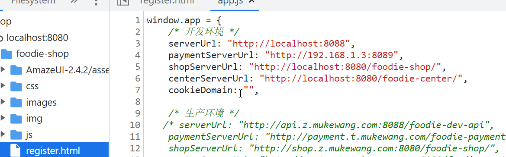

然后在前台注册界面中输入imooc, 看到控制台中输出

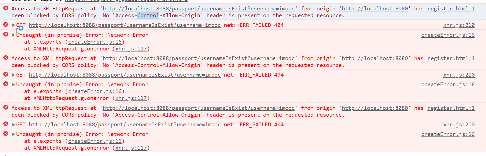

CORS跨域问题, 需要设置. 8080端口请求8088端口, 发生跨域

ps: 前端的请求axios, 是vue中的异步提交组件

2. 后端添加CORS配置类, 添加前端地址

foodie-dev-api中添加CorsConfig

```java
package com.imooc.config;

import org.springframework.context.annotation.Bean;
import org.springframework.context.annotation.Configuration;
import org.springframework.web.cors.CorsConfiguration;
import org.springframework.web.cors.UrlBasedCorsConfigurationSource;
import org.springframework.web.filter.CorsFilter;

@Configuration
public class CorsConfig {

    public CorsConfig() {

    }

    @Bean
    public CorsFilter corsFilter() {
        // 1. 添加cors配置信息
        CorsConfiguration corsConfig = new CorsConfiguration();
        corsConfig.addAllowedOrigin("http://localhost:8080");

        // 请求数据是否可以携带内容, 是否可以发送cookie信息
        corsConfig.setAllowCredentials(true);

        // 设置允许请求的方式
        corsConfig.addAllowedMethod("*");

        // 设置允许的header
        corsConfig.addAllowedHeader("*");

        // 2. 为url添加映射路径
        // /**: 所有的路由
        UrlBasedCorsConfigurationSource corsConfigSource = new UrlBasedCorsConfigurationSource();
        corsConfigSource.registerCorsConfiguration("/**", corsConfig);

        return new CorsFilter(corsConfigSource);
    }
}
```

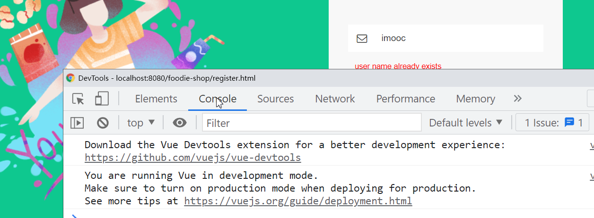

注册后成功插入数据库

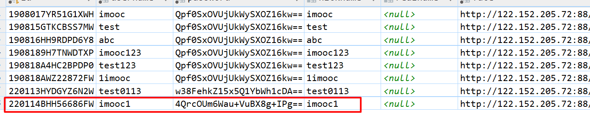


## 登陆


### 实现登录


## cookie和session


## 用户信息在页面显示


## 日志

### 整合log4j打印日志


### 通过日志监控service执行时间


## 用户退出登录清空cookie


## 开启MyBatis日志Sql打印


# 分类实现


# 商品推荐


# 搜索


# 商品评价


# 购物车


# 收货地址


# 订单

## 确认订单


## 创建订单


# 支付


# 定时任务


# 用户中心


## 用户信息


## 用户头像


## 用户订单管理


## 用户评价管理


## 用户中心首页


# 云服务部署


# Ref

[Java架构师-技术专家](https://class.imooc.com/javaarchitect#Anchor), 地基项目

* 第1周  万丈高楼，地基首要

* 第2周  分类，推荐，搜索，评价，购物车开发

* 第3周  地址，订单，支付，定时任务开发

* 第4周  用户中心 ,订单/评价管理开发

* 第5周  云服务器部署上线

---

[Java工程师](https://class.imooc.com/sale/java2021)中的Redis缓存


