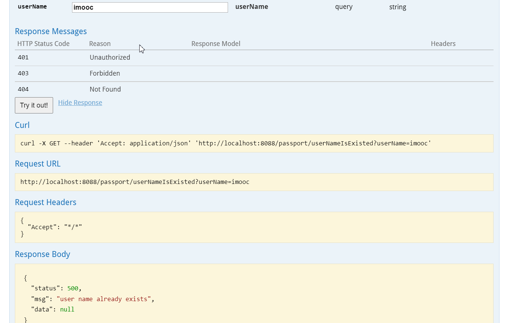
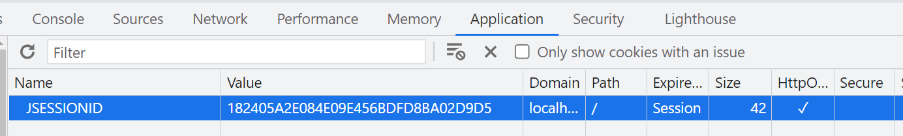
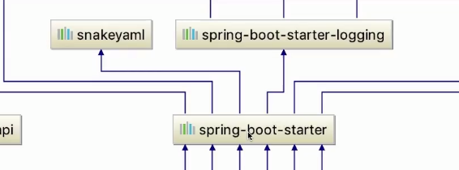

# 介绍

前端懒加载模式, 滑动到对应区域再进行加载, 减少压力

## 技术选型

### Spring boot还是Spring MVC

* Spring MVC是框架, Spring Boot是工具, 需要什么工具引入依赖

* 从xml繁琐配置到零配置yml

* Spring boot集成了多样化中间件(`*-starter*`)

* tomcat内置

Struts: MVC框架, 老项目中使用. 

* 有安全漏洞, 
* 请求变量共享(线程安全问题), 
* Filter拦截类拦截. SpringMVC和Springboot是基于AOP的filter
* 非Spring官方

### 前端选型

MVVM开发模式: Model–view–viewmode. [MVC, MVP 和 MVVM 的图示](https://www.ruanyifeng.com/blog/2015/02/mvcmvp_mvvm.html)

JQuery, Vue.js(渐进式开发模式)

html, css. 界面样式

### 技术选型需要考虑的

切合业务, 社区活跃度, 团队技术经验, 版本更新迭代周期(dubbo的停更), 试错, 安全性(Struts), 成功案例, 开源

## 前后端分离开发模式

### 传统Java web模式


jsp渲染过程也是在后端处理, 对服务器压力大.

### 前后端单页面交互, MVVM


* 静态资源存储在静态资源服务器Nginx中,返回H5

* 可以进行并行开发

## 后台项目拆分和聚合

最终的war包或者jar包, 由其他jar聚合而成

maven聚合拆分项目, 将项目拆成子模块, 按需给其他项目提供依赖


# 项目构建

## 新建maven工程

1. 因为是聚合项目, 在最外层中添加packaging, 打包方式, 默认是jar

```xml
<?xml version="1.0" encoding="UTF-8"?>
<project xmlns="http://maven.apache.org/POM/4.0.0"
         xmlns:xsi="http://www.w3.org/2001/XMLSchema-instance"
         xsi:schemaLocation="http://maven.apache.org/POM/4.0.0 http://maven.apache.org/xsd/maven-4.0.0.xsd">
    <modelVersion>4.0.0</modelVersion>

    <groupId>org.example</groupId>
    <artifactId>foodie-dev</artifactId>
    <version>1.0-SNAPSHOT</version>

    <properties>
        <maven.compiler.source>8</maven.compiler.source>
        <maven.compiler.target>8</maven.compiler.target>
    </properties>

    <packaging>pom</packaging>

</project>
```

2. 添加子项目foodie-dev-common

右键新增module, 当前项目的子工程foodie-dev-common

所有子模块的打包方式都是jar包(默认)

```
1. 聚合工程里可以分为顶级项目(顶级工程、父工程)与子工程, 这两者的关系就是父子继承的关系. 
子工程在maven里称之为模块(module), 模块之间是平级, 是可以相互依赖的. 
2. 子模块可以使用顶级工程里所有的资源(依赖), 子模块之间如果要使用资源, 必须构建依赖(构建关系)
3. 一个顶级工程是可以由多个不同的子工程共同组合而成. 
```

3. 添加子项目foodie-dev-pojo

entity


让pojo依赖common, foodie-dev-pojo中的pom文件中添加依赖

```hxml
<dependencies>
    <dependency>
        <groupId>org.example</groupId>
        <artifactId>foodie-dev-common</artifactId>
        <version>1.0-SNAPSHOT</version>
    </dependency>
</dependencies>
```

4. 添加数据层子项目foodie-dev-mapper

数据层中对应生成接口, 与mapper.xml做映射一一对应.

在resources下新建mapper文件夹, 其中的xml文件与数据库一一对应 -> 数据层foodie-dev-api的application.yml中配置数据源和mybatis

mapper中依赖pojo, 同时注意, 因为pojo依赖common. 所以mapper可以通过pojo使用common中对应方法

```xml
<!-- mapper -> pojo -> common
            所以mapper通过pojo可以使用common中对应方法
         -->
<dependency>
    <groupId>org.example</groupId>
    <artifactId>foodie-dev-pojo</artifactId>
    <version>1.0-SNAPSHOT</version>
</dependency>
```

5. 添加子项目foodie-dev-service, service中调用mapper

service -> mapper -> pojo -> common

```xml
<dependency>
    <groupId>org.example</groupId>
    <artifactId>foodie-dev-mapper</artifactId>
    <version>1.0-SNAPSHOT</version>
</dependency>
```

6. 接口层, 添加子项目foodie-dev-api, 提供接口(controller)

```xml
<!-- api -> service -> mapper -> pojo -> common -->
<dependency>
    <groupId>org.example</groupId>
    <artifactId>foodie-dev-service</artifactId>
    <version>1.0-SNAPSHOT</version>
</dependency>
```

api不应该直接调用mapper, 应该通过service去操作数据

7. 建立依赖关系


务必在根目录下点击install安装操作, 才会存在子模块之间的依赖关系, 可以真正使用子模块调用相关方法

类比汽车子零件安装使用

---

* package命令完成了项目编译、单元测试、打包功能, 但没有把打好的可执行jar包（war包或其它形式的包）布署到本地maven仓库和远程maven私服仓库
* install命令完成了项目编译、单元测试、打包功能, 同时把打好的可执行jar包（war包或其它形式的包）布署到本地maven仓库, 但没有布署到远程maven私服仓库
* deploy命令完成了项目编译、单元测试、打包功能, 同时把打好的可执行jar包（war包或其它形式的包）布署到本地maven仓库和远程maven私服仓库

## 修改启动项目前务必install

修改模块的代码后需要在foodie-dev中重新install, 否则找不到对应的方法. 类比汽车零件修改后要重新安装


## 设计数据库

[PDMan](http://www.pdman.cn/#/), 元数据建模工具. foodie-dev.pdman.json. 项目: foodie-dev.pdman.json

增量同步: 修改表

全量同步: drop旧表, 新建新表

---

数据库外键:

* 性能影响. 三范式. -> 移除物理外键
* 热更新. 分布式场景下, 项目绝大多数情况下进行热更新, 不停机维护. 外键可能导致新更新的无法运行, 需要重启服务器. 外键强依赖性
* 降低耦合度. 删除外键并不是真的全都删除, 而是删除物理外键, 物理的一层关系不需要了. 
  * 物理和逻辑. 逻辑: 用户地址和用户表, userId为外键, 关联两张表, 不需要设置物理外键, 依赖关系还是存在的

* 数据分库分表. 外键关联难以做分库分表, 

## 聚合工程整合

启动springboot

### 在根项目的pom中引入

1. 引入依赖parent

```xml
<parent>
    <groupId>org.springframework.boot</groupId>
    <artifactId>spring-boot</artifactId>
    <version>2.1.5.RELEASE</version>
    <relativePath/>
</parent>
```

2. 设置资源属性

```xml
<properties>
    <maven.compiler.source>8</maven.compiler.source>
    <maven.compiler.target>8</maven.compiler.target>

    <project.build.sourceEncoding>UTF-8</project.build.sourceEncoding>
    <project.reporting.outputEncoding>UTF-8</project.reporting.outputEncoding>
    <java.version>1.8</java.version>
</properties>
```

3. 引入依赖

````xml
<dependencies>
    <dependency>
        <groupId>org.springframework.boot</groupId>
        <artifactId>spring-boot-starter</artifactId>
        <exclusions>
            <exclusion>
                <groupId>org.springframework.boot</groupId>
                <artifactId>spring-boot-starter-logging</artifactId>
            </exclusion>
        </exclusions>
    </dependency>

    <dependency>
        <groupId>org.springframework.boot</groupId>
        <artifactId>spring-boot-starter-web</artifactId>
    </dependency>
    
	<!-- 默认解析yml, 引入该依赖可以解析其他格式的配置文件 -->
    <dependency>
        <groupId>org.springframework.boot</groupId>
        <artifactId>spring-boot-configuration-processor</artifactId>
        <optional>true</optional>
    </dependency>
</dependencies>
````

这里不需要写版本是因为在``<parent>``的依赖中的

```xml
<parent>
    <groupId>org.springframework.boot</groupId>
    <artifactId>spring-boot-dependencies</artifactId>
    <version>2.1.5.RELEASE</version>
    <relativePath>../../spring-boot-dependencies</relativePath>
</parent>
```

其中的spring-boot-dependencies中已经声明了依赖


### foodie-dev-api 101

创建yml配置文件

* foodie-dev-api中

1.resources新增配置文件application.yml

2.新增启动类

```java
package com.imooc;

import org.springframework.boot.SpringApplication;
import org.springframework.boot.autoconfigure.SpringBootApplication;

@SpringBootApplication
public class Application {
    public static void main(String[] args) {
        SpringApplication.run(Application.class, args);
    }
}
```

3. 新增controller, hello程序

```java
package com.imooc.controller;

import org.springframework.web.bind.annotation.GetMapping;
import org.springframework.web.bind.annotation.RestController;

@RestController
public class HelloController {

    @GetMapping("/hello")
    public Object hello() {
        return "hello world";
    }
}
```


# 面试题: Spring Boot自动装配, 如何启动内置Tomcat的?

1. 跟踪源代码, 查看SpringApplication.run方法源代码

```java
/**
	 * Static helper that can be used to run a {@link SpringApplication} from the
	 * specified source using default settings.
	 * @param primarySource the primary source to load
	 * @param args the application arguments (usually passed from a Java main method)
	 * @return the running {@link ApplicationContext}
	 */
public static ConfigurableApplicationContext run(Class<?> primarySource,
                                                 String... args) {
    return run(new Class<?>[] { primarySource }, args);
}
```

primarySource就是要加载的source.

其中提到`using default settings`, 这里的默认配置是在注解@SpringBootApplication中的

最后返回一个`running ApplicationContext`

2. 查看@SpringBootApplication注解

```java
@Target(ElementType.TYPE)
@Retention(RetentionPolicy.RUNTIME)
@Documented
@Inherited
@SpringBootConfiguration
@EnableAutoConfiguration
@ComponentScan(excludeFilters = {
		@Filter(type = FilterType.CUSTOM, classes = TypeExcludeFilter.class),
		@Filter(type = FilterType.CUSTOM,
				classes = AutoConfigurationExcludeFilter.class) })
public @interface SpringBootApplication {}
```

重点是@SpringBootConfiguration, @EnableAutoConfiguration, @ComponentScan

* @ComponentScan扫描, 默认是在当前包和子包中的类, 例如这的Application所在的com.imooc包下的子包controller中的@RESTController就被加载到了容器中

* SpringBootConfiguration

```java
@Target(ElementType.TYPE)
@Retention(RetentionPolicy.RUNTIME)
@Documented
@Configuration
public @interface SpringBootConfiguration {}
```

其中的@Configuration注解 -> 就是一个容器, 类似Spring中写xml配置的beans包含了一个个bean, IOC容器

* @EnableAutoConfiguration

用来开启自动装配

```java
@Target(ElementType.TYPE)
@Retention(RetentionPolicy.RUNTIME)
@Documented
@Inherited
@AutoConfigurationPackage
@Import(AutoConfigurationImportSelector.class)
public @interface EnableAutoConfiguration {}
```

其中的@Import

```java
Indicates one or more {@link Configuration @Configuration} classes to import.
```

AutoConfigurationImportSelector.class, 自动装配导入的选择器

```java
@Override
public String[] selectImports(AnnotationMetadata annotationMetadata) {
    if (!isEnabled(annotationMetadata)) {
        return NO_IMPORTS;
    }
    AutoConfigurationMetadata autoConfigurationMetadata = AutoConfigurationMetadataLoader
        .loadMetadata(this.beanClassLoader);
    AutoConfigurationEntry autoConfigurationEntry = getAutoConfigurationEntry(
        autoConfigurationMetadata, annotationMetadata);
    return StringUtils.toStringArray(autoConfigurationEntry.getConfigurations());
}
```

选择要导入的类, 其中的getAutoConfigurationEntry:

```java
protected AutoConfigurationEntry getAutoConfigurationEntry(
    AutoConfigurationMetadata autoConfigurationMetadata,
    AnnotationMetadata annotationMetadata) {
    if (!isEnabled(annotationMetadata)) {
        return EMPTY_ENTRY;
    }
    AnnotationAttributes attributes = getAttributes(annotationMetadata);
    List<String> configurations = getCandidateConfigurations(annotationMetadata,
                                                             attributes);
    configurations = removeDuplicates(configurations);
    Set<String> exclusions = getExclusions(annotationMetadata, attributes);
    checkExcludedClasses(configurations, exclusions);
    configurations.removeAll(exclusions);
    configurations = filter(configurations, autoConfigurationMetadata);
    fireAutoConfigurationImportEvents(configurations, exclusions);
    return new AutoConfigurationEntry(configurations, exclusions);
}
```

关注其中的`List<String> configurations`, 就是配置. 再看其中的getCandidateConfigurations方法

```java
protected List<String> getCandidateConfigurations(AnnotationMetadata metadata,
                                                  AnnotationAttributes attributes) {
    List<String> configurations = SpringFactoriesLoader.loadFactoryNames(
        getSpringFactoriesLoaderFactoryClass(), getBeanClassLoader());
    Assert.notEmpty(configurations,
                    "No auto configuration classes found in META-INF/spring.factories. If you "
                    + "are using a custom packaging, make sure that file is correct.");
    return configurations;
}
```


其中的spring.factories中就是自动装配的类

```
org.springframework.boot.autoconfigure.web.embedded.EmbeddedWebServerFactoryCustomizerAutoConfiguration,\
```

点击查看类

```java
@Configuration
@ConditionalOnClass({ Tomcat.class, UpgradeProtocol.class })
public static class TomcatWebServerFactoryCustomizerConfiguration {

    @Bean
    public TomcatWebServerFactoryCustomizer tomcatWebServerFactoryCustomizer(
        Environment environment, ServerProperties serverProperties) {
        return new TomcatWebServerFactoryCustomizer(environment, serverProperties);
    }

}
```

Tomcat.class: SpringBoot内置的tomcat, 点入看到, 默认端口8080, 默认hostname: localhost

---

```
org.springframework.boot.autoconfigure.web.servlet.WebMvcAutoConfiguration,\
```

自动装配web mvc

```java
/**
 * {@link EnableAutoConfiguration Auto-configuration} for {@link EnableWebMvc Web MVC}.
 */
```

---
```
org.springframework.boot.autoconfigure.web.servlet.ServletWebServerFactoryAutoConfiguration,\
```

```java
/**
 * {@link EnableAutoConfiguration Auto-configuration} for servlet web servers. */
```

```java
@Bean
@ConditionalOnClass(name = "org.apache.catalina.startup.Tomcat")
public TomcatServletWebServerFactoryCustomizer tomcatServletWebServerFactoryCustomizer(
    ServerProperties serverProperties) {
    return new TomcatServletWebServerFactoryCustomizer(serverProperties);
}
```

运行Application, 内置的tomcat也随之启动

在spring.factories中包含了许多自动转配的类

---

@SpringBootApplication -> @EnableAutoConfiguration ->  @Import(AutoConfigurationImportSelector.class) -> AutoConfigurationImportSelector.class -> selectImports -> getAutoConfigurationEntry -> getCandidateConfigurations -> loadFactoryNames


```java
/**
	 * Load the fully qualified class names of factory implementations of the
	 * given type from {@value #FACTORIES_RESOURCE_LOCATION}, using the given
	 * class loader.
	 * @param factoryClass the interface or abstract class representing the factory
	 * @param classLoader the ClassLoader to use for loading resources; can be
	 * {@code null} to use the default
	 * @throws IllegalArgumentException if an error occurs while loading factory names
	 * @see #loadFactories
	 */
public static List<String> loadFactoryNames(Class<?> factoryClass, @Nullable ClassLoader classLoader) {
    String factoryClassName = factoryClass.getName();
    return loadSpringFactories(classLoader).getOrDefault(factoryClassName, Collections.emptyList());
}
```

其中:

```java
public static final String FACTORIES_RESOURCE_LOCATION = "META-INF/spring.factories";
```

# 数据层

foodie-shop-dev.sql -> mysql5.7 run sql script

## HikariCP数据源

### 简述

HikariCP: SpringBoot2.x的默认数据源(默认数据库连接池). 速度快


[为什么HikariCP快](https://github.com/brettwooldridge/HikariCP/wiki/Down-the-Rabbit-Hole)

ali: Durid

### 整合HikariCP

数据层HikariCP与MyBatis整合

1. pom中引入数据源驱动与mybatis依赖

foodie-dev的pom中

```xml
<!-- 数据库驱动 -->
<dependency>
    <groupId>mysql</groupId>
    <artifactId>mysql-connector-java</artifactId>
    <version>5.1.41</version>
</dependency>

<!-- mybatis -->
<dependency>
    <groupId>org.mybatis.spring.boot</groupId>
    <artifactId>mybatis-spring-boot-starter</artifactId>
    <version>2.1.0</version>
</dependency>
```

2. foodie-dev-api的application.yml中配置数据源和mybatis

```yaml
############################################################
#
#
# 配置数据源信息
#
############################################################
spring:
  datasource: # 数据源的相关配置
    type: com.zaxxer.hikari.HikariDataSource   # 数据源类型: HikariCP
    driver-class-name: com.mysql.jdbc.Driver   # mysql驱动
    url: jdbc:mysql://114.55.64.149:3306/foodie-shop-dev?useUnicode=true&characterEncoding=UTF-8&autoReconnect
    username: root
    password:

    hikari:
      connection-timeout: 30000 # 等待连接池分配连接的最大时长(毫秒), 超过这个时长还没可用的连接则发生SQLException, 默认:30秒
      minimum-idle: 5 # 最小连接数
      maximum-pool-size: 20 # 最大连接数
      auto-commit: true # 自动提交
      idle-timeout: 600000 # 连接超时的最大时长(毫秒), 超时则被释放(retired),默认:10分钟
      pool-name: DataSourceHikariCP # 连接池名称
      max-lifetime: 1800000 # 连接的生命时长(毫秒),超时而且没被使用则被释放(retired), 默认:30分钟 1800000ms
      connection-test-query: select 1


############################################################
#
# mybatis 配置
#
############################################################
mybatis:
  type-aliases-package: com.imooc.pojo # 所有pojo类(entity)所在的包路径
  mapper-locations: classpath:mapper/*.xml # mapper映射文件
```

其中在foodie-dev-pojo的java目录下新建包com.imooc.pojo以便扫描

在foodie-dev-mapper的resources下新建mapper文件夹, 后续的文件就是放在xml下的

classpath就是所有的resources

todo: 为什么这里不同包下的文件可以配置到

---

内置tomcat配置:

foodie-dev-api的application.yml中

```yaml
#
# 内置tomcat, web访问端口号  约定：8088
#
############################################################
server:
  port: 8088
  tomcat:
    uri-encoding: UTF-8
  max-http-header-size: 80KB
```

8080端口后续给静态资源服务器

浏览器访问: `localhost:8088/hello`

---

hikari:
      minimum-idle: 5 # 最小连接数
      maximum-pool-size: 20 # 最大连接数

默认最大连接数10. 最大连接数和服务器配置有关, 同时并不是越大越好. 四核->10, 八核->20

作者的观点希望最大最小一致, 固定连接池大小, 系统一般不会出现闲置情况

## MyBatis逆向生成工具

生成Pojo, Mapper.xml, mapperxml对接接口映射类

Mybatis-generator工具, 其中集成MyMapper工具


工具项目: mybatis-generator-for-imooc

generatorConfig.xml文件中设置table

```xml
<table tableName="carousel"/>
<table tableName="category"/>
<table tableName="items"/>
<table tableName="items_comments"/>
<table tableName="items_img"/>
<table tableName="items_param"/>
<table tableName="items_spec"/>
<table tableName="order_items"/>
<table tableName="order_status"/>
<table tableName="orders"/>
<table tableName="user_address"/>
<table tableName="users"/>
```

生成文件后拷贝到自己的项目中


---

使用工具

1. 在根pom中添加通用mapper工具

foodie-dev.pom中添加

```xml
<!-- 通用mapper逆向工具 -->
<dependency>
    <groupId>tk.mybatis</groupId>
    <artifactId>mapper-spring-boot-starter</artifactId>
    <version>2.1.5</version>
</dependency>
```

2. 在yml中引入通用mapper配置

在api层中, foodie-dev-api中添加

```yaml
############################################################
#
# mybatis mapper 配置
#
############################################################
# 通用Mapper配置
mapper:
  mappers: com.imooc.my.mapper.MyMapper
  not-empty: false # 在进行数据库操作的的时候, 判断表达式 username != null, 是否追加 username != ''
  identity: MYSQL
```

not-empty: 做更新等操作判断属性是否为空,  

在进行数据库操作的的时候, 判断表达式 username != null, 是否追加 username != ''

建议自己手写, 不要依赖框架 


3. 引入MyMapper接口类

```java
/*
 * The MIT License (MIT)
 *
 * Copyright (c) 2014-2016 abel533@gmail.com
 *
 * Permission is hereby granted, free of charge, to any person obtaining a copy
 * of this software and associated documentation files (the "Software"), to deal
 * in the Software without restriction, including without limitation the rights
 * to use, copy, modify, merge, publish, distribute, sublicense, and/or sell
 * copies of the Software, and to permit persons to whom the Software is
 * furnished to do so, subject to the following conditions:
 *
 * The above copyright notice and this permission notice shall be included in
 * all copies or substantial portions of the Software.
 *
 * THE SOFTWARE IS PROVIDED "AS IS", WITHOUT WARRANTY OF ANY KIND, EXPRESS OR
 * IMPLIED, INCLUDING BUT NOT LIMITED TO THE WARRANTIES OF MERCHANTABILITY,
 * FITNESS FOR A PARTICULAR PURPOSE AND NONINFRINGEMENT. IN NO EVENT SHALL THE
 * AUTHORS OR COPYRIGHT HOLDERS BE LIABLE FOR ANY CLAIM, DAMAGES OR OTHER
 * LIABILITY, WHETHER IN AN ACTION OF CONTRACT, TORT OR OTHERWISE, ARISING FROM,
 * OUT OF OR IN CONNECTION WITH THE SOFTWARE OR THE USE OR OTHER DEALINGS IN
 * THE SOFTWARE.
 */

package com.imooc.my.mapper;

import tk.mybatis.mapper.common.Mapper;
import tk.mybatis.mapper.common.MySqlMapper;

/**
 * 继承自己的MyMapper
 */
public interface MyMapper<T> extends Mapper<T>, MySqlMapper<T> {
}
```

4. 验证

maven install

运行后访问/hello查看是否出错

## 通过mapper基于RESTful编写api接口
### RESTful Web Service

* 一种通信方式, 
* 信息传递, 现在流行json传输
* 无状态: RESTful Web Service的特点, 服务器接收客户端请求, 对于服务器无需了解request之前做了什么, 接下来可能做什么. -> 后续的分布式会话. session会话(单机中存在, 有状态)

* 独立性. 系统与系统之间解耦

---

设计规范: -> Spring MVC中

GET -> /order/{id} -> /getOrder?id=1001

POST -> /order . 其他的构建JSON对象给后端 -> /saveOrder

PUT -> /order/{id} -> modifyOrder

DELETE -> /order/{id} -> deleteOrder?id=1001

最右侧的url直观, 降低沟通成本

### 编写api接口

基于webservice的CRUD -> Stu表来做demo

get请求: getStu

post请求:saveStu, updateStu, deleteStu

1. Controller层

foodie-dev-api中

```java
package com.imooc.controller;

import com.imooc.service.StuService;
import org.springframework.beans.factory.annotation.Autowired;
import org.springframework.web.bind.annotation.GetMapping;
import org.springframework.web.bind.annotation.PostMapping;
import org.springframework.web.bind.annotation.RestController;

@RestController
public class StuDemoController {

    @Autowired
    private StuService stuService;

    @GetMapping("/getStu")
    public Object getStu(Integer id) {
        return stuService.getStuInfo(id);
    }

    @PostMapping("/saveStu")
    public Object saveStu() {
        stuService.saveStu();
        return "saveStu OK";
    }

    @PostMapping("/updateStu")
    public Object updateStu(int id) {
        stuService.updateStu(id);
        return "updateStu OK";
    }

    @PostMapping("/deleteStu")
    public Object deleteStu(int id) {
        stuService.deleteStu(id);
        return "deleteStu OK";
    }
}
```

2. service层

foodie-dev-service

```java
package com.imooc.service;

import com.imooc.pojo.Stu;

public interface StuService {

    /**
     * 根据id获取student info
     *
     * @param id
     * @return
     */
    public Stu getStuInfo(Integer id);

    /**
     * 保存学生数据, 一般由前端穿来, 这边直接写死
     */
    public void saveStu();

    /**
     * update
     *
     * @param id
     */
    public void updateStu(Integer id);

    /**
     * delete
     *
     * @param id
     */
    public void deleteStu(Integer id);
    public void saveParent();
    public void saveChildren();
}
```

impl:

```java
package com.imooc.service.impl;

import com.imooc.mapper.StuMapper;
import com.imooc.pojo.Stu;
import com.imooc.service.StuService;
import org.springframework.beans.factory.annotation.Autowired;
import org.springframework.stereotype.Service;
import org.springframework.transaction.annotation.Propagation;
import org.springframework.transaction.annotation.Transactional;

import javax.swing.*;

@Service
public class StuServiceImpl implements StuService {

    @Autowired
    private StuMapper stuMapper;


    @Transactional(propagation = Propagation.SUPPORTS)
    @Override
    public Stu getStuInfo(Integer id) {
        return stuMapper.selectByPrimaryKey(id);
    }

    @Transactional(propagation = Propagation.REQUIRED)
    @Override
    public void saveStu() {
        Stu stu = new Stu();
        stu.setName("jack");
        stu.setAge(19);
        stuMapper.insert(stu);
    }


    @Transactional(propagation = Propagation.REQUIRED)
    @Override
    public void updateStu(Integer id) {
        Stu stu = new Stu();
        stu.setId(id);
        stu.setName("lucy");
        stu.setAge(20);
        stuMapper.updateByPrimaryKey(stu);
    }


    @Transactional(propagation = Propagation.REQUIRED)
    @Override
    public void deleteStu(Integer id) {
        stuMapper.deleteByPrimaryKey(id);
    }

    @Override
    public void saveParent() {

    }

    @Override
    public void saveChildren() {

    }
}
```

stuMapper中的方法由之前生成的类提供

其中的

```java
@Autowired
private StuMapper stuMapper;
```

会报错


解决报错:

首先需要让spring扫描mapper

在foodie-dev-api的Application启动类中, 添加扫描注解@MapperScan(basePackages = "com.imooc.mapper"), 扫描对应包下的类

```java
package com.imooc;

import org.springframework.boot.SpringApplication;
import org.springframework.boot.autoconfigure.SpringBootApplication;
import tk.mybatis.spring.annotation.MapperScan;

@SpringBootApplication
// 扫描 mybatis 通用 mapper 所在的包
@MapperScan(basePackages = "com.imooc.mapper")
public class Application {
    public static void main(String[] args) {
        SpringApplication.run(Application.class, args);
    }
}

```

此时已经将类添加到了容器中, 但是还是红色下划线, 需要取消此类提示, 如下所示: setting -> inspections -> spring -> spring core -> code -> 


---

幂等性说明: 

这里的一系列接口, 例如: save接口, 暂时不保证幂等性 -> 后续课程中调整幂等性

---

Problem: 

ThinkPad运行后, 报错:

```
2022-01-13 09:27:24.903 ERROR 7608 --- [nio-8088-exec-1] com.zaxxer.hikari.pool.HikariPool        : DataSourceHikariCP - Exception during pool initialization.

com.mysql.jdbc.exceptions.jdbc4.CommunicationsException: Communications link failure

The last packet successfully received from the server was 597 milliseconds ago.  The last packet sent successfully to the server was 592 milliseconds ago.
...
Caused by: javax.net.ssl.SSLHandshakeException: No appropriate protocol (protocol is disabled or cipher suites are inappropriate)
	...
2022-01-13 09:27:24.922 ERROR 7608 --- [nio-8088-exec-1] o.a.c.c.C.[.[.[/].[dispatcherServlet]    : Servlet.service() for servlet [dispatcherServlet] in context with path [] threw exception [Request processing failed; nested exception is org.mybatis.spring.MyBatisSystemException: nested exception is org.apache.ibatis.exceptions.PersistenceException: 
### Error querying database.  Cause: org.springframework.jdbc.CannotGetJdbcConnectionException: Failed to obtain JDBC Connection; nested exception is com.mysql.jdbc.exceptions.jdbc4.CommunicationsException: Communications link failure

The last packet successfully received from the server was 597 milliseconds ago.  The last packet sent successfully to the server was 592 milliseconds ago.
### The error may exist in com/imooc/mapper/StuMapper.java (best guess)
### The error may involve com.imooc.mapper.StuMapper.selectByPrimaryKey
### The error occurred while executing a query
### Cause: org.springframework.jdbc.CannotGetJdbcConnectionException: Failed to obtain JDBC Connection; nested exception is com.mysql.jdbc.exceptions.jdbc4.CommunicationsException: Communications link failure

The last packet successfully received from the server was 597 milliseconds ago.  The last packet sent successfully to the server was 592 milliseconds ago.] with root cause

javax.net.ssl.SSLHandshakeException: No appropriate protocol (protocol is disabled or cipher suites are inappropriate)
...
```

Solution: [jdk1.8版本导致SSL调用权限上有问题](https://blog.csdn.net/weixin_38111957/article/details/80577688)

ThinkPad jdk8版本:

```
java version "1.8.0_301"
Java(TM) SE Runtime Environment (build 1.8.0_301-b09)
Java HotSpot(TM) 64-Bit Server VM (build 25.301-b09, mixed mode)
```

jdk安装目录下, C:\jdk\jdk_1.8\jre\lib\security\java.security中找到并删除SSLv3, 删掉SSLv3就是允许SSL调用


但运行还是出错. 最后发现SSLv3后面有两个和它后缀一样的算法, **将它们一起删掉后重启项目**, 成功解决问题


最后的文件内容:

```
jdk.tls.disabledAlgorithms=RC4, DES, MD5withRSA, \
    DH keySize < 1024, EC keySize < 224, 3DES_EDE_CBC, anon, NULL, \
    include jdk.disabled.namedCurves
```

---

或者直接url中添加useSSL=false即可

```yaml
spring:
  datasource: # 数据源的相关配置
    type: com.zaxxer.hikari.HikariDataSource   # 数据源类型: HikariCP
    driver-class-name: com.mysql.jdbc.Driver   # mysql驱动
    url: jdbc:mysql://114.55.64.149:3306/foodie-shop-dev?useUnicode=true&characterEncoding=UTF-8&autoReconnect&useSSL=false
    username: root
    password: mypwd
```

---

浏览器访问get接口, 成功调用: `http://localhost:8088/getStu?id=1203`


### postman测试Restful接口

postman调用后端api即可


saveorder


运行代码后:


其他接口类似的测试

## 事务的传播propagation

* 事务传播行为是指多个拥有事务的方法在嵌套调用时的事务控制方式
* XML:  <tx:method name="..." propagation="REQUIRED"/>
* 注解: @Transactional(propagation=Propagation.REQUIRED)


事务传播行为七种类型: PROPAGATION

| 事务传播类型          | 说明                                                         |
| --------------------- | ------------------------------------------------------------ |
| REQUIRED <br />(默认) | 如果当前没有事务, 就新建一个事务, 如果已经存在一个事务中, 加入到这个事务中. |
| SUPPORTS              | 支持当前事务, 如果当前没有事务, 就以非事务方式执行           |
| MANDATORY             | 使用当前的事务, 如果当前没有事务, 就抛出异常                 |
| REQUIRES_NEW          | 新建事务, 如果当前存在事务, 把当前事务挂起                   |
| NOT_SUPPORTED         | 以非事务方式执行操作, 如果当前存在事务, 就把当前事务挂起     |
| NEVER                 | 以非事务方式执行, 如果当前存在事务, 则抛出异常. (几乎不用)   |
| NESTED                | 如果当前存在事务, 则在嵌套事务内执行.<br />如果当前没有事务, 则执行与PROPAGATION REQUIRED类似的操作 |

---

```java
public @interface Transactional {
    Propagation propagation() default Propagation.REQUIRED;
}
```

默认的传播方式是REQUIRED

---

api层的pom文件添加test依赖

```xml
<!-- test -->
<dependency>
    <groupId>org.springframework.boot</groupId>
    <artifactId>spring-boot-starter-test</artifactId>
    <scope>test</scope>
</dependency>
```

### 不加注解的情况

所有的方法上都不加@Transactional注解. 以下省略接口. 只记录实现

Test:

```java
@RunWith(SpringRunner.class)
@SpringBootTest(classes = Application.class)
public class TransTest {

    @Autowired
    private StuService stuService;

    @Autowired
    private TestTransService testTransService;

    @Test
    public void myTest() {
        // stuService.testPropagationTrans();
        testTransService.testPropagationTrans();
    }
}
```

TestTransServiceImpl: 

```java
package com.imooc.service.impl;

@Service
public class TestTransServiceImpl implements TestTransService {

    @Autowired
    private StuService stuService;

    // @Transactional(propagation = Propagation.REQUIRED)
    @Override
    public void testPropagationTrans() {
        stuService.saveParent();
        stuService.saveChildren();
    }
}
```

StuServiceImpl: 

```java
package com.imooc.service.impl;

@Service
public class StuServiceImpl implements StuService {

    @Autowired
    private StuMapper stuMapper;

    @Override
    public void saveParent() {
        Stu stu = new Stu();
        stu.setName("parent");
        stu.setAge(19);
        stuMapper.insert(stu);

    }

    // @Transactional(propagation = Propagation.REQUIRED)
    @Override
    public void saveChildren() {
        saveChild1();
        int a = 1 / 0;
        saveChild2();
    }

    private void saveChild1() {
        Stu stu1 = new Stu();
        stu1.setName("child-1");
        stu1.setAge(11);
        stuMapper. insert(stu1);

    }

    private void saveChild2() {
        Stu stu2 = new Stu();
        stu2.setName("child-2");
        stu2.setAge(12);
        stuMapper. insert(stu2);

    }
}
```

在不加注解的情况下, 运行test, 控制台中报错:

```
D:\JDK\jdk1.8\bin\java.exe -ea -Didea.test.cyclic.buffer.size=1048576 "-javaagent:D:\Program Files\JetBrains\IntelliJ IDEA 2021.1.2\lib\idea_rt.jar=16605:D:\Program Files\JetBrains\IntelliJ IDEA 2021.1.2\bin" -Dfile.encoding=UTF-8 -classpath "D:\Program Files\JetBrains\IntelliJ IDEA 2021.1.2\lib\idea_rt.jar;D:\Program Files\JetBrains\IntelliJ IDEA 2021.1.2\plugins\junit\lib\junit5-rt.jar;D:\Program Files\JetBrains\IntelliJ IDEA 2021.1.2\plugins\junit\lib\junit-rt.jar;D:\JDK\jdk1.8\jre\lib\charsets.jar;D:\JDK\jdk1.8\jre\lib\deploy.jar;D:\JDK\jdk1.8\jre\lib\ext\access-bridge-64.jar;D:\JDK\jdk1.8\jre\lib\ext\cldrdata.jar;D:\JDK\jdk1.8\jre\lib\ext\dnsns.jar;D:\JDK\jdk1.8\jre\lib\ext\jaccess.jar;D:\JDK\jdk1.8\jre\lib\ext\jfxrt.jar;D:\JDK\jdk1.8\jre\lib\ext\localedata.jar;D:\JDK\jdk1.8\jre\lib\ext\nashorn.jar;D:\JDK\jdk1.8\jre\lib\ext\sunec.jar;D:\JDK\jdk1.8\jre\lib\ext\sunjce_provider.jar;D:\JDK\jdk1.8\jre\lib\ext\sunmscapi.jar;D:\JDK\jdk1.8\jre\lib\ext\sunpkcs11.jar;D:\JDK\jdk1.8\jre\lib\ext\zipfs.jar;D:\JDK\jdk1.8\jre\lib\javaws.jar;D:\JDK\jdk1.8\jre\lib\jce.jar;D:\JDK\jdk1.8\jre\lib\jfr.jar;D:\JDK\jdk1.8\jre\lib\jfxswt.jar;D:\JDK\jdk1.8\jre\lib\jsse.jar;D:\JDK\jdk1.8\jre\lib\management-agent.jar;D:\JDK\jdk1.8\jre\lib\plugin.jar;D:\JDK\jdk1.8\jre\lib\resources.jar;D:\JDK\jdk1.8\jre\lib\rt.jar;E:\Github\springboot-study\foodie-study\foodie-dev-api\target\test-classes;E:\Github\springboot-study\foodie-study\foodie-dev-api\target\classes;E:\Github\springboot-study\foodie-study\foodie-dev-service\target\classes;E:\Github\springboot-study\foodie-study\foodie-dev-mapper\target\classes;E:\Github\springboot-study\foodie-study\foodie-dev-pojo\target\classes;E:\Github\springboot-study\foodie-study\foodie-dev-common\target\classes;D:\Maven\MavenRepository\org\springframework\boot\spring-boot-starter-test\2.1.5.RELEASE\spring-boot-starter-test-2.1.5.RELEASE.jar;D:\Maven\MavenRepository\org\springframework\boot\spring-boot-test\2.1.5.RELEASE\spring-boot-test-2.1.5.RELEASE.jar;D:\Maven\MavenRepository\org\springframework\boot\spring-boot-test-autoconfigure\2.1.5.RELEASE\spring-boot-test-autoconfigure-2.1.5.RELEASE.jar;D:\Maven\MavenRepository\com\jayway\jsonpath\json-path\2.4.0\json-path-2.4.0.jar;D:\Maven\MavenRepository\net\minidev\json-smart\2.3\json-smart-2.3.jar;D:\Maven\MavenRepository\net\minidev\accessors-smart\1.2\accessors-smart-1.2.jar;D:\Maven\MavenRepository\org\ow2\asm\asm\5.0.4\asm-5.0.4.jar;D:\Maven\MavenRepository\junit\junit\4.12\junit-4.12.jar;D:\Maven\MavenRepository\org\assertj\assertj-core\3.11.1\assertj-core-3.11.1.jar;D:\Maven\MavenRepository\org\mockito\mockito-core\2.23.4\mockito-core-2.23.4.jar;D:\Maven\MavenRepository\net\bytebuddy\byte-buddy\1.9.12\byte-buddy-1.9.12.jar;D:\Maven\MavenRepository\net\bytebuddy\byte-buddy-agent\1.9.12\byte-buddy-agent-1.9.12.jar;D:\Maven\MavenRepository\org\objenesis\objenesis\2.6\objenesis-2.6.jar;D:\Maven\MavenRepository\org\hamcrest\hamcrest-core\1.3\hamcrest-core-1.3.jar;D:\Maven\MavenRepository\org\hamcrest\hamcrest-library\1.3\hamcrest-library-1.3.jar;D:\Maven\MavenRepository\org\skyscreamer\jsonassert\1.5.0\jsonassert-1.5.0.jar;D:\Maven\MavenRepository\com\vaadin\external\google\android-json\0.0.20131108.vaadin1\android-json-0.0.20131108.vaadin1.jar;D:\Maven\MavenRepository\org\springframework\spring-core\5.1.7.RELEASE\spring-core-5.1.7.RELEASE.jar;D:\Maven\MavenRepository\org\springframework\spring-jcl\5.1.7.RELEASE\spring-jcl-5.1.7.RELEASE.jar;D:\Maven\MavenRepository\org\springframework\spring-test\5.1.7.RELEASE\spring-test-5.1.7.RELEASE.jar;D:\Maven\MavenRepository\org\xmlunit\xmlunit-core\2.6.2\xmlunit-core-2.6.2.jar;D:\Maven\MavenRepository\org\springframework\boot\spring-boot-starter\2.1.5.RELEASE\spring-boot-starter-2.1.5.RELEASE.jar;D:\Maven\MavenRepository\org\springframework\boot\spring-boot\2.1.5.RELEASE\spring-boot-2.1.5.RELEASE.jar;D:\Maven\MavenRepository\org\springframework\spring-context\5.1.7.RELEASE\spring-context-5.1.7.RELEASE.jar;D:\Maven\MavenRepository\org\springframework\boot\spring-boot-autoconfigure\2.1.5.RELEASE\spring-boot-autoconfigure-2.1.5.RELEASE.jar;D:\Maven\MavenRepository\javax\annotation\javax.annotation-api\1.3.2\javax.annotation-api-1.3.2.jar;D:\Maven\MavenRepository\org\yaml\snakeyaml\1.23\snakeyaml-1.23.jar;D:\Maven\MavenRepository\org\springframework\boot\spring-boot-starter-web\2.1.5.RELEASE\spring-boot-starter-web-2.1.5.RELEASE.jar;D:\Maven\MavenRepository\org\springframework\boot\spring-boot-starter-json\2.1.5.RELEASE\spring-boot-starter-json-2.1.5.RELEASE.jar;D:\Maven\MavenRepository\com\fasterxml\jackson\core\jackson-databind\2.9.8\jackson-databind-2.9.8.jar;D:\Maven\MavenRepository\com\fasterxml\jackson\core\jackson-core\2.9.8\jackson-core-2.9.8.jar;D:\Maven\MavenRepository\com\fasterxml\jackson\datatype\jackson-datatype-jdk8\2.9.8\jackson-datatype-jdk8-2.9.8.jar;D:\Maven\MavenRepository\com\fasterxml\jackson\datatype\jackson-datatype-jsr310\2.9.8\jackson-datatype-jsr310-2.9.8.jar;D:\Maven\MavenRepository\com\fasterxml\jackson\module\jackson-module-parameter-names\2.9.8\jackson-module-parameter-names-2.9.8.jar;D:\Maven\MavenRepository\org\springframework\boot\spring-boot-starter-tomcat\2.1.5.RELEASE\spring-boot-starter-tomcat-2.1.5.RELEASE.jar;D:\Maven\MavenRepository\org\apache\tomcat\embed\tomcat-embed-core\9.0.19\tomcat-embed-core-9.0.19.jar;D:\Maven\MavenRepository\org\apache\tomcat\embed\tomcat-embed-el\9.0.19\tomcat-embed-el-9.0.19.jar;D:\Maven\MavenRepository\org\apache\tomcat\embed\tomcat-embed-websocket\9.0.19\tomcat-embed-websocket-9.0.19.jar;D:\Maven\MavenRepository\org\hibernate\validator\hibernate-validator\6.0.16.Final\hibernate-validator-6.0.16.Final.jar;D:\Maven\MavenRepository\javax\validation\validation-api\2.0.1.Final\validation-api-2.0.1.Final.jar;D:\Maven\MavenRepository\org\jboss\logging\jboss-logging\3.3.2.Final\jboss-logging-3.3.2.Final.jar;D:\Maven\MavenRepository\org\springframework\spring-web\5.1.7.RELEASE\spring-web-5.1.7.RELEASE.jar;D:\Maven\MavenRepository\org\springframework\spring-beans\5.1.7.RELEASE\spring-beans-5.1.7.RELEASE.jar;D:\Maven\MavenRepository\org\springframework\spring-webmvc\5.1.7.RELEASE\spring-webmvc-5.1.7.RELEASE.jar;D:\Maven\MavenRepository\org\springframework\spring-expression\5.1.7.RELEASE\spring-expression-5.1.7.RELEASE.jar;D:\Maven\MavenRepository\org\springframework\boot\spring-boot-starter-aop\2.1.5.RELEASE\spring-boot-starter-aop-2.1.5.RELEASE.jar;D:\Maven\MavenRepository\org\springframework\spring-aop\5.1.7.RELEASE\spring-aop-5.1.7.RELEASE.jar;D:\Maven\MavenRepository\org\aspectj\aspectjweaver\1.9.4\aspectjweaver-1.9.4.jar;D:\Maven\MavenRepository\org\springframework\boot\spring-boot-configuration-processor\2.1.5.RELEASE\spring-boot-configuration-processor-2.1.5.RELEASE.jar;D:\Maven\MavenRepository\mysql\mysql-connector-java\5.1.41\mysql-connector-java-5.1.41.jar;D:\Maven\MavenRepository\org\mybatis\spring\boot\mybatis-spring-boot-starter\2.1.0\mybatis-spring-boot-starter-2.1.0.jar;D:\Maven\MavenRepository\org\springframework\boot\spring-boot-starter-jdbc\2.1.5.RELEASE\spring-boot-starter-jdbc-2.1.5.RELEASE.jar;D:\Maven\MavenRepository\com\zaxxer\HikariCP\3.2.0\HikariCP-3.2.0.jar;D:\Maven\MavenRepository\org\springframework\spring-jdbc\5.1.7.RELEASE\spring-jdbc-5.1.7.RELEASE.jar;D:\Maven\MavenRepository\org\springframework\spring-tx\5.1.7.RELEASE\spring-tx-5.1.7.RELEASE.jar;D:\Maven\MavenRepository\org\mybatis\spring\boot\mybatis-spring-boot-autoconfigure\2.1.0\mybatis-spring-boot-autoconfigure-2.1.0.jar;D:\Maven\MavenRepository\org\mybatis\mybatis\3.5.2\mybatis-3.5.2.jar;D:\Maven\MavenRepository\org\mybatis\mybatis-spring\2.0.2\mybatis-spring-2.0.2.jar;D:\Maven\MavenRepository\tk\mybatis\mapper-spring-boot-starter\2.1.5\mapper-spring-boot-starter-2.1.5.jar;D:\Maven\MavenRepository\tk\mybatis\mapper-core\1.1.5\mapper-core-1.1.5.jar;D:\Maven\MavenRepository\javax\persistence\persistence-api\1.0\persistence-api-1.0.jar;D:\Maven\MavenRepository\tk\mybatis\mapper-base\1.1.5\mapper-base-1.1.5.jar;D:\Maven\MavenRepository\tk\mybatis\mapper-weekend\1.1.5\mapper-weekend-1.1.5.jar;D:\Maven\MavenRepository\tk\mybatis\mapper-spring\1.1.5\mapper-spring-1.1.5.jar;D:\Maven\MavenRepository\tk\mybatis\mapper-extra\1.1.5\mapper-extra-1.1.5.jar;D:\Maven\MavenRepository\tk\mybatis\mapper-spring-boot-autoconfigure\2.1.5\mapper-spring-boot-autoconfigure-2.1.5.jar;D:\Maven\MavenRepository\com\github\pagehelper\pagehelper-spring-boot-starter\1.2.12\pagehelper-spring-boot-starter-1.2.12.jar;D:\Maven\MavenRepository\com\github\pagehelper\pagehelper-spring-boot-autoconfigure\1.2.12\pagehelper-spring-boot-autoconfigure-1.2.12.jar;D:\Maven\MavenRepository\com\github\pagehelper\pagehelper\5.1.10\pagehelper-5.1.10.jar;D:\Maven\MavenRepository\com\github\jsqlparser\jsqlparser\2.0\jsqlparser-2.0.jar;D:\Maven\MavenRepository\commons-codec\commons-codec\1.11\commons-codec-1.11.jar;D:\Maven\MavenRepository\org\apache\commons\commons-lang3\3.4\commons-lang3-3.4.jar;D:\Maven\MavenRepository\commons-io\commons-io\1.3.2\commons-io-1.3.2.jar;D:\Maven\MavenRepository\org\projectlombok\lombok\1.18.22\lombok-1.18.22.jar;D:\Maven\MavenRepository\io\springfox\springfox-swagger2\2.4.0\springfox-swagger2-2.4.0.jar;D:\Maven\MavenRepository\io\swagger\swagger-annotations\1.5.6\swagger-annotations-1.5.6.jar;D:\Maven\MavenRepository\io\swagger\swagger-models\1.5.6\swagger-models-1.5.6.jar;D:\Maven\MavenRepository\com\fasterxml\jackson\core\jackson-annotations\2.9.0\jackson-annotations-2.9.0.jar;D:\Maven\MavenRepository\io\springfox\springfox-spi\2.4.0\springfox-spi-2.4.0.jar;D:\Maven\MavenRepository\io\springfox\springfox-core\2.4.0\springfox-core-2.4.0.jar;D:\Maven\MavenRepository\io\springfox\springfox-schema\2.4.0\springfox-schema-2.4.0.jar;D:\Maven\MavenRepository\io\springfox\springfox-swagger-common\2.4.0\springfox-swagger-common-2.4.0.jar;D:\Maven\MavenRepository\io\springfox\springfox-spring-web\2.4.0\springfox-spring-web-2.4.0.jar;D:\Maven\MavenRepository\com\google\guava\guava\18.0\guava-18.0.jar;D:\Maven\MavenRepository\com\fasterxml\classmate\1.4.0\classmate-1.4.0.jar;D:\Maven\MavenRepository\org\springframework\plugin\spring-plugin-core\1.2.0.RELEASE\spring-plugin-core-1.2.0.RELEASE.jar;D:\Maven\MavenRepository\org\springframework\plugin\spring-plugin-metadata\1.2.0.RELEASE\spring-plugin-metadata-1.2.0.RELEASE.jar;D:\Maven\MavenRepository\io\springfox\springfox-swagger-ui\2.4.0\springfox-swagger-ui-2.4.0.jar;D:\Maven\MavenRepository\com\github\xiaoymin\swagger-bootstrap-ui\1.6\swagger-bootstrap-ui-1.6.jar;D:\Maven\MavenRepository\org\slf4j\slf4j-api\1.7.21\slf4j-api-1.7.21.jar;D:\Maven\MavenRepository\org\slf4j\slf4j-log4j12\1.7.21\slf4j-log4j12-1.7.21.jar;D:\Maven\MavenRepository\log4j\log4j\1.2.17\log4j-1.2.17.jar" com.intellij.rt.junit.JUnitStarter -ideVersion5 -junit4 TransTest,myTest
INFO  SpringBootTestContextBootstrapper:308 - Neither @ContextConfiguration nor @ContextHierarchy found for test class [TransTest], using SpringBootContextLoader
log4j:ERROR Failed to rename [/workspaces/logs/foodie-api/imooc.log] to [/workspaces/logs/foodie-api/imooc.log.2022-01-26-12-59].
INFO  AbstractContextLoader:264 - Could not detect default resource locations for test class [TransTest]: no resource found for suffixes {-context.xml, Context.groovy}.
INFO  SpringBootTestContextBootstrapper:248 - Loaded default TestExecutionListener class names from location [META-INF/spring.factories]: [org.springframework.boot.test.mock.mockito.MockitoTestExecutionListener, org.springframework.boot.test.mock.mockito.ResetMocksTestExecutionListener, org.springframework.boot.test.autoconfigure.restdocs.RestDocsTestExecutionListener, org.springframework.boot.test.autoconfigure.web.client.MockRestServiceServerResetTestExecutionListener, org.springframework.boot.test.autoconfigure.web.servlet.MockMvcPrintOnlyOnFailureTestExecutionListener, org.springframework.boot.test.autoconfigure.web.servlet.WebDriverTestExecutionListener, org.springframework.test.context.web.ServletTestExecutionListener, org.springframework.test.context.support.DirtiesContextBeforeModesTestExecutionListener, org.springframework.test.context.support.DependencyInjectionTestExecutionListener, org.springframework.test.context.support.DirtiesContextTestExecutionListener, org.springframework.test.context.transaction.TransactionalTestExecutionListener, org.springframework.test.context.jdbc.SqlScriptsTestExecutionListener]
INFO  SpringBootTestContextBootstrapper:177 - Using TestExecutionListeners: [org.springframework.test.context.web.ServletTestExecutionListener@5cee5251, org.springframework.test.context.support.DirtiesContextBeforeModesTestExecutionListener@433d61fb, org.springframework.boot.test.mock.mockito.MockitoTestExecutionListener@5c909414, org.springframework.boot.test.autoconfigure.SpringBootDependencyInjectionTestExecutionListener@4b14c583, org.springframework.test.context.support.DirtiesContextTestExecutionListener@65466a6a, org.springframework.test.context.transaction.TransactionalTestExecutionListener@4ddced80, org.springframework.test.context.jdbc.SqlScriptsTestExecutionListener@1534f01b, org.springframework.boot.test.mock.mockito.ResetMocksTestExecutionListener@78e117e3, org.springframework.boot.test.autoconfigure.restdocs.RestDocsTestExecutionListener@2ea227af, org.springframework.boot.test.autoconfigure.web.client.MockRestServiceServerResetTestExecutionListener@4386f16, org.springframework.boot.test.autoconfigure.web.servlet.MockMvcPrintOnlyOnFailureTestExecutionListener@363ee3a2, org.springframework.boot.test.autoconfigure.web.servlet.WebDriverTestExecutionListener@4690b489]
INFO  Version:21 - HV000001: Hibernate Validator 6.0.16.Final

  .   ____          _            __ _ _
 /\\ / ___'_ __ _ _(_)_ __  __ _ \ \ \ \
( ( )\___ | '_ | '_| | '_ \/ _` | \ \ \ \
 \\/  ___)| |_)| | | | | || (_| |  ) ) ) )
  '  |____| .__|_| |_|_| |_\__, | / / / /
 =========|_|==============|___/=/_/_/_/
 :: Spring Boot ::        (v2.1.5.RELEASE)

INFO  TransTest:50 - Starting TransTest on DESKTOP-4DCIJ80 with PID 14980 (started by 12280 in E:\Github\springboot-study\foodie-study\foodie-dev-api)
INFO  TransTest:675 - No active profile set, falling back to default profiles: default
WARN  ClassPathMapperScanner:44 - No MyBatis mapper was found in '[com.imooc]' package. Please check your configuration.
INFO  PostProcessorRegistrationDelegate$BeanPostProcessorChecker:330 - Bean 'org.springframework.transaction.annotation.ProxyTransactionManagementConfiguration' of type [org.springframework.transaction.annotation.ProxyTransactionManagementConfiguration$$EnhancerBySpringCGLIB$$720d9f0b] is not eligible for getting processed by all BeanPostProcessors (for example: not eligible for auto-proxying)
Logging initialized using 'class org.apache.ibatis.logging.stdout.StdOutImpl' adapter.
Parsed mapper file: 'file [E:\Github\springboot-study\foodie-study\foodie-dev-mapper\target\classes\mapper\CarouselMapper.xml]'
Parsed mapper file: 'file [E:\Github\springboot-study\foodie-study\foodie-dev-mapper\target\classes\mapper\CategoryMapper.xml]'
Parsed mapper file: 'file [E:\Github\springboot-study\foodie-study\foodie-dev-mapper\target\classes\mapper\CategoryMapperCustom.xml]'
Parsed mapper file: 'file [E:\Github\springboot-study\foodie-study\foodie-dev-mapper\target\classes\mapper\ItemsCommentsMapper.xml]'
Parsed mapper file: 'file [E:\Github\springboot-study\foodie-study\foodie-dev-mapper\target\classes\mapper\ItemsImgMapper.xml]'
Parsed mapper file: 'file [E:\Github\springboot-study\foodie-study\foodie-dev-mapper\target\classes\mapper\ItemsMapper.xml]'
Parsed mapper file: 'file [E:\Github\springboot-study\foodie-study\foodie-dev-mapper\target\classes\mapper\ItemsMapperCustom.xml]'
Parsed mapper file: 'file [E:\Github\springboot-study\foodie-study\foodie-dev-mapper\target\classes\mapper\ItemsParamMapper.xml]'
Parsed mapper file: 'file [E:\Github\springboot-study\foodie-study\foodie-dev-mapper\target\classes\mapper\ItemsSpecMapper.xml]'
Parsed mapper file: 'file [E:\Github\springboot-study\foodie-study\foodie-dev-mapper\target\classes\mapper\OrderItemsMapper.xml]'
Parsed mapper file: 'file [E:\Github\springboot-study\foodie-study\foodie-dev-mapper\target\classes\mapper\OrderStatusMapper.xml]'
Parsed mapper file: 'file [E:\Github\springboot-study\foodie-study\foodie-dev-mapper\target\classes\mapper\OrdersMapper.xml]'
Parsed mapper file: 'file [E:\Github\springboot-study\foodie-study\foodie-dev-mapper\target\classes\mapper\StuMapper.xml]'
Parsed mapper file: 'file [E:\Github\springboot-study\foodie-study\foodie-dev-mapper\target\classes\mapper\UserAddressMapper.xml]'
Parsed mapper file: 'file [E:\Github\springboot-study\foodie-study\foodie-dev-mapper\target\classes\mapper\UsersMapper.xml]'
INFO  ThreadPoolTaskExecutor:171 - Initializing ExecutorService 'applicationTaskExecutor'
INFO  MapperCacheDisabler:60 - Clear tk.mybatis.mapper.util.MsUtil CLASS_CACHE cache.
INFO  MapperCacheDisabler:60 - Clear tk.mybatis.mapper.genid.GenIdUtil CACHE cache.
INFO  MapperCacheDisabler:60 - Clear tk.mybatis.mapper.version.VersionUtil CACHE cache.
INFO  MapperCacheDisabler:83 - Clear EntityHelper entityTableMap cache.
Logging initialized using 'class org.apache.ibatis.logging.stdout.StdOutImpl' adapter.
INFO  DocumentationPluginsBootstrapper:84 - Context refreshed
INFO  DocumentationPluginsBootstrapper:87 - Found 1 custom documentation plugin(s)
INFO  ApiListingReferenceScanner:44 - Scanning for api listing references
INFO  TransTest:59 - Started TransTest in 10.46 seconds (JVM running for 12.077)
INFO  ServiceLogAspect:42 - ==== proceed com.imooc.service.impl.TestTransServiceImpl.testPropagationTrans ====
INFO  ServiceLogAspect:42 - ==== proceed com.imooc.service.impl.StuServiceImpl.saveParent ====
Creating a new SqlSession
SqlSession [org.apache.ibatis.session.defaults.DefaultSqlSession@69ec93c2] was not registered for synchronization because synchronization is not active
INFO  HikariDataSource:110 - DataSourceHikariCP - Starting...
INFO  HikariDataSource:123 - DataSourceHikariCP - Start completed.
JDBC Connection [HikariProxyConnection@918584437 wrapping com.mysql.jdbc.JDBC4Connection@544e3679] will not be managed by Spring
==>  Preparing: INSERT INTO stu ( id,name,age ) VALUES( ?,?,? ) 
==> Parameters: null, parent(String), 19(Integer)
<==    Updates: 1
Closing non transactional SqlSession [org.apache.ibatis.session.defaults.DefaultSqlSession@69ec93c2]
INFO  ServiceLogAspect:64 - ====== proceed end. duration: 846 ms ======
INFO  ServiceLogAspect:42 - ==== proceed com.imooc.service.impl.StuServiceImpl.saveChildren ====
Creating a new SqlSession
SqlSession [org.apache.ibatis.session.defaults.DefaultSqlSession@747f6c5a] was not registered for synchronization because synchronization is not active
JDBC Connection [HikariProxyConnection@1726169577 wrapping com.mysql.jdbc.JDBC4Connection@544e3679] will not be managed by Spring
==>  Preparing: INSERT INTO stu ( id,name,age ) VALUES( ?,?,? ) 
==> Parameters: null, child-1(String), 11(Integer)
<==    Updates: 1
Closing non transactional SqlSession [org.apache.ibatis.session.defaults.DefaultSqlSession@747f6c5a]
java.lang.ArithmeticException: / by zero
```

然后刷新数据库可以看到在表中保存了两条数据


分析saveChildren()的代码

```java
@Override
public void saveChildren() {
    saveChild1();
    int a = 1 / 0;
    saveChild2();
}
```

saveChild1()成功, 然后发生了异常, child2无法保存, 整个方法没有回滚.

saveparent没有影响

### 开启事务1

TestTransServiceImpl的testPropagationTrans方法中开启事务, 

```java
@Transactional(propagation = Propagation.REQUIRED)
@Override
public void testPropagationTrans() {
    stuService.saveParent();
    stuService.saveChildren();
}
```

然后再运行, 控制台中报错

```
INFO  DocumentationPluginsBootstrapper:84 - Context refreshed
INFO  DocumentationPluginsBootstrapper:87 - Found 1 custom documentation plugin(s)
INFO  ApiListingReferenceScanner:44 - Scanning for api listing references
INFO  TransTest:59 - Started TransTest in 9.502 seconds (JVM running for 10.859)
INFO  HikariDataSource:110 - DataSourceHikariCP - Starting...
INFO  HikariDataSource:123 - DataSourceHikariCP - Start completed.
INFO  ServiceLogAspect:42 - ==== proceed com.imooc.service.impl.TestTransServiceImpl.testPropagationTrans ====
INFO  ServiceLogAspect:42 - ==== proceed com.imooc.service.impl.StuServiceImpl.saveParent ====
Creating a new SqlSession
Registering transaction synchronization for SqlSession [org.apache.ibatis.session.defaults.DefaultSqlSession@2b6fb197]
JDBC Connection [HikariProxyConnection@767535474 wrapping com.mysql.jdbc.JDBC4Connection@d2708a7] will be managed by Spring
==>  Preparing: INSERT INTO stu ( id,name,age ) VALUES( ?,?,? ) 
==> Parameters: null, parent(String), 19(Integer)
<==    Updates: 1
Releasing transactional SqlSession [org.apache.ibatis.session.defaults.DefaultSqlSession@2b6fb197]
INFO  ServiceLogAspect:64 - ====== proceed end. duration: 159 ms ======
INFO  ServiceLogAspect:42 - ==== proceed com.imooc.service.impl.StuServiceImpl.saveChildren ====
Fetched SqlSession [org.apache.ibatis.session.defaults.DefaultSqlSession@2b6fb197] from current transaction
==>  Preparing: INSERT INTO stu ( id,name,age ) VALUES( ?,?,? ) 
==> Parameters: null, child-1(String), 11(Integer)
<==    Updates: 1
Releasing transactional SqlSession [org.apache.ibatis.session.defaults.DefaultSqlSession@2b6fb197]
java.lang.ArithmeticException: / by zero

Transaction synchronization committing SqlSession [org.apache.ibatis.session.defaults.DefaultSqlSession@2b6fb197]
Transaction synchronization deregistering SqlSession [org.apache.ibatis.session.defaults.DefaultSqlSession@2b6fb197]
Transaction synchronization closing SqlSession [org.apache.ibatis.session.defaults.DefaultSqlSession@2b6fb197]
INFO  ThreadPoolTaskExecutor:208 - Shutting down ExecutorService 'applicationTaskExecutor'
INFO  HikariDataSource:350 - DataSourceHikariCP - Shutdown initiated...
INFO  HikariDataSource:352 - DataSourceHikariCP - Shutdown completed.
```

数据库中的数据: 无

因为Propagation.REQUIRED会将事务传递到下一个方法中, 即使子方法中没有注解, 当其中的字方法saveChildren方法抛出异常之后, 事务都会整体回滚.


### 开启事务2

TestTransServiceImpl中注释掉事务注解

```java
package com.imooc.service.impl;
@Service
public class TestTransServiceImpl implements TestTransService {

    @Autowired
    private StuService stuService;


    // @Transactional(propagation = Propagation.REQUIRED)
    @Override
    public void testPropagationTrans() {
        stuService.saveParent();
        stuService.saveChildren();
    }
}
```


```java
@Transactional(propagation = Propagation.REQUIRED)
@Override
public void saveChildren() {
    saveChild1();
    int a = 1 / 0;
    saveChild2();
}
```


## 为何不使用@EnableTransactionManagement就能使用事务

@SpringApplication -> @EnableAutoConfiguration -> @Import(AutoConfigurationImportSelector.class) -> AutoConfigurationImportSelector.class -> selectImports -> getAutoConfigurationEntry -> getCandidateConfigurations -> spring.factories

```
org.springframework.boot.autoconfigure.transaction.TransactionAutoConfiguration,\
```

也就是在Spring启动的时候会自动加载

```java
/**
 * {@link org.springframework.boot.autoconfigure.EnableAutoConfiguration
 * Auto-configuration} for Spring transaction.
 *
 * @author Stephane Nicoll
 * @since 1.3.0
 */
@Configuration
@ConditionalOnClass(PlatformTransactionManager.class)
@AutoConfigureAfter({ JtaAutoConfiguration.class, HibernateJpaAutoConfiguration.class,
		DataSourceTransactionManagerAutoConfiguration.class,
		Neo4jDataAutoConfiguration.class })
@EnableConfigurationProperties(TransactionProperties.class)
public class TransactionAutoConfiguration {}
```


其中已经@EnableTransactionManagement开启事务管理. 基于spring aop: 动态代理和cglib

所以启动类中对于注解@EnableTransactionManagement可加可不加

# 单体电商的核心功能

* 注册和登录

* cookie和session
* 集成swapper2 api, 接口文档
* 分类的设计与实现
* 首页商品推荐 -> 首页懒加载
* 商品搜索与分页
* 商品详情和评论渲染
* 购物车和订单. 电商核心. 购物车的多种实现方式; 订单全局id? 订单唯一(刷新只会有一个); 控制库存, 超卖
* 支付. 电商核心. 微信和支付宝. 时序图讲解支付节点

# 注册与登陆

## 流程

* 用户名流程

用户 -> 输入用户名密码(前提注册) -> 校验(失败重新输入) -> 注册/登录成功

* 邮箱注册流程

用户 -> 输入用户名邮箱密码 -> 发送激活邮件(token), token有时效性 -> 用户点击链接 -> 注册成功


很长的参数, ac=, 就是token. 重要的参数.

对于注册来说, 只需要关注token和email就可以. -> 后台接收到地址后, 校验token和邮箱是否匹配, 如果匹配则激活成功.

* 手机号注册登陆流程

用户 -> 输入手机号 -> 发送验证码 -> 校验验证码(时效性) -> 注册成功

---

这里使用用户名密码方式. 基于风控和信任的考虑

## 用户注册

校验: 前后端都要做, 前端校验可以降低后端压力, 后端校验预防绕过前端的攻击

### 校验用户名是否存在queryUserNameIsExisted

第一步, 校验用户名是否存在, 避免重复注册

开发步骤: 从下往上, 数据层 -> service -> 接口层. mapper已经提供了, 写service层

1. service层

UserService接口

```java
package com.imooc.service;

public interface UserService {

    /**
     * 判断用户名是否存在
     */
    public boolean queryUserNameIsExisted(String userName);

}
```

impl, 这里使用Example查询条件的方式来做查询

UserServiceImpl

```java
package com.imooc.service.impl;

import com.imooc.mapper.UsersMapper;
import com.imooc.pojo.Users;
import com.imooc.service.UserService;
import org.springframework.beans.factory.annotation.Autowired;
import org.springframework.stereotype.Service;
import org.springframework.transaction.annotation.Propagation;
import org.springframework.transaction.annotation.Transactional;
import tk.mybatis.mapper.entity.Example;


@Service
public class UserServiceImpl implements UserService {

    @Autowired
    private UsersMapper usersMapper;

    @Transactional(propagation = Propagation.SUPPORTS)
    @Override
    public boolean queryUserNameIsExisted(String userName) {
        // 根据条件查询
        Example example = new Example(Users.class);
        Example.Criteria userCriteria = example.createCriteria();
        userCriteria.andEqualTo("username", userName);

        Users users = usersMapper.selectOneByExample(example);
        return null != users;
    }
}
```

2. controller层

PassportController

```java
package com.imooc.controller;

import com.imooc.service.UserService;
import org.apache.commons.lang3.StringUtils;
import org.springframework.beans.factory.annotation.Autowired;
import org.springframework.web.bind.annotation.GetMapping;
import org.springframework.web.bind.annotation.RequestMapping;
import org.springframework.web.bind.annotation.RequestParam;
import org.springframework.web.bind.annotation.RestController;

@RestController
@RequestMapping("passport")
public class PassportController {

    @Autowired
    private UserService userService;

    /**
     * 用户名是否存在
     *
     * @param userName
     * @return 状态码
     */
    @GetMapping("/userNameIsExisted")
    public int userNameIsExisted(@RequestParam String userName) {
        // 判空
        if (StringUtils.isBlank(userName)) {
            return 500;
        }

        // 是否注册过
        if (userService.queryUserNameIsExisted(userName)) {
            // 注册过
            return 500;
        }

        // 成功
        return 200;
    }
}
```

字符串处理方法, 添加依赖

foodie-dev的pom中, 添加后续要用到的apache工具类依赖

```xml
<dependency>
    <groupId>commons-codec</groupId>
    <artifactId>commons-codec</artifactId>
    <version>1.11</version>
</dependency>
<dependency>
    <groupId>org.apache.commons</groupId>
    <artifactId>commons-lang3</artifactId>
    <version>3.4</version>
</dependency>
<dependency>
    <groupId>org.apache.commons</groupId>
    <artifactId>commons-io</artifactId>
    <version>1.3.2</version>
</dependency>
```

### 自定义响应JSONResult

原始是httpstatus. 按照规范

查看jd的recommend返回json格式


本身就是一个实体类, 包含了各种属性, 可以将这些内容做封装

JSONResult.java -> foodie-dev-common中, 

```java
package com.imooc.utils;

import com.fasterxml.jackson.annotation.JsonIgnore;
import com.fasterxml.jackson.databind.ObjectMapper;

/**
 *
 * @Title: IMOOCJSONResult.java
 * @Package com.imooc.utils
 * @Description: 自定义响应数据结构
 * 				本类可提供给 H5/ios/安卓/公众号/小程序 使用
 * 				前端接受此类数据（json object)后, 可自行根据业务去实现相关功能
 *
 * 				200：表示成功
 * 				500：表示错误, 错误信息在msg字段中
 * 				501：bean验证错误, 不管多少个错误都以map形式返回
 * 				502：拦截器拦截到用户token出错
 * 				555：异常抛出信息
 * 				556: 用户qq校验异常
 * @Copyright: Copyright (c) 2020
 * @Company: www.imooc.com
 * @author 慕课网 - 风间影月
 * @version V1.0
 */
public class JSONResult {

    // 定义jackson对象
    private static final ObjectMapper MAPPER = new ObjectMapper();

    // 响应业务状态
    private Integer status;

    // 响应消息
    private String msg;

    // 响应中的数据
    private Object data;

    @JsonIgnore
    private String ok;	// 不使用

    public static JSONResult build(Integer status, String msg, Object data) {
        return new JSONResult(status, msg, data);
    }

    public static JSONResult build(Integer status, String msg, Object data, String ok) {
        return new JSONResult(status, msg, data, ok);
    }

    public static JSONResult ok(Object data) {
        return new JSONResult(data);
    }

    public static JSONResult ok() {
        return new JSONResult(null);
    }

    public static JSONResult errorMsg(String msg) {
        return new JSONResult(500, msg, null);
    }

    public static JSONResult errorMap(Object data) {
        return new JSONResult(501, "error", data);
    }

    public static JSONResult errorTokenMsg(String msg) {
        return new JSONResult(502, msg, null);
    }

    public static JSONResult errorException(String msg) {
        return new JSONResult(555, msg, null);
    }

    public static JSONResult errorUserQQ(String msg) {
        return new JSONResult(556, msg, null);
    }

    public JSONResult() {

    }

    public JSONResult(Integer status, String msg, Object data) {
        this.status = status;
        this.msg = msg;
        this.data = data;
    }

    public JSONResult(Integer status, String msg, Object data, String ok) {
        this.status = status;
        this.msg = msg;
        this.data = data;
        this.ok = ok;
    }

    public JSONResult(Object data) {
        this.status = 200;
        this.msg = "OK";
        this.data = data;
    }

    public Boolean isOK() {
        return this.status == 200;
    }

    public Integer getStatus() {
        return status;
    }

    public void setStatus(Integer status) {
        this.status = status;
    }

    public String getMsg() {
        return msg;
    }

    public void setMsg(String msg) {
        this.msg = msg;
    }

    public Object getData() {
        return data;
    }

    public void setData(Object data) {
        this.data = data;
    }

    public String getOk() {
        return ok;
    }

    public void setOk(String ok) {
        this.ok = ok;
    }
}
```

改变Controller的返回

```java
package com.imooc.controller;

import com.imooc.service.UserService;
import com.imooc.utils.JSONResult;
import org.apache.commons.lang3.StringUtils;
import org.springframework.beans.factory.annotation.Autowired;
import org.springframework.http.HttpStatus;
import org.springframework.web.bind.annotation.GetMapping;
import org.springframework.web.bind.annotation.RequestMapping;
import org.springframework.web.bind.annotation.RequestParam;
import org.springframework.web.bind.annotation.RestController;

@RestController
@RequestMapping("passport")
public class PassportController {

    @Autowired
    private UserService userService;

    /**
     * 用户名是否存在
     *
     * @param userName
     * @return 状态码
     */
    @GetMapping("/userNameIsExisted")
    public JSONResult userNameIsExisted(@RequestParam String userName) {
        // 判空
        if (StringUtils.isBlank(userName)) {
            return JSONResult.errorMsg("user name cannot be empty");
        }

        // 是否注册过
        if (userService.queryUserNameIsExisted(userName)) {
            // 注册过
            return JSONResult.errorMsg("user name already exists");
        }

        // 成功
        return JSONResult.ok();
        // return HttpStatus.OK.value();
    }
}
```


### 创建用户

#### UserBO

前端传过来的数据, 一张表单, 将前端页面中的用户名, 密码, 确认密码等数据包装成一个JSON发到后端, 一个偏向业务类型的数据包, 所以这里统一定义为BO对象. 用来接收前端传递的数据体.

foodie-dev-pojo中定义UserBO

```java
package com.imooc.pojo.bo;

import lombok.Getter;
import lombok.Setter;
import lombok.ToString;

@Getter
@Setter
@ToString
public class UserBO {
    private String userName;

    private String password;

    private String confirmedPassword;
}
```

#### Service

1. 接口中

```java
/**
     * 创建用户
     */
public Users createUser(UserBO userBO);
```

2. impl中

```java
// 默认头像
private static final String DEFAULT_USER_FACE = "http://122.152.205.72:88/group1/M00/00/05/CpoxxFw_8_qAIlFXAAAcIhVPdSg994.png";


@Autowired
private Sid sid;
```

```java
/**
     * 创建用户
     *
     * @param userBO 前台传入的业务对象
     *
     * @return Users
     */
@Transactional(propagation = Propagation.REQUIRED)
@Override
public Users createUser(UserBO userBO) {
    Users user = new Users();

    user.setId(sid.nextShort());

    user.setUsername(userBO.getUserName());

    try {
        // 密码使用md5加密
        user.setPassword(MD5Utils.getMD5Str(userBO.getPassword()));
    } catch(Exception e) {
        e.printStackTrace();
    }

    // 默认用户昵称同用户名
    user.setNickname(userBO.getUserName());
    user.setFace(DEFAULT_USER_FACE);
    user.setSex(Sex.secret.type);
    // 设置默认生日
    user.setBirthday(DateUtil.stringToDate("1900-01-01"));


    user.setCreatedTime(new Date());
    user.setUpdatedTime(new Date());

    usersMapper.insert(user);

    return user;
}
```

* userId, 主键, 全局唯一. -> 后续讲解全局唯一的多种方式

这里直接使用组件idworker中的工具类Sid, 有些类似腾讯新闻中生成id的格式

* 密码需要MD5加密, foodie-dev-common中添加MD5Utils

* 生日使用日期处理工具类, foodie-dev-common中添加DateUtil

* 性别的枚举类, foodie-dev-common中添加Sex

```java
package com.imooc.enums;

public enum Sex {
    woman(0, "woman"),
    man(1, "man"),
    secret(2, "secret");

    public final Integer type;

    public final String value;

    Sex(Integer type, String value) {
        this.type = type;
        this.value = value;
    }
}
```

---

3. Controller的启动类中添加扫描

因为common中增加了idworker, 需要在启动的时候扫描到spring容器中, 所以添加注解@ComponentScan

@ComponentScan(basePackages = {"com.imooc", "org.n3r.idworker"})

```java
package com.imooc;

import org.springframework.boot.SpringApplication;
import org.springframework.boot.autoconfigure.SpringBootApplication;
import org.springframework.context.annotation.ComponentScan;
import tk.mybatis.spring.annotation.MapperScan;

@SpringBootApplication
// 扫描所有包以及相关组件包, com.imooc是默认的
@ComponentScan(basePackages = {"com.imooc", "org.n3r.idworker"})
// 扫描 mybatis 通用 mapper 所在的包
@MapperScan(basePackages = "com.imooc.mapper")
public class Application {
    public static void main(String[] args) {
        SpringApplication.run(Application.class, args);
    }
}
```

#### controller

foodie-dev-api中写创建用户接口regist

```java
/**
     * 创建用户
     *
     * @param userBO 前端输入数据
     * @return users
     */
@PostMapping("/regist")
public JSONResult regist(@RequestBody UserBO userBO) {
    // ------------------------ 校验 ------------------------
    // 元素不能为空
    if (StringUtils.isBlank(userBO.getUserName()) ||
        StringUtils.isBlank(userBO.getPassword()) ||
        StringUtils.isBlank(userBO.getConfirmedPassword())) {
        return JSONResult.errorMsg("error, empty paramter");
    }

    // 查询用户名是否存在
    if (userService.queryUserNameIsExisted(userBO.getUserName())) {
        return JSONResult.errorMsg("user name already exists");
    }

    // 密码长度
    if (StringUtils.length(userBO.getPassword()) < 6) {
        return JSONResult.errorMsg("the length of pwd is too short");
    }

    // 两次输入密码一致
    if (!StringUtils.equals(userBO.getPassword(), userBO.getConfirmedPassword())) {
        return JSONResult.errorMsg("inconsistent password");
    }

    // ------------------------ 注册 ------------------------
    Users user = userService.createUser(userBO);

    // null properties
    user.setPassword(null);
    user.setMobile(null);
    user.setEmail(null);
    user.setCreatedTime(null);
    user.setUpdatedTime(null);
    user.setBirthday(null);

    // ------------------------ return ------------------------
    return JSONResult.ok(user);
}
```


````
localhost:8088/passport/regist

{
    "userName": "test0113",
    "password": "test0113",
    "confirmedPassword": "test0113"
}
````

## 基于Swagger2的API文档

降低编写接口文档的时间, 通过代码生成文档API提供给前端人员

ps: Apifox: postman + swagger + mock

---

1. 引入pom依赖, foodie-dev中

```xml
<!-- swagger2 配置 -->
<dependency>
    <groupId>io.springfox</groupId>
    <artifactId>springfox-swagger2</artifactId>
    <version>2.4.0</version>
</dependency>
<dependency>
    <groupId>io.springfox</groupId>
    <artifactId>springfox-swagger-ui</artifactId>
    <version>2.4.0</version>
</dependency>
<dependency>
    <groupId>com.github.xiaoymin</groupId>
    <artifactId>swagger-bootstrap-ui</artifactId>
    <version>1.6</version>
</dependency>
```

2. 配置类

foodie-dev-api中

```java
package com.imooc.config;

import org.springframework.context.annotation.Bean;
import org.springframework.context.annotation.Configuration;
import springfox.documentation.builders.ApiInfoBuilder;
import springfox.documentation.builders.PathSelectors;
import springfox.documentation.builders.RequestHandlerSelectors;
import springfox.documentation.service.ApiInfo;
import springfox.documentation.service.Contact;
import springfox.documentation.spi.DocumentationType;
import springfox.documentation.spring.web.plugins.Docket;
import springfox.documentation.swagger2.annotations.EnableSwagger2;

/**
 * swagger2相关配置
 *
 * http://localhost:8088/swagger-ui.html     原路径
 * http://localhost:8088/doc.html     原路径
 */
@Configuration
// 开启swagger2
@EnableSwagger2
public class Swagger2Config {


    // 配置swagger2核心配置, docket
    @Bean
    public Docket createRestApi() {
        // 响应式编程风格

        return new Docket(DocumentationType.SWAGGER_2) // 指定api类型为swagger2
                // 定义api文档汇总信息
                .apiInfo(apiInfo())
                .select()
                // 扫描包所在地址指定controller包. 选择器
                .apis(RequestHandlerSelectors.basePackage("com.imooc.controller"))
                // 所有controller
                .paths(PathSelectors.any())
                .build();
    }

    /**
     * 定义api文档汇总信息
     *
     * @return ApiInfo
     */
    private ApiInfo apiInfo() {
        return new ApiInfoBuilder()
                .title("foodie-dev api")        // 文档页标题
                .contact(new Contact("imooc",
                        "https://www.imooc.com",
                        "abc@imooc.com"))        // 联系人信息
                .description("foodie-dev api dec")  // 详细信息
                .version("1.0.1")   // 文档版本号
                .termsOfServiceUrl("https://www.imooc.com") // 网站地址
                .build();
    }
}
```

浏览器访问: `http://localhost:8088/swagger-ui.html`, 官方提供的网址



xml中依赖了github自定义的swagger2, -> `http://localhost:8088/doc.html`, 修改页面风格

---

自定义优化swagger2显示

1. @ApiIgnore忽略不需要显示的类

```java
@RestController
@ApiIgnore
public class StuDemoController {}
```

```java
@RestController
@ApiIgnore
public class HelloController {}
```


2.@Api用在请求类上做说明

```java
@Api(value = "register and login", tags = {"apis for register and login"})
@RestController
@RequestMapping("passport")
public class PassportController {}
```


3. @ApiOperation用在请求的方法上, 说明方法的用途、作用


路由名称修改.

```java
@ApiOperation(value = "whether user name is existed",
              notes = "whether user name is existed", httpMethod = "GET")
@GetMapping("/userNameIsExisted")
public JSONResult userNameIsExisted(@RequestParam String userName) {}
```


```java
@ApiOperation(value = "register", notes = "register user", httpMethod = "POST")
@PostMapping("/regist")
public JSONResult regist(@RequestBody UserBO userBO) {}
```


4. @ApiModel和@ApiModelProperty


```java
@ApiModel(value = "user business object",
        description = "From client, the data passed in by the user is formed in this entity")
public class UserBO {
    @ApiModelProperty(value = "user name", name = "userName",
            example = "imooc", required = true)
    private String userName;

    @ApiModelProperty(value = "password", name = "password, md5",
            example = "imooc", required = true)
    private String password;

    @ApiModelProperty(value = "confirmed password", name = "confirmedPassword, md5",
            example = "123456", required = true)
    private String confirmedPassword;
}
```


---

总结: 

```
@Api：用在请求的类上, 表示对类的说明
    tags="说明该类的作用, 可以在UI界面上看到的注解"
    value="该参数没什么意义, 在UI界面上也看到, 所以不需要配置"

@ApiOperation：用在请求的方法上, 说明方法的用途、作用
    value="说明方法的用途、作用"
    notes="方法的备注说明"

@ApiImplicitParams：用在请求的方法上, 表示一组参数说明
    @ApiImplicitParam：用在@ApiImplicitParams注解中, 指定一个请求参数的各个方面
        name：参数名
        value：参数的汉字说明、解释
        required：参数是否必须传
        paramType：参数放在哪个地方
            · header --> 请求参数的获取：@RequestHeader
            · query --> 请求参数的获取：@RequestParam
            · path（用于restful接口）--> 请求参数的获取：@PathVariable
            · body（不常用）
            · form（不常用）    
        dataType：参数类型, 默认String, 其它值dataType="Integer"       
        defaultValue：参数的默认值

@ApiResponses：用在请求的方法上, 表示一组响应
    @ApiResponse：用在@ApiResponses中, 一般用于表达一个错误的响应信息
        code：数字, 例如400
        message：信息, 例如"请求参数没填好"
        response：抛出异常的类

@ApiModel：用于响应类上, 表示一个返回响应数据的信息
            （这种一般用在post创建的时候, 使用@RequestBody这样的场景, 
            请求参数无法使用@ApiImplicitParam注解进行描述的时候）
    @ApiModelProperty：用在属性上, 描述响应类的属性
    
@ApiIgnore: 当前类不需要显示

@ApiParam: 请求参数说明. 
           name : 参数名称
           value : 参数说明 
           required : 参数是否必须
```


## 前后端联调

### tomcat运行前端

静态资源服务器, 后续会使用nginx发布前端代码, 这里先使用tomcat

内置的tomcat版本


tomcat9版本

1. 将foodie-shop拷贝到apache-tomcat-9.0.13\webapps中


实际运行的tomcat是按照配置的环境变量来的

[windows下配置两个或多个Tomcat启动的方法](https://blog.51cto.com/beyang/3271017)

2. bin中启动tomcat

```
双击startup.bat
```

3. 浏览器访问

`http://localhost:8080/foodie-shop`

F12可以看到报错, 后续需要修改

### 设置跨域配置实现前后端联调

1. 查看调用

前端的register.html代码中找到发送后端的代码

```html
var serverUrl = app.serverUrl;
var returnUrl = this.returnUrl;
// form提交
axios.defaults.withCredentials = true;
// console.log(axios.defaults);
axios.post(serverUrl + '/passport/regist', userBO)
```

可以看到是app.serverUrl, 查看app

```
<script type="text/javascript " src="js/app.js"></script>
```

所以在js/app.js中查看

```javascript
/* 开发环境 */
// serverUrl: "http://localhost:8088",                                   // 接口服务接口地址
// paymentServerUrl: "http://192.168.1.3:8089",                            // 支付中心服务地址
// shopServerUrl: "http://localhost:8080/foodie-shop/",                  // 门户网站地址
// centerServerUrl: "http://localhost:8080/foodie-center/",              // 用户中心地址
// cookieDomain: "",                                                       // cookie 域

/* 生产环境 */
serverUrl: "http://api.z.mukewang.com:8088/foodie-dev-api",                      // 接口服务接口地址
    paymentServerUrl: "http://payment.t.mukewang.com/foodie-payment",       // 支付中心服务地址
        shopServerUrl: "http://shop.z.mukewang.com:8080/foodie-shop/",                            // 门户网站地址
            centerServerUrl: "http://center.z.mukewang.com:8080/foodie-center/",                        // 用户中心地址
cookieDomain: ".z.mukewang.com;",                                       // cookie 域
```

使用开发环境, serverUrl修改为本地的地址和端口


然后在前台注册界面中输入imooc, 看到控制台中输出


CORS跨域问题, 需要设置. 8080端口请求8088端口, 发生跨域

ps: 前端的请求axios, 是vue中的异步提交组件

2. 后端添加CORS配置类, 添加前端地址

foodie-dev-api中添加CorsConfig

```java
package com.imooc.config;

import org.springframework.context.annotation.Bean;
import org.springframework.context.annotation.Configuration;
import org.springframework.web.cors.CorsConfiguration;
import org.springframework.web.cors.UrlBasedCorsConfigurationSource;
import org.springframework.web.filter.CorsFilter;

@Configuration
public class CorsConfig {

    public CorsConfig() {

    }

    @Bean
    public CorsFilter corsFilter() {
        // 1. 添加cors配置信息
        CorsConfiguration corsConfig = new CorsConfiguration();
        corsConfig.addAllowedOrigin("http://localhost:8080");

        // 请求数据是否可以携带内容, 是否可以发送cookie信息
        corsConfig.setAllowCredentials(true);

        // 设置允许请求的方式
        corsConfig.addAllowedMethod("*");

        // 设置允许的header
        corsConfig.addAllowedHeader("*");

        // 2. 为url添加映射路径
        // /**: 所有的路由
        UrlBasedCorsConfigurationSource corsConfigSource = new UrlBasedCorsConfigurationSource();
        corsConfigSource.registerCorsConfiguration("/**", corsConfig);

        return new CorsFilter(corsConfigSource);
    }
}
```


注册后成功插入数据库


## 登陆

### 实现登录

用户输入用户名和密码, 后台进行检索, 如果没有找到数据就报错

1. service层

接口中新增

```java
/**
     * 检索用户, 用于登陆
     */
public Users queryUser4Login(String userName, String password);
```

impl

```java
/**
     * 查询用户, 用于登陆
     *
     * @param userName userName
     * @param password 密码密文
     * @return users
     */
@Transactional(propagation = Propagation.SUPPORTS)
@Override
public Users queryUser4Login(String userName, String password) {

    Example example = new Example(Users.class);

    Example.Criteria criteria = example.createCriteria();
    criteria.andEqualTo("username", userName);
    criteria.andEqualTo("password", password);

    return usersMapper.selectOneByExample(example);
}
```

2. api层

```java
/**
     * 用户登陆
     *
     * @param userBO
     * @return
     */
@ApiOperation(value = "user login", notes = "user login", httpMethod="POST")
@PostMapping("/login")
public JsonResult login(@RequestBody UserBO userBO) {
    // ------------------------ check ------------------------
    if (StringUtils.isBlank(userBO.getUserName()) || StringUtils.isBlank(userBO.getPassword())) {
        return JsonResult.errorMsg("empty parameter");
    }

    if (!userService.queryUserNameIsExisted(userBO.getUserName())) {
        return JsonResult.errorMsg("no user, pls register first");
    }

    try {
        final Users users = userService.queryUser4Login(userBO.getUserName(), MD5Utils.getMD5Str(userBO.getPassword()));
        if (null == users) {
            return JsonResult.errorMsg("wrong password");
        }


        return JsonResult.ok(users);
    } catch(Exception e) {
        return JsonResult.errorMsg(e.getMessage());
    }
}
```

可以看到, 在登陆的时候confirmedPassword不需要, 所以UserBO中

```java
@ApiModelProperty(value = "confirmed password", name = "confirmedPassword",
                  example = "123456", required = false)
private String confirmedPassword;
```

## 用户信息在当前页面显示

### cookie和session

cookie: 存储在浏览器的缓. 例子, `www.jd.com`中 F12中的application

- 以键值对的形式存储信息在浏览器. 存储在浏览器的缓存, 大小有限制(不超过4kb)

- cookie不能跨域, 当前及其父级域名可以取值. 例如: `www.jd.com`中jd.com就是一级域名

* cookie可以设置有效时期expires

* cookie可以设置path. 路由信息, 一般就是`/`, 所有路径都可以使用cookie的值

session: 服务器端的缓存. -> 后续讲解有状态session和无状态session

* 基于服务器内存的缓存(非持久化. 重启会清空), 可保存请求会话

* 每个session通过sessionid来区分不同请求
* session可以设置过期时间
* 以键值对的形式存储信息

---

```java
@GetMapping("/setSession")
public Object setSession(HttpServletRequest request) {
    HttpSession session = request.getSession();
    session.setAttribute("userInfo", "newUser");
    session.setMaxInactiveInterval(3600);
    session.getAttribute("userInfo");
    session.removeAttribute("userInfo");
    return "setSession ok";
}
```



浏览器中的JSESSIONID就是和后端session相关的. 不同的会话不同的id. 在requestHeader之中. 后端可以获取该id根据不同的id当前是哪个用户会话. 在server就可以获得对应的userinfo.


### 用户登陆后显示信息

登陆之后的界面中, 仍然没有登陆后的用户信息(登录后显示用户昵称和头像) -> 前后端一体时, jsp中是后端设置session, 前端jsp拿到相关信息

session在html中无法获得. 

查看jd的登陆效果, 登陆信息保存在cookie中. F12的Application中clear cookie, 会发现需要重新登陆. 

-> 这里模仿jd将信息存储在cookie中

-> session也很重要. 后面Redis实现分布式会话

---

在login中, 设置cookie, 在设置之前需要考虑将用户的敏感信息去除. 有两种方法:

* 在Users类中对敏感属性设置@JsonIgion, 这样在返回json对象的时候不会返回这些属性

但是不建议这么做, 破坏了完整性.

```java
@JsonIgnore
private String password;
@JsonIgnore
private String realname;
```


* 保留Users的完整, 手动屏蔽敏感信息

```java
// 设置敏感信息为null
user.setPassword(null);
user.setMobile(null);
user.setEmail(null);
user.setCreatedTime(null);
user.setUpdatedTime(null);
user.setBirthday(null);
```


---

设置cookie可以在前端也可以在服务端. 这里在服务端设置

复制CookieUtils, 调用其中的方法. 将user的方法转成json(JsonUtils)放到user中

```java
// 设置cookie
CookieUtils.setCookie(request, response,
                      "user", JsonUtils.objectToJson(user), true);
```

前端index.html去cookie中获取user, 做展示

```javascript
var userCookie = app.getCookie("user");
if (userCookie != null && userCookie != undefined && userCookie != '') {
    var userInfoStr = decodeURIComponent(userCookie);
    if (userInfoStr != null && userInfoStr != undefined && userInfoStr != '') {
        var userInfo = JSON.parse(userInfoStr);
        // 判断是否是一个对象
        if ( typeof(userInfo)  == "object" ) {
            this.userIsLogin = true;
            // console.log(userInfo);
            this.userInfo = userInfo;
        } else {
            this.userIsLogin = false;
            this.userInfo = {};
        }
    }
} else {
    this.userIsLogin = false;
    this.userInfo = {};
}
```


同理注册的时候也需要使用. 相同的内容拷贝过去即可

## 日志

### 整合log4j打印日志

spring本身集成了日志框架




1. 移除默认日志

foodie-dev中

```xml
<dependency>
    <groupId>org.springframework.boot</groupId>
    <artifactId>spring-boot-starter</artifactId>
    <exclusions>
        <exclusion>
            <groupId>org.springframework.boot</groupId>
            <artifactId>spring-boot-starter-logging</artifactId>
        </exclusion>
    </exclusions>
</dependency>
```

2. 添加日志框架依赖

foodie-dev中

```xml
<!--引入日志依赖 抽象层 与 实现层-->
<dependency>
    <groupId>org.slf4j</groupId>
    <artifactId>slf4j-api</artifactId>
    <version>1.7.21</version>
</dependency>
<dependency>
    <groupId>org.slf4j</groupId>
    <artifactId>slf4j-log4j12</artifactId>
    <version>1.7.21</version>
</dependency>
```

3. 创建log4j.properties并且放到foodie-dev资源文件目录src/main/resources

```properties
log4j.rootLogger=DEBUG,stdout,file
log4j.additivity.org.apache=true

# 控制台输出
log4j.appender.stdout=org.apache.log4j.ConsoleAppender
log4j.appender.stdout.threshold=INFO
log4j.appender.stdout.layout=org.apache.log4j.PatternLayout
log4j.appender.stdout.layout.ConversionPattern=%-5p %c{1}:%L - %m%n

# daily rolling 天为单位保存
log4j.appender.file=org.apache.log4j.DailyRollingFileAppender
log4j.appender.file.layout=org.apache.log4j.PatternLayout
log4j.appender.file.DatePattern='.'yyyy-MM-dd-HH-mm
log4j.appender.file.layout.ConversionPattern=%d{yyyy-MM-dd HH:mm:ss} %-5p %c{1}:%L - %m%n
log4j.appender.file.Threshold=INFO
log4j.appender.file.append=true
log4j.appender.file.File=/workspaces/logs/foodie-api/imooc.log
```

4. 测试

helloController中添加日志记录者

```java
private final static Logger logger = LoggerFactory.getLogger(HelloController.class);

@GetMapping("/hello")
public Object hello() {

    logger.info("hello");
    logger.debug("hello");
    logger.warn("hello");
    logger.error("hello");

    return "hello world";
}
```

访问后查看日志:

```
INFO  HelloController:23 - hello
WARN  HelloController:25 - hello
ERROR HelloController:26 - hello
```

### 通过日志监控service执行时间

时间过长, error. 时间略长, info.

借助Spring AOP来实现. 

1. 添加AOP依赖

foodie-dev中

```xml
<dependency>
    <groupId>org.springframework.boot</groupId>
    <artifactId>spring-boot-starter-aop</artifactId>
</dependency>
```

2. foodie-dev-api中添加aop切面类

```java
package com.imooc.aspect;

import org.aspectj.lang.ProceedingJoinPoint;
import org.aspectj.lang.annotation.Around;
import org.aspectj.lang.annotation.Aspect;
import org.slf4j.Logger;
import org.slf4j.LoggerFactory;
import org.springframework.stereotype.Component;

@Aspect
@Component
public class ServiceLogAspect {

    private final static Logger LOGGER = LoggerFactory.getLogger(ServiceLogAspect.class);


    /**
     * AOP通知：
     * 1. 前置通知：在方法调用之前执行
     * 2. 后置通知：在方法正常调用之后执行
     * 3. 环绕通知：在方法调用之前和之后, 都分别可以执行的通知
     * 4. 异常通知：如果在方法调用过程中发生异常, 则通知
     * 5. 最终通知：在方法调用之后执行
     */

    /**
     * 切面表达式：
     * execution 代表所要执行的表达式主体
     * 第一处 * 代表方法返回类型 *代表所有类型
     * 第二处 包名代表aop监控的类所在的包
     * 第三处 .. 代表该包以及其子包下的所有类方法
     * 第四处 * 代表类名, *代表所有类
     * 第五处 *(..) *代表类中的方法名, (..)表示方法中的任何参数
     *
     * @param joinPoint
     * @return
     */
    @Around("execution(* com.imooc.service.impl..*.*(..))")
    public Object recordTimeLog(ProceedingJoinPoint joinPoint) {

        LOGGER.info("==== proceed {}.{} ====",
                    joinPoint.getTarget().getClass(), joinPoint.getSignature());


        long startTime = System.currentTimeMillis();

        // 执行目标 service
        Object proceed = null;
        try {
            proceed = joinPoint.proceed();
        } catch (Throwable e) {
            e.printStackTrace();
        }

        long endTime = System.currentTimeMillis();
        long duration = endTime - startTime;

        if (duration > 3000) {
            LOGGER.error("====== proceed end. duration: {} ms ======", duration);
        } else if (duration > 2000) {
            LOGGER.warn("====== proceed end. duration: {} ms ======", duration);
        } else {
            LOGGER.info("====== proceed end. duration: {} ms ======", duration);
        }

        return proceed;
    }
}
```

3. 手动sleep测试

```java
try {
    Thread.sleep(4000);
} catch (InterruptedException e) {
    e.printStackTrace();
}
```

日志

```
INFO  ServiceLogAspect:42 - ==== proceed com.imooc.service.impl.UserServiceImpl.queryUserNameIsExisted ====
INFO  HikariDataSource:110 - DataSourceHikariCP - Starting...
INFO  HikariDataSource:123 - DataSourceHikariCP - Start completed.
ERROR ServiceLogAspect:60 - ====== proceed end. duration: 4722 ms ======
INFO  ServiceLogAspect:42 - ==== proceed com.imooc.service.impl.UserServiceImpl.queryUser4Login ====
INFO  ServiceLogAspect:64 - ====== proceed end. duration: 27 ms ======
INFO  CookieUtils:210 - ========== domainName: localhost ==========
```

---

-> 需要注意的是, 这里的日志是单机的, 后续在分布式系统中, 各个日志会分布在不同的系统中, 后续使用Kafka做日志收集汇总工作

## 用户退出登录清空cookie

第一阶段: 清空cookie

```java
/**
     * logout
     *
     * @param request request
     * @param response response
     * @return JsonResult
     */
@ApiOperation(value = "logout", notes = "user logout", httpMethod = "POST")
@PostMapping("/logout")
public JsonResult logout(@RequestParam String userId,
                         HttpServletRequest request, HttpServletResponse response) {

    // 删除user相关cookie
    CookieUtils.deleteCookie(request, response, "user");


    // TODO 用户退出登录, 需要清空购物车
    // TODO 分布式会话中需要清除用户数据

    return JsonResult.ok();
}
```

## 开启MyBatis日志Sql打印

在CRUD的时候, 并没有自己写sql, 都是提供好了的mapper方法

这里让控制台打印每次执行的sql语句 -> **注意只适合在开发环境中使用, 生产上请求量多, 并且重复sql语句很多**

foodie-dev-api中的application.yml中添加配置

```yaml
############################################################
#
# mybatis 配置
#
############################################################
mybatis:
  type-aliases-package: com.imooc.pojo # 所有pojo类(entity)所在的包路径
  mapper-locations: classpath:mapper/*.xml # mapper映射文件
  configuration:
    log-impl: org.apache.ibatis.logging.stdout.StdOutImpl
```

查看日志

```
INFO  ServiceLogAspect:42 - ==== proceed com.imooc.service.impl.UserServiceImpl.queryUserNameIsExisted ====
Creating a new SqlSession
Registering transaction synchronization for SqlSession [org.apache.ibatis.session.defaults.DefaultSqlSession@798974cf]
INFO  HikariDataSource:110 - DataSourceHikariCP - Starting...
INFO  HikariDataSource:123 - DataSourceHikariCP - Start completed.
JDBC Connection [HikariProxyConnection@1170339132 wrapping com.mysql.jdbc.JDBC4Connection@5150ce64] will be managed by Spring
==>  Preparing: SELECT id,username,password,nickname,realname,face,mobile,email,sex,birthday,created_time,updated_time FROM users WHERE ( ( username = ? ) ) 
==> Parameters: imooc22(String)
<==    Columns: id, username, password, nickname, realname, face, mobile, email, sex, birthday, created_time, updated_time
<==        Row: 220114FBNGX2T9P0, imooc22, 4QrcOUm6Wau+VuBX8g+IPg==, imooc22, null, http://122.152.205.72:88/group1/M00/00/05/CpoxxFw_8_qAIlFXAAAcIhVPdSg994.png, null, null, 2, 1900-01-01, 2022-01-14 20:12:06.0, 2022-01-14 20:12:06.0
<==      Total: 1
Releasing transactional SqlSession [org.apache.ibatis.session.defaults.DefaultSqlSession@798974cf]
INFO  ServiceLogAspect:64 - ====== proceed end. duration: 799 ms ======
Transaction synchronization deregistering SqlSession [org.apache.ibatis.session.defaults.DefaultSqlSession@798974cf]
Transaction synchronization closing SqlSession [org.apache.ibatis.session.defaults.DefaultSqlSession@798974cf]
INFO  ServiceLogAspect:42 - ==== proceed com.imooc.service.impl.UserServiceImpl.queryUser4Login ====
Creating a new SqlSession
Registering transaction synchronization for SqlSession [org.apache.ibatis.session.defaults.DefaultSqlSession@1ed38556]
JDBC Connection [HikariProxyConnection@1336051912 wrapping com.mysql.jdbc.JDBC4Connection@5150ce64] will be managed by Spring
==>  Preparing: SELECT id,username,password,nickname,realname,face,mobile,email,sex,birthday,created_time,updated_time FROM users WHERE ( ( username = ? and password = ? ) ) 
==> Parameters: imooc22(String), 4QrcOUm6Wau+VuBX8g+IPg==(String)
<==    Columns: id, username, password, nickname, realname, face, mobile, email, sex, birthday, created_time, updated_time
<==        Row: 220114FBNGX2T9P0, imooc22, 4QrcOUm6Wau+VuBX8g+IPg==, imooc22, null, http://122.152.205.72:88/group1/M00/00/05/CpoxxFw_8_qAIlFXAAAcIhVPdSg994.png, null, null, 2, 1900-01-01, 2022-01-14 20:12:06.0, 2022-01-14 20:12:06.0
<==      Total: 1
Releasing transactional SqlSession [org.apache.ibatis.session.defaults.DefaultSqlSession@1ed38556]
INFO  ServiceLogAspect:64 - ====== proceed end. duration: 31 ms ======
Transaction synchronization deregistering SqlSession [org.apache.ibatis.session.defaults.DefaultSqlSession@1ed38556]
Transaction synchronization closing SqlSession [org.apache.ibatis.session.defaults.DefaultSqlSession@1ed38556]
```

# 首页分类

## 首页电商轮播图


就是这里的轮播图. 由几张图片组成, 首页轮播. -> 用户点击后跳转到页面. 对应数据库表carousel


* 可以点击跳转商品, 或者跳转商品类别

* type: 轮播图类型, 用于判断, 可以根据商品id或者分类进行页面跳转, r1：商品2：分类

1. Service层

添加接口

```java
package com.imooc.service;

import com.imooc.pojo.Carousel;

import java.util.List;

public interface CarouselService {

    /**
     * 查询所有轮播图列表
     * @param isShow
     * @return
     */
    public List<Carousel> queryAllValidCarousel(Integer isShow);
}
```

添加impl

```java
package com.imooc.service.impl;

import com.imooc.mapper.CarouselMapper;
import com.imooc.pojo.Carousel;
import com.imooc.service.CarouselService;
import io.swagger.annotations.ApiOperation;
import org.springframework.beans.factory.annotation.Autowired;
import org.springframework.stereotype.Service;
import tk.mybatis.mapper.entity.Example;

import java.util.List;

@Service
public class CarouselServiceImpl implements CarouselService {

    @Autowired
    private CarouselMapper carouselMapper;

    /**
     * 查询所有可显示的轮播图
     *
     * @param isShow
     * @return
     */
    @Override
    public List<Carousel> queryAllValidCarousel(Integer isShow) {
        Example example = new Example(Carousel.class);
        // sort顺序属性, 倒序输出
        example.orderBy("sort").desc();

        Example.Criteria criteria = example.createCriteria();
        criteria.andEqualTo("isShow", isShow);

        return carouselMapper.selectByExample(example);
    }
}
```

2. controller层

新增枚举类

```java
package com.imooc.enums;

/**
 * @Desc: 是否 枚举
 */
public enum YesOrNo {
    NO(0, "否"),
    YES(1, "是");

    public final Integer type;
    public final String value;

    YesOrNo(Integer type, String value) {
        this.type = type;
        this.value = value;
    }
}
```

controller

```java
package com.imooc.controller;


import com.imooc.enums.YesOrNo;
import com.imooc.pojo.Carousel;
import com.imooc.service.CarouselService;
import com.imooc.utils.JsonResult;
import io.swagger.annotations.Api;
import io.swagger.annotations.ApiOperation;
import org.springframework.beans.factory.annotation.Autowired;
import org.springframework.web.bind.annotation.GetMapping;
import org.springframework.web.bind.annotation.RequestMapping;
import org.springframework.web.bind.annotation.RestController;

import java.util.List;

@Api(value = "index", tags = {"index apis"})
@RequestMapping("index")
@RestController
public class IndexController {
    @Autowired
    private CarouselService carouselService;

    @ApiOperation(value = "getAllValidCarousel", notes = "getAllValidCarousel", httpMethod = "GET")
    @GetMapping("/carousel")
    public JsonResult getAllValidCarousel() {
        List<Carousel> carousels = carouselService.queryAllValidCarousel(YesOrNo.YES.type);

        return JsonResult.ok(carousels);
    }
}
```

## 首页分类需求分析

jd为例子:


同一张表进行无限的递归, 

* 数据库的设置

category表


name: 页面展示的名称

type: 1: 一级大分类. 2: 二级分类. 3: 三级小分类

father: 上级分类id

* 页面设置

鼠标移动到页面 -> 懒加载, -> 根据root分类查询分类下所有的子类 -> 渲染和展示

查看jd的network.


鼠标移动上去之后有信息, 如果再次移动到该项目, 不会有新的加载

这里也模拟这个实现 -> 懒加载的方式

```java
首页分类展示需求：
1. 第一次刷新主页查询大分类, 渲染展示到首页
2. 如果鼠标上移到大分类(根分类), 则加载其子分类的内容, 如果已经存在子分类, 则不需要加载（懒加载模式）
```

## 分类实现

###  加载与渲染大分类

查看前端代码的渲染分类方法renderCategorys(). 

懒加载逻辑: 如果该节点下没有内容, 则发起请求查询子分类并且渲染到页面, 如果有的话就不查询了（懒加载模式）

```javascript
renderCategorys() {
    var serverUrl = app.serverUrl;

    // 获得商品分类 - 大分类
    axios.get(
        serverUrl + '/index/cats', {})
        .then(res => {

        if (res.data.status == 200) {
            var categoryList = res.data.data
            this.categoryList = categoryList;

            var rootCatHtml = "";
            for (var i = 0; i < categoryList.length; i++) {

                var cat = categoryList[i];
                rootCatHtml += '' +'<li class="appliance js_toggle relative">' +'<div class="category-info">' +'<h3 class="category-name b-category-name">' +'<i></i>' +'<a class="ml-22" title="' + cat.name + '">' + cat.name + '</a>' +'</h3>' +'<em>&gt;</em></div>' +'<div class="menu-item menu-in top">' +'<div class="area-in">' +'<div class="area-bg">' +'<div class="menu-srot">' +'<div class="sort-side" rootCatId="' + cat.id + '"></div>' +'</div>' +'</div>' +'</div>' +'</div>' +'<b class="arrow"></b>' +'</li>';
            }
            var $leftNav = $('#js_climit_li');
            $leftNav.html(rootCatHtml);

            $("li").hover(function () {
                // debugger;
                $(".category-content .category-list li.first .menu-in").css("display","none");
                $(".category-content .category-list li.first").removeClass("hover");

                var meLi = $(this);

                var subWapper = $(this).children("div.menu-in").children("div.area-in")
                .children("div.area-bg").children("div.menu-srot").children("div.sort-side");
                // console.log(subWapper.html());
                var subCatHtml = subWapper.html();
                var rootCatId = subWapper.attr("rootCatId");
                // console.log(rootCatId);
                // 如果该节点下没有内容, 则发起请求查询子分类并且渲染到页面, 如果有的话就不查询了（懒加载模式）
                if (subCatHtml == null || subCatHtml == '' || subCatHtml == undefined) {
                    if (rootCatId != undefined && rootCatId != null && rootCatId != '') {
                        // 根据root分类id查询该分类下的所有子分类
                        axios.get(
                            serverUrl + '/index/subCat/' + rootCatId, {})
                            .then(res => {
                            if (res.data.status == 200) {
                                var catList = res.data.data
                                // this.catList = catList;
                                // debugger;
                                var subRenderHtml = '';
                                for (var i = 0; i < catList.length; i++) {
                                    var cat = catList[i];
                                    subRenderHtml += '' +
                                        '<dl class="dl-sort">' +
                                        '<dt><span title="' + cat.name + '">' +
                                        cat.name + '</span></dt>';

                                    // 拼接第三级分类
                                    var subCatList = cat.subCatList;
                                    for (var j = 0; j < subCatList.length; j++) {
                                        var subCat = subCatList[j];
                                        subRenderHtml += '<dd><a title="' + subCat
                                            .subName + '" href="catItems.html?searchType=catItems&catId='+ subCat.subId +'" target="_blank"><span>' +
                                            subCat.subName + '</span></a></dd>'
                                    }

                                    subRenderHtml += '</dl>';
                                }
                                subWapper.html(subRenderHtml);
                                meLi.addClass("hover");
                                meLi.children("div.menu-in").css("display",
                                                                 "block");
                            }
                        });
                    }
                    // var renderHtml = '' 
                    // 	+ '<dl class="dl-sort">'
                    // 		+ '<dt><span title="大包装">大包装</span></dt>'
                    // 		+ '<dd><a title="蒸蛋糕" href="#"><span>蒸蛋糕</span></a></dd>'
                    // 		+ '<dd><a title="脱水蛋糕" href="#"><span>脱水蛋糕</span></a></dd>'
                    // 		+ '<dd><a title="瑞士卷" href="#"><span>瑞士卷</span></a></dd>'
                    // 		+ '<dd><a title="软面包" href="#"><span>软面包</span></a></dd>'
                    // 		+ '<dd><a title="马卡龙" href="#"><span>马卡龙</span></a></dd>'
                    // 		+ '<dd><a title="千层饼" href="#"><span>千层饼</span></a></dd>'
                    // 		+ '<dd><a title="甜甜圈" href="#"><span>甜甜圈</span></a></dd>'
                    // 		+ '<dd><a title="蒸三明治" href="#"><span>蒸三明治</span></a></dd>'
                    // 		+ '<dd><a title="铜锣烧" href="#"><span>铜锣烧</span></a></dd>'
                    // 	+ '</dl>'
                    // 	+ '<dl class="dl-sort">'
                    // 		+ '<dt><span title="两件套">两件套</span></dt>'
                    // 		+ '<dd><a title="蒸蛋糕" href="#"><span>蒸蛋糕</span></a></dd>'
                    // 		+ '<dd><a title="脱水蛋糕" href="#"><span>脱水蛋糕</span></a></dd>'
                    // 		+ '<dd><a title="瑞士卷" href="#"><span>瑞士卷</span></a></dd>'
                    // 		+ '<dd><a title="软面包" href="#"><span>软面包</span></a></dd>'
                    // 		+ '<dd><a title="马卡龙" href="#"><span>马卡龙</span></a></dd>'
                    // 		+ '<dd><a title="千层饼" href="#"><span>千层饼</span></a></dd>'
                    // 		+ '<dd><a title="甜甜圈" href="#"><span>甜甜圈</span></a></dd>'
                    // 		+ '<dd><a title="蒸三明治" href="#"><span>蒸三明治</span></a></dd>'
                    // 		+ '<dd><a title="铜锣烧" href="#"><span>铜锣烧</span></a></dd>'
                    // 	+ '</dl>';
                    // 	$(this)
                    // 		.children("div.menu-in")
                    // 		.children("div.area-in")
                    // 		.children("div.area-bg")
                    // 		.children("div.menu-srot")
                    // 		.children("div.sort-side")
                    // 		.html(renderHtml);
                } else {
                    $(this).addClass("hover");
                    $(this).children("div.menu-in").css("display", "block");
                }

                // $(this).addClass("hover");
                // $(this).children("div.menu-in").css("display", "block")
            }, function () {
                $(this).removeClass("hover")
                $(this).children("div.menu-in").css("display", "none")
            });
            this.renderSixNewItems();
        }
    });
},
```

循环渲染拼接, 得到根/index/cats -> 得到subcat, /index/subCat/ + rootCatId -> 拼接三级

最大的分类, category表type为1

1. Service层, CategoryService

接口

```java
package com.imooc.service;

import com.imooc.pojo.Category;

import java.util.List;

/**
 * 首页分类相关服务
 */
public interface CategoryService {
    /**
     * 查询所有一级分类, type = 1
     */
    public List<Category> queryAllRootCategories();
}
```

impl

```java
package com.imooc.service.impl;

import com.imooc.mapper.CategoryMapper;
import com.imooc.pojo.Category;
import com.imooc.service.CategoryService;
import org.springframework.beans.factory.annotation.Autowired;
import org.springframework.stereotype.Service;
import org.springframework.transaction.annotation.Propagation;
import org.springframework.transaction.annotation.Transactional;
import tk.mybatis.mapper.entity.Example;

import java.util.List;

@Service
public class CategoryServiceImpl implements CategoryService {

    @Autowired
    private CategoryMapper categoryMapper;

    /**
     * 查询所有一级分类, type = 1
     */
    @Transactional(propagation = Propagation.SUPPORTS)
    @Override
    public List<Category> queryAllRootCategories() {
        Example example = new Example(Category.class);

        Example.Criteria criteria = example.createCriteria();
        criteria.andEqualTo("type", "1");

        return categoryMapper.selectByExample(example);
    }
}
```

2. api层

IndexController中

```java
@Autowired
private CategoryService categoryService;

/**
     * 查询所有的根目录, type = 1
     */
@ApiOperation(value = "getAllRootCategories", notes = "getAllRootCategories", httpMethod = "GET")
@GetMapping("cats")
public JsonResult getAllRootCategories() {
    List<Category> categories = categoryService.queryAllRootCategories();

    return JsonResult.ok(categories);
}
```


浏览器get请求测试: `http://localhost:8088/index/cats`
```json
{
    "status": 200,
    "msg": "OK",
    "data": [
        {
            "id": 1,
            "name": "甜点/蛋糕",
            "type": 1,
            "fatherId": 0,
            "logo": "img/cake.png",
            "slogan": "每一道甜品都能打开你的味蕾",
            "catImage": "http://122.152.205.72:88/foodie/category/cake.png",
            "bgColor": "#fe7a65"
        },
        {
            "id": 2,
            "name": "饼干/膨化",
            "type": 1,
            "fatherId": 0,
            "logo": "img/cookies.png",
            "slogan": "嘎嘣脆, 一听到声音就开吃",
            "catImage": "http://122.152.205.72:88/foodie/category/cookies.png",
            "bgColor": "#f59cec"
        },
        {
            "id": 3,
            "name": "熟食/肉类",
            "type": 1,
            "fatherId": 0,
            "logo": "img/meat.png",
            "slogan": "食肉者最爱绝佳美食",
            "catImage": "http://122.152.205.72:88/foodie/category/meat.png",
            "bgColor": "#b474fe"
        },
        {
            "id": 4,
            "name": "素食/卤味",
            "type": 1,
            "fatherId": 0,
            "logo": "img/luwei.png",
            "slogan": "香辣甜辣麻辣, 辣了才有味",
            "catImage": "http://122.152.205.72:88/foodie/category/duck.png",
            "bgColor": "#82ceff"
        },
        {
            "id": 5,
            "name": "坚果/炒货",
            "type": 1,
            "fatherId": 0,
            "logo": "img/jianguo.png",
            "slogan": "酥脆无比, 休闲最佳",
            "catImage": "http://122.152.205.72:88/foodie/category/nut.png",
            "bgColor": "#c6a868"
        },
        {
            "id": 6,
            "name": "糖果/蜜饯",
            "type": 1,
            "fatherId": 0,
            "logo": "img/sweet.png",
            "slogan": "甜味是爱美者的最爱",
            "catImage": "http://122.152.205.72:88/foodie/category/mango.png",
            "bgColor": "#6bdea7"
        },
        {
            "id": 7,
            "name": "巧克力",
            "type": 1,
            "fatherId": 0,
            "logo": "img/chocolate.png",
            "slogan": "美容养颜, 男女都爱",
            "catImage": "http://122.152.205.72:88/foodie/category/chocolate.png",
            "bgColor": "#f8c375"
        },
        {
            "id": 8,
            "name": "海鲜/海味",
            "type": 1,
            "fatherId": 0,
            "logo": "img/lobster.png",
            "slogan": "吃货们怎么能少了海鲜呢？",
            "catImage": "http://122.152.205.72:88/foodie/category/crab.png",
            "bgColor": "#84affe"
        },
        {
            "id": 9,
            "name": "花茶/果茶",
            "type": 1,
            "fatherId": 0,
            "logo": "img/tea.png",
            "slogan": "绿茶红茶怎能少得了",
            "catImage": "http://122.152.205.72:88/foodie/category/tea.png",
            "bgColor": "#ff9229"
        },
        {
            "id": 10,
            "name": "生鲜/蔬果",
            "type": 1,
            "fatherId": 0,
            "logo": "img/food.png",
            "slogan": "新鲜少不了, 每日蔬果生鲜",
            "catImage": "http://122.152.205.72:88/foodie/category/meat2.png",
            "bgColor": "#6cc67c"
        }
    ]
}
```

查看前台的页面

一级分类的展示完成


### 自连接查询子分类

执行第二次查询, 用户鼠标移动到目录的item上(主分类的id, 对应就是子分类的father_id), 展示子分类


所有的分类数据都在一张表中 -> 自连接sql

现在项目中的通用mapper做不到多表查询. 只支持单张表.

```mysql
select * from category f left join category c on f.id = c.father_id where f.father_id = 1;
```


前半部分二级分类和后半部分三级分类

LEFT JOIN 关键字从左表（table1）返回所有的行, 即使右表（table2）中没有匹配. 如果右表中没有匹配, 则结果为 NULL。

显示前端需要的内容

```mysql
select f.id        as id,
       f.name      as name,
       f.type      as type,
       f.father_id as fatherId,
       c.id        as subId,
       c.name      as subName,
       c.type      as subType,
       c.father_id as subFatherId
from category f
         left join category c on f.id = c.father_id
where f.father_id = 1;
```


### 自定义mapper实现懒加载子分类展示

相应的内容放到代码中实现, 现在代码中使用的都是通用的mapper, 例如上面的CategoryMapper, 需要自定义mapper, 编写自定义语句.

查看原始的CategoryMapper

```java
public interface CategoryMapper extends MyMapper<Category> {}
```

需要自定义该mapper, 做扩展.

1. foodie-dev-mapper层中添加

接口CategoryMapperCustom定义查询子分类的方法

```java
public interface CategoryMapperCustom {
    public List<CategoryVO> getSubCategoryList(Integer rootCategoryId);
}
```

2. 自定义的CategoryMapperCustom.xml. 先写sql

```xml
<?xml version="1.0" encoding="UTF-8" ?>
<!DOCTYPE mapper PUBLIC "-//mybatis.org//DTD Mapper 3.0//EN" "http://mybatis.org/dtd/mybatis-3-mapper.dtd" >
<mapper namespace="com.imooc.mapper.CategoryMapperCustom">

    <select id="getSubCategoryList" resultMap="myCategoryVO" parameterType="int">
        SELECT f.id        as id,
               f.name      as name,
               f.type      as type,
               f.father_id as fatherId,
               c.id        as subId,
               c.name      as subName,
               c.type      as subType,
               c.father_id as subFatherId
        FROM category f
                 LEFT JOIN
             category c
             on
                 f.id = c.father_id
        WHERE f.father_id = #{rootCatId}
    </select>

</mapper>
```

3. foodie-dev-pojo层, 新建vo, 

BO(Business Object): 前端业务层封装的数据传递到后端.

VO(View Object): 内部传出去, 给前端(h5, app, html)的数据

二级分类VO: CategoryVO. 三级分类做成list封装到二级分类中

```java
package com.imooc.pojo.vo;

/**
 * 二级分类VO
 */
@Getter
@Setter
public class CategoryVO {
    private Integer id;
    private String name;
    private String type;
    private Integer fatherId;

    // 三级分类vo list
    private List<SubCategoryVO> subCatList;
}
```

三级分类VO: SubCategoryVO

```java
package com.imooc.pojo.vo;

import lombok.Getter;
import lombok.Setter;

@Getter
@Setter
public class SubCategoryVO {
    private Integer subId;
    private String subName;
    private String subType;
    private Integer subFatherId;
}
```

4. 自定义mapper中, sql查询出来的内容, 需要对应一个实体, 使用resultMap做映射. CategoryVO

```xml
<?xml version="1.0" encoding="UTF-8" ?>
<!DOCTYPE mapper PUBLIC "-//mybatis.org//DTD Mapper 3.0//EN" "http://mybatis.org/dtd/mybatis-3-mapper.dtd" >
<mapper namespace="com.imooc.mapper.CategoryMapperCustom">

    <resultMap id="myCategoryVO" type="com.imooc.pojo.vo.CategoryVO">
        <id column="id" property="id"/>
        <result column="name" property="name"/>
        <result column="type" property="type"/>
        <result column="fatherId" property="fatherId"/>

        <!--
          collection 标签：用于定义关联的list集合类型的封装规则
          property：对应三级分类的list属性名
          ofType：集合的类型, 三级分类的vo
        -->
        <collection property="subCategoryList" ofType="com.imooc.pojo.vo.SubCategoryVO">
            <id column="subId" property="subId"/>
            <result column="subName" property="subName"/>
            <result column="subType" property="subType"/>
            <result column="subFatherId" property="subFatherId"/>
        </collection>
    </resultMap>

    <select id="getSubCategoryList" resultMap="myCategoryVO" parameterType="int">
        SELECT f.id        as id,
        f.name      as name,
        f.type      as type,
        f.father_id as fatherId,
        c.id        as subId,
        c.name      as subName,
        c.type      as subType,
        c.father_id as subFatherId
        FROM category f
        LEFT JOIN
        category c
        on
        f.id = c.father_id
        WHERE f.father_id = #{rootCatId}
    </select>
</mapper>
```

5. foodie-dev-service中CategoryService

接口CategoryService

```java
/**
     * 根据一级分类id查询子分类信息
     */
public List<CategoryVO> getSubCategoryList(Integer rootCategoryId);
```

impl

```java
@Autowired
private CategoryMapperCustom categoryMapperCustom;

/**
     * 根据一级分类id查询子分类信息
     */
@Transactional(propagation = Propagation.SUPPORTS)
@Override
public List<CategoryVO> getSubCategoryList(Integer rootCategoryId) {
    return categoryMapperCustom.getSubCategoryList(rootCategoryId);
}
```

调用自定义的mapper

6. foodie-dev-api层

```java
/**
     * 获取商品子分类, 根据根目录
     */
@ApiOperation(value = "getSubCategory", notes = "getSubCategoriesByRootId", httpMethod = "GET")
@GetMapping("/subCat/{rootCategoryId}")
public JsonResult getSubCategoriesByRootId(
    @ApiParam(name = "rootCategoryId", value = "RootCategoryId", required = true)
    @PathVariable Integer rootCategoryId) {
    if (rootCategoryId == null) {
        return JsonResult.errorMsg("wrong category root id");
    }

    List<CategoryVO> subCategoryList = categoryService.getSubCategoryList(rootCategoryId);

    return JsonResult.ok(subCategoryList);
}
```

前端传过来的是路径参数的方式, 所以这里使用路径参数的形式接收参数

```javascript
axios.get(serverUrl + '/index/subCat/' + rootCatId, {})
```

浏览器测试:`http://localhost:8088/index/subCat/1`

```json
{
    "status": 200,
    "msg": "OK",
    "data": [
        {
            "id": 11,
            "name": "蛋糕",
            "type": "2",
            "fatherId": 1,
            "subCategoryList": [
                {
                    "subId": 37,
                    "subName": "蒸蛋糕",
                    "subType": "3",
                    "subFatherId": 11
                },
                {
                    "subId": 38,
                    "subName": "软面包",
                    "subType": "3",
                    "subFatherId": 11
                },
                {
                    "subId": 39,
                    "subName": "脱水蛋糕",
                    "subType": "3",
                    "subFatherId": 11
                },
                {
                    "subId": 40,
                    "subName": "马卡龙",
                    "subType": "3",
                    "subFatherId": 11
                },
                {
                    "subId": 41,
                    "subName": "甜甜圈",
                    "subType": "3",
                    "subFatherId": 11
                },
                {
                    "subId": 42,
                    "subName": "三明治",
                    "subType": "3",
                    "subFatherId": 11
                },
                {
                    "subId": 43,
                    "subName": "铜锣烧",
                    "subType": "3",
                    "subFatherId": 11
                }
            ]
        },
        {
            "id": 12,
            "name": "点心",
            "type": "2",
            "fatherId": 1,
            "subCategoryList": [
                {
                    "subId": 44,
                    "subName": "肉松饼",
                    "subType": "3",
                    "subFatherId": 12
                },
                {
                    "subId": 45,
                    "subName": "华夫饼",
                    "subType": "3",
                    "subFatherId": 12
                },
                {
                    "subId": 46,
                    "subName": "沙琪玛",
                    "subType": "3",
                    "subFatherId": 12
                },
                {
                    "subId": 47,
                    "subName": "鸡蛋卷",
                    "subType": "3",
                    "subFatherId": 12
                },
                {
                    "subId": 48,
                    "subName": "蛋饼",
                    "subType": "3",
                    "subFatherId": 12
                },
                {
                    "subId": 49,
                    "subName": "凤梨酥",
                    "subType": "3",
                    "subFatherId": 12
                },
                {
                    "subId": 50,
                    "subName": "手撕面包",
                    "subType": "3",
                    "subFatherId": 12
                }
            ]
        }
    ]
}
```


# 商品推荐

## 需求和sql关联查询

首页下方新商品的分类推荐, 不同类别的商品做推荐, 首页下拉的内容.

使用懒加载模式, 在前端判断页面的滚动, 当滚动条触底, 就依次展示下一个类别的商品

前端代码:

```javascript
<script type="text/javascript">
    $(window).scroll(
    function() {
        // scrollTop为滚动条在Y轴上的滚动距离. 
        // clientHeight为内容可视区域的高度. 
        // scrollHeight为内容可视区域的高度加上溢出（滚动）的距离. 
        var scrollTop = $(this).scrollTop();
        var scrollHeight = $(document).height();
        var windowHeight = $(this).height();
        if (scrollTop + windowHeight > (scrollHeight - 50) ) {
            // 此处是滚动条到底部时候触发的事件, 在这里写要加载的数据, 或者是拉动滚动条的操作
            // console.log("123");
            index.renderSixNewItems();
        }
    });
</script>
```

对scroll做监听, 当滚动条达到一定程度之后就会对新加载renderSixNewItems

```javascript
renderSixNewItems() {
    var serverUrl = app.serverUrl;
    var categoryList = this.categoryList;
    var catIndex = this. ;

    var rootCat = categoryList[catIndex];
    if (rootCat == undefined || rootCat == null || rootCat == '') {
        return;
    }
    var rootCatId = rootCat.id;

    catIndex++;
    this.catIndex = catIndex;

    // 获得各个分类下的最新6个商品
    axios.get(
        serverUrl + '/index/sixNewItems/' + rootCatId, {})
        .then(res => {
        if (res.data.status == 200) {
            var sixNewItemsListTemp = res.data.data
            var sixNewItemsList = this.sixNewItemsList;
            sixNewItemsList.push(sixNewItemsListTemp[0]);
            this.sixNewItemsList = sixNewItemsList;
            // console.log(sixNewItemsList);
            this.isScrolling = false;	// 加载完毕以后表示下次可以继续滚动加载
        }
    });
},
```

catIndex: 用于懒加载判断每次的幅度

```javascript
<div v-for="(rootCat, rootIndex) in sixNewItemsList">
				<!--甜点-->
				<div class="am-container ">
					<div class="shopTitle ">
						<h4>{{rootCat.rootCatName}}</h4>
						<h3>{{rootCat.slogan}}</h3>
					</div>
				</div>
				<div class="am-g am-g-fixed floodFour">
					<div class="am-u-sm-5 am-u-md-4 text-one list" :style="'background-color:' + rootCat.bgColor">
						<a href="javascript:void(0);">
							
						</a>
						<div class="triangle-topright"></div>
					</div>
					<div class="am-u-sm-7 am-u-md-4 text-two sug">
						<div class="outer-con ">
							<div class="title ">
								{{rootCat.simpleItemList[0].itemName}}
							</div>
						</div>
						<a :href="'item.html?itemId=' + rootCat.simpleItemList[0].itemId" target="_blank"></a>
					</div>
					<div class="am-u-sm-7 am-u-md-4 text-two">
						<div class="outer-con ">
							<div class="title ">
								{{rootCat.simpleItemList[1].itemName}}
							</div>
						</div>
						<a :href="'item.html?itemId=' + rootCat.simpleItemList[1].itemId" target="_blank"></a>
					</div>
					<div class="am-u-sm-3 am-u-md-2 text-three big" >
						<div class="outer-con " >
							<div class="title ">
								{{rootCat.simpleItemList[2].itemName}}
							</div>
						</div>
						<a :href="'item.html?itemId=' + rootCat.simpleItemList[2].itemId" target="_blank"></a>
					</div>
					<div class="am-u-sm-3 am-u-md-2 text-three sug">
						<div class="outer-con ">
							<div class="title ">
								{{rootCat.simpleItemList[3].itemName}}
							</div>
						</div>
						<a :href="'item.html?itemId=' + rootCat.simpleItemList[3].itemId" target="_blank"></a>
					</div>
					<div class="am-u-sm-3 am-u-md-2 text-three ">
						<div class="outer-con ">
							<div class="title ">
								{{rootCat.simpleItemList[4].itemName}}
							</div>
						</div>
						<a :href="'item.html?itemId=' + rootCat.simpleItemList[4].itemId" target="_blank"></a>
					</div>
					<div class="am-u-sm-3 am-u-md-2 text-three last big ">
						<div class="outer-con ">
							<div class="title ">
								{{rootCat.simpleItemList[5].itemName}}
							</div>
						</div>
						<a :href="'item.html?itemId=' + rootCat.simpleItemList[5].itemId" target="_blank"></a>
					</div>
				</div>
				<div class="clear "></div>
			</div>
```

然后循环每一个分类下的item, 做展示. 懒加载

items商品表:

```mysql
-- auto-generated definition
create table items
(
    id            varchar(64) not null comment '商品主键id'
    primary key,
    item_name     varchar(32) not null comment '商品名称 商品名称',
    cat_id        int         not null comment '分类外键id 分类id',
    root_cat_id   int         not null comment '一级分类外键id',
    sell_counts   int         not null comment '累计销售 累计销售',
    on_off_status int         not null comment '上下架状态 上下架状态,1:上架 2:下架',
    content       text        not null comment '商品内容 商品内容',
    created_time  datetime    not null comment '创建时间',
    updated_time  datetime    not null comment '更新时间'
)
    comment '商品表 商品信息相关表：分类表, 商品图片表, 商品规格表, 商品参数表' charset = utf8mb4;
```

cat_id, 分类外键id, 子分类的id, 三级分类id

root_cat_id, 一级外键id, rootid

这里把两个分类的id放在一张表, 就是不需要在做过多的表关联了, 表关联太多了sql性能低下. 

商品图片items_img, 关联items表. is_main: 是否是主图, 商品可能有多个图片, 首页显示的是主图, 点击进入详情页再展示其他的图片


```mysql
-- 首页分类的最新推荐商品查询
select f.id   as rootCategoryId,
       f.name as rootCategoryName,
       f.slogan as slogan,
       f.cat_image as categoryImage,
       f.bg_color as backgroundColor,
       i.id as itemId,
       i.item_name as itemName,
       ii.url as itemUrl,
       i.created_time as createTime
from category f
         left join items i on f.id = i.root_cat_id
         left join items_img ii on i.id = ii.item_id
where f.type = 1
  and ii.is_main = 1
  and i.root_cat_id = 7
order by i.created_time desc
limit 0, 6;
```


## 代码实现

1. mapper

CategoryMapperCustom中新增方法

这里采用新的方式传递参数, 不仅可以使用String, Integer, Map也可以

```java
public List<NewItemsVO> getSixNewItemsLazy(@Param("paramsMap") Map<String, Object> map);
```

pojo层定义NewItemsVO

```java
/**
 * 最新商品VO
 */
@Getter
@Setter
public class NewItemsVO {
    private Integer rootCategoryId;
    private String rootCategoryName;
    private String slogan;
    private String categoryImage;
    private String backgroundColor;

    private List<SimpleItemVO> simpleItemList;
}
```

SimpleItemVO:

```java
@Getter
@Setter
public class SimpleItemVO {
    private String itemId;
    private String itemName;
    private String itemUrl;
}
```

2. mapper.xml

```xml
<resultMap id="myNewItemsVO" type="com.imooc.pojo.vo.NewItemsVO">
    <id column="rootCategoryId" property="rootCategoryId"/>
    <result column="rootCategoryName" property="rootCategoryName"/>
    <result column="slogan" property="slogan"/>
    <result column="categoryImage" property="categoryImage"/>
    <result column="backgroundColor" property="backgroundColor"/>

    <collection property="simpleItemList" ofType="com.imooc.pojo.vo.SimpleItemVO">
        <id column="itemId" property="itemId"/>
        <result column="itemName" property="itemName"/>
        <result column="itemUrl" property="itemUrl"/>
    </collection>
</resultMap>

<select id="getSixNewItemsLazy" resultMap="myNewItemsVO" parameterType="Map">
    select f.id           as rootCategoryId,
    f.name         as rootCategoryName,
    f.slogan       as slogan,
    f.cat_image    as categoryImage,
    f.bg_color     as backgroundColor,
    i.id           as itemId,
    i.item_name    as itemName,
    ii.url         as itemUrl,
    i.created_time as createTime
    from category f
    left join items i on f.id = i.root_cat_id
    left join items_img ii on i.id = ii.item_id
    where f.type = 1
    and ii.is_main = 1
    and i.root_cat_id = #{paramsMap.rootCategoryId}
    order by i.created_time desc
    limit 0, 6;
</select>
```

3. Service层

接口

```java
/**
     * 查询首页每个一级分类下的6条最新商品数据
     */
public List<NewItemsVO> getSixNewItemsLazy(Integer rootCategoryId);
```

impl

```java
/**
     * 查询首页每个一级分类下的6条最新商品数据
     */
@Transactional(propagation = Propagation.SUPPORTS)
@Override
public List<NewItemsVO> getSixNewItemsLazy(Integer rootCategoryId) {
    Map<String, Object> paramsMap = new HashMap<>();
    paramsMap.put("rootCategoryId", rootCategoryId);
    return categoryMapperCustom.getSixNewItemsLazy(paramsMap);
}
```

4. api层

```java
/**
     * 查询每个一级分类下的最新6条商品数据
     */
@ApiOperation(value = "getSixNewItems", notes = "get 6 items based on the rootCateGoryId", httpMethod = "GET")
@GetMapping("/sixNewItems/{rootCategoryId}")
public JsonResult getSixNewItems(
    @ApiParam(name = "rootCategoryId", value = "RootCategoryId", required = true)
    @PathVariable Integer rootCategoryId) {

    if (rootCategoryId == null) {
        return JsonResult.errorMsg("wrong category root id");
    }

    List<NewItemsVO> sixNewItems = categoryService.getSixNewItemsLazy(rootCategoryId);
    LOGGER.info(JsonUtils.objectToJson(sixNewItems));
    return JsonResult.ok(sixNewItems);
}
```

## 错误记录

在mapper.xml中, 错误的设置了id的column名字, 导致找不到. 

```xml
<resultMap id="myNewItemsVO" type="com.imooc.pojo.vo.NewItemsVO">
    <id column="rootCategoryId" property="rootCategoryId"/>
    <result column="rootCategoryName" property="rootCategoryName"/>
    <result column="slogan" property="slogan"/>
    <result column="categoryImage" property="categoryImage"/>
    <result column="backgroundColor" property="backgroundColor"/>

    <collection property="simpleItemList" ofType="com.imooc.pojo.vo.SimpleItemVO">
        <id column="itemId" property="itemId"/>
        <result column="itemName" property="itemName"/>
        <result column="itemUrl" property="itemUrl"/>
    </collection>
</resultMap>
```

其中``result column="rootCategoryName"`一开始打错了, 导致找不到对应的column

返回给前台的json变成了: size为6的list

```json
"status": 200,
"msg": "OK",
"data": [
    {
        "rootCategoryId": null,
        "rootCategoryName": "甜点/蛋糕",
        "slogan": "每一道甜品都能打开你的味蕾",
        "categoryImage": "http://122.152.205.72:88/foodie/category/cake.png",
        "backgroundColor": "#fe7a65",
        "simpleItemList": [
            {
                "itemId": "cake-1005",
                "itemName": "【天天吃货】进口美食凤梨酥",
                "itemUrl": "http://122.152.205.72:88/foodie/cake-1005/img1.png"
            }
        ]
    },
    {
        "rootCategoryId": null,
        "rootCategoryName": "甜点/蛋糕",
        "slogan": "每一道甜品都能打开你的味蕾",
        "categoryImage": "http://122.152.205.72:88/foodie/category/cake.png",
        "backgroundColor": "#fe7a65",
        "simpleItemList": [
            {
                "itemId": "cake-1006",
                "itemName": "【天天吃货】机器猫最爱 铜锣烧 最美下午茶",
                "itemUrl": "http://122.152.205.72:88/foodie/cake-1006/img2.png"
            }
        ]
    },
    {
        "rootCategoryId": null,
        "rootCategoryName": "甜点/蛋糕",
        "slogan": "每一道甜品都能打开你的味蕾",
        "categoryImage": "http://122.152.205.72:88/foodie/category/cake.png",
        "backgroundColor": "#fe7a65",
        "simpleItemList": [
            {
                "itemId": "cake-1001",
                "itemName": "【天天吃货】真香预警 超级好吃 手撕面包 儿童早餐早饭",
                "itemUrl": "http://122.152.205.72:88/foodie/cake-1001/img1.png"
            }
        ]
    },
    {
        "rootCategoryId": null,
        "rootCategoryName": "甜点/蛋糕",
        "slogan": "每一道甜品都能打开你的味蕾",
        "categoryImage": "http://122.152.205.72:88/foodie/category/cake.png",
        "backgroundColor": "#fe7a65",
        "simpleItemList": [
            {
                "itemId": "cake-1002",
                "itemName": "【天天吃货】网红烘焙蛋糕 好吃的蛋糕",
                "itemUrl": "http://122.152.205.72:88/foodie/cake-1002/img1.png"
            }
        ]
    },
    {
        "rootCategoryId": null,
        "rootCategoryName": "甜点/蛋糕",
        "slogan": "每一道甜品都能打开你的味蕾",
        "categoryImage": "http://122.152.205.72:88/foodie/category/cake.png",
        "backgroundColor": "#fe7a65",
        "simpleItemList": [
            {
                "itemId": "cake-1004",
                "itemName": "【天天吃货】美味沙琪玛 超棒下午茶",
                "itemUrl": "http://122.152.205.72:88/foodie/cake-1004/img1.png"
            }
        ]
    },
    {
        "rootCategoryId": null,
        "rootCategoryName": "甜点/蛋糕",
        "slogan": "每一道甜品都能打开你的味蕾",
        "categoryImage": "http://122.152.205.72:88/foodie/category/cake.png",
        "backgroundColor": "#fe7a65",
        "simpleItemList": [
            {
                "itemId": "cake-1003",
                "itemName": "【天天吃货】超好吃华夫饼 美食诱惑 下午茶",
                "itemUrl": "http://122.152.205.72:88/foodie/cake-1003/img1.png"
            }
        ]
    }
]
```

然而正确的应该是返回, 一个list, 其中的sublist的size是6

```json
"rootCategoryId": 1,
"rootCategoryName": "甜点/蛋糕",
"slogan": "每一道甜品都能打开你的味蕾",
"categoryImage": "http://122.152.205.72:88/foodie/category/cake.png",
"backgroundColor": "#fe7a65",
"simpleItemList": [
    {
        "itemId": "cake-1005",
        "itemName": "【天天吃货】进口美食凤梨酥",
        "itemUrl": "http://122.152.205.72:88/foodie/cake-1005/img1.png"
    },
    {
        "itemId": "cake-1002",
        "itemName": "【天天吃货】网红烘焙蛋糕 好吃的蛋糕",
        "itemUrl": "http://122.152.205.72:88/foodie/cake-1002/img1.png"
    },
    {
        "itemId": "cake-1004",
        "itemName": "【天天吃货】美味沙琪玛 超棒下午茶",
        "itemUrl": "http://122.152.205.72:88/foodie/cake-1004/img1.png"
    },
    {
        "itemId": "cake-1006",
        "itemName": "【天天吃货】机器猫最爱 铜锣烧 最美下午茶",
        "itemUrl": "http://122.152.205.72:88/foodie/cake-1006/img2.png"
    },
    {
        "itemId": "cake-1001",
        "itemName": "【天天吃货】真香预警 超级好吃 手撕面包 儿童早餐早饭",
        "itemUrl": "http://122.152.205.72:88/foodie/cake-1001/img1.png"
    },
    {
        "itemId": "cake-1003",
        "itemName": "【天天吃货】超好吃华夫饼 美食诱惑 下午茶",
        "itemUrl": "http://122.152.205.72:88/foodie/cake-1003/img1.png"
    }
]
```

# 商品详情

## 需求分析

首页点击某个商品后进入商品详情页


切分成多个部分: 

* 商品图片. items_img表中数据, 根据商品id获取
* 商品信息. items表中的数据. 重要: 累计销售和商品内容

* 商品详情. 图片和文字. 

商品会有不同的规格, 这里对应不同的口味. 不同的商品不同的规格. 对应的价格也不一致. 

-> 对应商品规格表: items_spec

```mysql
-- auto-generated definition
create table items_spec
(
    id             varchar(64)   not null comment '商品规格id'
    primary key,
    item_id        varchar(64)   not null comment '商品外键id',
    name           varchar(32)   not null comment '规格名称',
    stock          int           not null comment '库存',
    discounts      decimal(4, 2) not null comment '折扣力度',
    price_discount int           not null comment '优惠价',
    price_normal   int           not null comment '原价',
    created_time   datetime      not null comment '创建时间',
    updated_time   datetime      not null comment '更新时间'
)
    comment '商品规格 每一件商品都有不同的规格, 不同的规格又有不同的价格和优惠力度, 规格表为此设计' charset = utf8mb4;
```

商品详情信息:


对应的商品详情表, items_param:

```mysql
-- auto-generated definition
create table items_param
(
    id               varchar(64) not null comment '商品参数id'
    primary key,
    item_id          varchar(32) not null comment '商品外键id',
    produc_place     varchar(32) not null comment '产地 产地, 例：中国江苏',
    foot_period      varchar(32) not null comment '保质期 保质期, 例：180天',
    brand            varchar(32) not null comment '品牌名 品牌名, 例：三只大灰狼',
    factory_name     varchar(32) not null comment '生产厂名 生产厂名, 例：大灰狼工厂',
    factory_address  varchar(32) not null comment '生产厂址 生产厂址, 例：大灰狼生产基地',
    packaging_method varchar(32) not null comment '包装方式 包装方式, 例：袋装',
    weight           varchar(32) not null comment '规格重量 规格重量, 例：35g',
    storage_method   varchar(32) not null comment '存储方法 存储方法, 例：常温5~25°',
    eat_method       varchar(32) not null comment '食用方式 食用方式, 例：开袋即食',
    created_time     datetime    not null comment '创建时间',
    updated_time     datetime    not null comment '更新时间'
)
    comment '商品参数 ' charset = utf8mb4;
```

---

如何进入商品详情页面:

* 所有的查询, 查询商品图片, 商品规格, 商品基本信息, 商品详情都放在一个请求中, 避免因为用户频繁刷新页面导致后端压力过大 -> 这里使用一个请求, 对应四个Service
* 分开查询相应的信息. 商品图片, 商品规格, 商品基本信息, 商品详情. 四个请求发送到后端, 四个controller接收. 分开请求, 页面加载比单次请求更快

## 商品详情代码实现

1. Service层

相关表的单表查询

接口

```java
/**
 * 商品信息相关接口
 */
public interface ItemService {

    /**
     * 根据商品ID查询详情
     */
    public Items queryItemById(String itemId);
    /**
     * 根据商品id查询商品图片列表
     */
    public List<ItemsImg> queryItemImgList(String itemId);

    /**
     * 根据商品id查询商品规格
     */
    public List<ItemsSpec> queryItemSpecList(String itemId);

    /**
     * 根据商品id查询商品参数
     */
    public ItemsParam queryItemParam(String itemId);
}
```

impl

```java
@Service
public class ItemServiceImpl implements ItemService {

    @Autowired
    private ItemsMapper itemsMapper;

    @Autowired
    private ItemsImgMapper itemsImgMapper;

    @Autowired
    private ItemsSpecMapper itemsSpecMapper;

    @Autowired
    private ItemsParamMapper itemsParamMapper;

    /**
     * 根据商品ID查询详情
     */
    @Transactional(propagation = Propagation.SUPPORTS)
    @Override
    public Items queryItemById(String itemId) {
        return itemsMapper.selectByPrimaryKey(itemId);
    }

    /**
     * 根据商品id查询商品图片列表
     */
    @Transactional(propagation = Propagation.SUPPORTS)
    @Override
    public List<ItemsImg> queryItemImgList(String itemId) {
        Example itemsImgExp = new Example(ItemsImg.class);
        Example.Criteria criteria = itemsImgExp.createCriteria();
        criteria.andEqualTo("itemId", itemId);

        return itemsImgMapper.selectByExample(itemsImgExp);
    }

    /**
     * 根据商品id查询商品规格
     */
    @Transactional(propagation = Propagation.SUPPORTS)
    @Override
    public List<ItemsSpec> queryItemSpecList(String itemId) {
        Example itemsSpecExp = new Example(ItemsSpec.class);
        Example.Criteria criteria = itemsSpecExp.createCriteria();
        criteria.andEqualTo("itemId", itemId);

        return itemsSpecMapper.selectByExample(itemsSpecExp);
    }

    /**
     * 根据商品id查询商品参数
     */
    @Transactional(propagation = Propagation.SUPPORTS)
    @Override
    public ItemsParam queryItemParam(String itemId) {
        Example itemsParamExp = new Example(ItemsParam.class);
        Example.Criteria criteria = itemsParamExp.createCriteria();
        criteria.andEqualTo("itemId", itemId);

        return itemsParamMapper.selectOneByExample(itemsParamExp);
    }
}
```

3. Controller层

新增pojo层中返回前台的数据结构

```java
package com.imooc.pojo.vo;

import com.imooc.pojo.Items;
import com.imooc.pojo.ItemsImg;
import com.imooc.pojo.ItemsParam;
import com.imooc.pojo.ItemsSpec;
import lombok.Getter;
import lombok.Setter;

import java.util.List;

/**
 * 返回给前台的商品详情信息
 */
@Getter
@Setter
public class ItemInfoVO {
    private Items item;
    private List<ItemsImg> itemImgList;
    private List<ItemsSpec> itemSpecList;
    private ItemsParam itemParams;
}
```

api层

```java
@Api(value = "items api", tags = {"items information presentation api"})
@RequestMapping("items")
@RestController
public class ItemsController {

    @Autowired
    private ItemService itemService;

    @ApiOperation(value = "queryItemInfo", notes = "query item info", httpMethod = "GET")
    @GetMapping("/info/{itemId}")
    public JsonResult info(
            @ApiParam(name = "itemId", value = "item id", required = true)
            @PathVariable String itemId) {
        if (StringUtils.isBlank(itemId)) {
            return JsonResult.errorMsg("wrong item id");
        }

        // 返回给前台的数据
        final ItemInfoVO itemInfoVO = new ItemInfoVO();
        itemInfoVO.setItem(itemService.queryItemById(itemId));
        itemInfoVO.setItemImgList(itemService.queryItemImgList(itemId));
        itemInfoVO.setItemSpecList(itemService.queryItemSpecList(itemId));
        itemInfoVO.setItemParams(itemService.queryItemParam(itemId));

        return JsonResult.ok(itemInfoVO);
    }
}
```

# 商品评价

## 需求分析

商品评价是在用户购买商品后, 所有的需求走完了之后进行评价. 这里在商品详情页中可以直接显示商品评价信息.


全部评价, 好评, 中评, 差评. 不同等级的评价都可以点击. 

下面是展示具体的评价内容, 最后包含了分页, 可以分页查询评价内容. 

用户评价时的昵称做脱敏处理, 不展示全称, 屏蔽中间的信息

---

商品评价表: items_comments

```mysql
-- auto-generated definition
create table items_comments
(
    id            varchar(64)  not null comment 'id主键'
    primary key,
    user_id       varchar(64)  null comment '用户id 用户名须脱敏',
    item_id       varchar(64)  not null comment '商品id',
    item_name     varchar(64)  null comment '商品名称',
    item_spec_id  varchar(64)  null comment '商品规格id 可为空',
    sepc_name     varchar(32)  null comment '规格名称 可为空',
    comment_level int          not null comment '评价等级 1：好评 2：中评 3：差评',
    content       varchar(128) not null comment '评价内容',
    created_time  datetime     null comment '创建时间',
    updated_time  datetime     null comment '更新时间'
)
    comment '商品评价表 ' charset = utf8mb4;
```

## 评论数量和好评度

查询好评中评差评的评论数量


1. service层

接口

```java
/**
     * 根据商品id查询商品的评价等级数量
     */
public CommentLevelCountsVO queryCommentCounts(String itemId);
```

impl

```java
/**
     * 根据商品id查询商品的评价等级数量
     */
@Transactional(propagation = Propagation.SUPPORTS)
@Override
public CommentLevelCountsVO queryCommentCounts(String itemId) {
    Integer goodCounts = getCommentCounts(itemId, CommentLevel.GOOD.type);
    Integer normalCounts = getCommentCounts(itemId, CommentLevel.NORMAL.type);
    Integer badCounts = getCommentCounts(itemId, CommentLevel.BAD.type);

    final CommentLevelCountsVO countsVO = new CommentLevelCountsVO();
    countsVO.setTotalCounts(goodCounts + normalCounts + badCounts);
    countsVO.setGoodCounts(goodCounts);
    countsVO.setNormalCounts(normalCounts);
    countsVO.setBadCounts(badCounts);

    return countsVO;
}

/**
     * 根据itemid和评论类型查询评论数量
     */
private Integer getCommentCounts(String itemId, Integer type) {
    ItemsComments itemsComments = new ItemsComments();
    itemsComments.setItemId(itemId);

    Optional.ofNullable(type).ifPresent(itemsComments::setCommentLevel);

    return itemsCommentsMapper.selectCount(itemsComments);
}
```

返回前台的viewObject为CommentLevelCountsVO, pojo中

```java
package com.imooc.pojo.vo;

import lombok.Getter;
import lombok.Setter;

/**
 * 用于展示商品评价数量的vo
 */
@Getter
@Setter
public class CommentLevelCountsVO {
    private Integer totalCounts;
    private Integer goodCounts;
    private Integer normalCounts;
    private Integer badCounts;
}
```

查询时候用枚举评论类别

```java
/**
 * 商品评价等级 枚举
 */
public enum CommentLevel {
    GOOD(1, "good comment"),
    NORMAL(2, "normal comment"),
    BAD(3, "bad comment");

    public final Integer type;
    public final String value;

    CommentLevel(Integer type, String value) {
        this.type = type;
        this.value = value;
    }
}
```

2. controller层

新增调用

```java
/**
     * 查询商品评价等级数量信息
     */
@ApiOperation(value = "getItemCommentLevel", notes = "getItemCommentLevel", httpMethod = "GET")
@GetMapping("/commentLevel")
public JsonResult getItemCommentLevel(
    @ApiParam(name = "itemId", value = "item id", required = true)
    @RequestParam String itemId) {
    if (StringUtils.isBlank(itemId)) {
        return JsonResult.errorMsg("wrong item id");
    }

    CommentLevelCountsVO countsVO = itemService.queryCommentCounts(itemId);

    return JsonResult.ok(countsVO);
}
```

这样就可以查询到评论的个数

3. 前台的显示

```html
<div class="actor-new comment-summary">
    <div class="rate">
        <div v-if="countsVO.totalCounts == 0">
            <strong>100<span>%</span></strong>
        </div>
        <div v-if="countsVO.totalCounts > 0">
            <strong>{{Math.round(countsVO.goodCounts / countsVO.totalCounts * 100)}}<span>%</span></strong>
        </div>
        <br /><span>好评度</span>
    </div>
    <div class="comment-counts">

        <div class="counts-words" @click="renderCommentsByLevel('')">全部评价（{{countsVO.totalCounts}}）</div>
        <div class="counts-words" @click="renderCommentsByLevel(1)" style="margin-left: 20px;">好评（{{countsVO.goodCounts}}）</div>
        <div class="counts-words" @click="renderCommentsByLevel(2)" style="margin-left: 20px;">中评（{{countsVO.normalCounts}}）</div>
        <div class="counts-words" @click="renderCommentsByLevel(3)" style="margin-left: 20px;">差评（{{countsVO.badCounts}}）</div>

    </div>
</div>
```

在前台计算好评率

## 评价内容

### 自定义sql


查询商品评价

```mysql
select ic.comment_level as commentLevel,
       ic.content       as contene,
       ic.sepc_name     as sepcName,
       ic.created_time  as createTime,
       u.face           as userFace,
       u.nickname       as nickname
from items_comments ic
         left join users u on ic.user_id = u.id
where ic.item_id = 'cake-1001'
  and ic.comment_level = 1
```

---

在mapper层中.

1. 新建接口

```java
package com.imooc.mapper;

import com.imooc.pojo.vo.ItemCommentVO;
import org.apache.ibatis.annotations.Param;

import java.util.List;
import java.util.Map;

public interface ItemsMapperCustom {
    public List<ItemCommentVO> queryItemComments(@Param("paramsMap") Map<String, Object> map);
}
```

2. 新建ItemsMapperCustom.xml

```xml
<?xml version="1.0" encoding="UTF-8" ?>
<!DOCTYPE mapper PUBLIC "-//mybatis.org//DTD Mapper 3.0//EN" "http://mybatis.org/dtd/mybatis-3-mapper.dtd" >
<mapper namespace="com.imooc.mapper.ItemsMapperCustom">
    <select id="queryItemComments" parameterType="Map" resultType="com.imooc.pojo.vo.ItemCommentVO">
        select ic.comment_level as commentLevel,
        ic.content as content,
        ic.sepc_name as specName,
        ic.created_time as createdTime,
        u.face as userFace,
        u.nickname as nickname
        from items_comments ic
        left join users u on ic.user_id = u.id
        where ic.item_id = #{paramsMap.itemId}
        <if test=" paramsMap.level != null and paramsMap.level != '' ">
            and ic.comment_level = #{paramsMap.level}
        </if>
    </select>
</mapper>
```

注意这里的`<if>`标签, and条件需要做判断, level可能为空

### Service

1. pojo中新建返回前台的ItemCommentVO

```java
package com.imooc.pojo.vo;

import lombok.Getter;
import lombok.Setter;

import java.util.Date;

/**
 * 用于展示商品评价的VO
 */
@Setter
@Getter
public class ItemCommentVO {
    private Integer commentLevel;
    private String content;
    private String specName;
    private Date createdTime;
    private String userFace;
    private String nickname;
}
```

2. service层

接口

```java
/**
     * 根据商品id查询商品的评价(分页)
     */
public List<ItemCommentVO> queryPagedComments(String itemId, Integer level, Integer page, Integer pageSize);
```

impl

```java
@Autowired
private ItemsMapperCustom itemsMapperCustom;

/**
     * 根据商品id查询商品的评价分页)
     */
@Transactional(propagation = Propagation.SUPPORTS)
@Override
public List<ItemCommentVO> queryPagedComments(String itemId, Integer level, Integer page, Integer pageSize) {
    Map<String, Object> map = new HashMap<>();
    map.put("itemId", itemId);
    map.put("level", level);

    List<ItemCommentVO> itemCommentVOS = itemsMapperCustom.queryItemComments(map);

    return itemCommentVOS;
}
```

这里分页还没有处理, 下节用pagehelper进行分页

### 分页

自定义sql语句中也可以实现分页, 使用limit. 如果系统中有很多分页, 使用pagehelper统一

#### SpringBoot整合mybatis-pagehelper

1. foodie-dev层引入pagehelper依赖

```xml
<!--pagehelper -->
<dependency>
    <groupId>com.github.pagehelper</groupId>
    <artifactId>pagehelper-spring-boot-starter</artifactId>
    <version>1.2.12</version>
</dependency>
```

2. 配置yml文件

foodie-dev的application.yml文件新增配置

```yaml
# 分页插件配置
pagehelper:
  helperDialect: mysql
  supportMethodsArguments: true
```

3. 使用分页插件

使用分页插件, 在**查询前**使用分页插件, 原理: 统一拦截sql, 为其提供分页功能

```java
/**
         * page: 第几页
         * pageSize: 每页显示的数量
         */
PageHelper.startPage(page, pageSize);
```

4. 分页数据封装到PagedGridResult.java传给前端

common层中新增util. 提供给前端的数据

```java
package com.imooc.utils;
import lombok.Getter;
import lombok.Setter;
import java.util.List;
@Getter
@Setter
public class PagedGridResult {
    // 当前页数
    private int page;
    // 总页数
    private int total;
    // 总记录数
    private long records;
    // 每行显示的内容
    private List<?> rows;
}
```

pageInfo中包含了分页的数据: 当前第几页, 查询的数据是哪些, 总共多少列

```java
PageInfo<?> pageInfo = new PageInfo<>(list);
PagedGridResult pagedGridResult = new PagedGridResult();
pagedGridResult.setPage(page);
pagedGridResult.setRecords(pageInfo.getPages());
pagedGridResult.setRows(list);
pagedGridResult.setTotal(pageInfo.getTotal());
```

注意这里的参数含义和自己定义的不一致, 做好对应

接口返回类型修改

```java
/**
     * 根据商品id查询商品的评价(分页)
     */
public PagedGridResult queryPagedComments(String itemId, Integer level, Integer page, Integer pageSize);
```

impl

```java
/**
     * 根据商品id查询商品的评价分页)
     */
@Transactional(propagation = Propagation.SUPPORTS)
@Override
public PagedGridResult queryPagedComments(String itemId, Integer level, Integer page, Integer pageSize) {
    Map<String, Object> map = new HashMap<>();
    map.put("itemId", itemId);
    map.put("level", level);

    // mybatis-pagehelper

    /**
         * page: 查询哪一页
         * pageSize: 一页的数量
         */
    PageHelper.startPage(page, pageSize);

    List<ItemCommentVO> list = itemsMapperCustom.queryItemComments(map);

    // 这里的参数含义和前端不一致, 需要注意
    PageInfo<?> pageInfo = new PageInfo<>(list);
    PagedGridResult grid = new PagedGridResult();
    grid.setPage(page);
    grid.setTotal(pageInfo.getPages());
    grid.setRecords(pageInfo.getTotal());
    grid.setRows(list);

    return grid;
}
```

其中因为搜索等功能也会用到分页的, 可以拆出来

```java
private PagedGridResult setterPagedGrid(List<?> list, Integer page) {
    PageInfo<?> pageList = new PageInfo<>(list);
    PagedGridResult grid = new PagedGridResult();
    grid.setPage(page);
    grid.setRows(list);
    grid.setTotal(pageList.getPages());
    grid.setRecords(pageList.getTotal());
    return grid;
}
```

```java
PageHelper.startPage(page, pageSize);

List<ItemCommentVO> list = itemsMapperCustom.queryItemComments(map);

return setterPagedGrid(list, page);
```

#### api层

```java
/**
     * 查询商品评论信息
     */
@ApiOperation(value = "queryItemComments", notes = "queryItemComments", httpMethod = "GET")
@GetMapping("/comments")
public JsonResult comments(
    @ApiParam(name = "itemId", value = "itemId", required = true)
    @RequestParam String itemId,
    @ApiParam(name = "level", value = "comment level", required = false)
    @RequestParam Integer level,
    @ApiParam(name = "page", value = "查询下一页的第几页", required = false)
    @RequestParam Integer page,
    @ApiParam(name = "pageSize", value = "分页的每一页显示的条数", required = false)
    @RequestParam Integer pageSize) {
    if (StringUtils.isBlank(itemId)) {
        return JsonResult.errorMsg("wrong item id");
    }

    // ------------------------ 设置默认值 ------------------------
    if (page == null) {
        page = 1;
    }

    if (pageSize == null) {
        pageSize = COMMON_PAGE_SIZE;
    }

    // ------------------------ handle ------------------------
    PagedGridResult pagedGridResult = itemService.queryPagedComments(itemId, level, page, pageSize);

    return JsonResult.ok(pagedGridResult);
}
```

增加BaseController, 更好的扩展

```java
package com.imooc.controller;

import org.springframework.stereotype.Controller;

@Controller
public class BaseController {
    public static final Integer COMMON_PAGE_SIZE = 10;
    public static final Integer PAGE_SIZE = 20;
}
```

```java
public class ItemsController extends BaseController {}
```

前端的分页

```javascript
renderComments(itemId, level, page, pageSize) {

    var serverUrl = app.serverUrl;
    axios.defaults.withCredentials = true;
    axios.get(
        serverUrl + '/items/comments?itemId=' + itemId + "&level=" + level + "&page=" + page +
        "&pageSize=" + pageSize, {})
        .then(res => {
        if (res.data.status == 200) {
            var grid = res.data.data;
            var commentList = grid.rows;
            this.commentList = commentList;
            // console.log(commentList);

            for (var i = 0 ; i < commentList.length ; i ++) {
                var date = commentList[i].createdTime;
                var formatedTime = moment(date).format('YYYY年MM月DD日 h:mm:ss');
                // console.log(formatedTime);
                commentList[i].createdTime = formatedTime;
            }

            var maxPage = grid.total; // 获得总页数
            var total = grid.records; // 获得总记录数

            this.maxPage = maxPage;
            this.total = total;

        } else if (res.data.status == 500) {
            alert(res.data.msg);
        }
    });
},
```

`<zpagenav>`

```html
<!-- 分页 start-->
<div class="wrap" id="wrap">
    <zpagenav v-bind:page="page" v-bind:page-size="pageSize" v-bind:total="total" 
              v-bind:max-page="maxPage"  v-on:pagehandler="doPaging">
    </zpagenav>
</div>

// 分页实现方法 跳转到page页
doPaging: function (page) {
    this.page = page;
    this.renderComments(this.itemId, this.level, page, this.pageSize);
},
```

分页完成


### 信息脱敏

对用户的nickname做脱敏处理, 直接使用工具类DesensitizationUtil

```java
List<ItemCommentVO> list = itemsMapperCustom.queryItemComments(map);

// 信息脱敏
for (ItemCommentVO vo : list) {
    vo.setNickname(DesensitizationUtil.commonDisplay(vo.getNickname()));
}
```


# 商品搜索

## 搜索框搜索与sql


许多页面都有的搜索框, 搜索好吃之后:


可以看到有分页的效果, 还有展示商品的相关信息(图片, 价格, 销量) -> 这里涉及到多表查询

items为主表, 商品名称, 关联商品规格表(展示规格中最低的那个), 商品图片表(其中选择主图)

页面中还有排序的功能: 默认排序, 价格的排序, 销量的排序. 通过点击切换排序的规则


---

sql编写:

搜索商品列表

```mysql
-- 搜索商品列表
select i.id                    as itemId,
       i.item_name             as itemName,
       i.sell_counts           as sellCounts,
       ii.url                  as imgUrl,
       temp_spec.priceDiscount as price
from items i
         left join items_img ii on i.id = ii.item_id
         left join (select item_id,
                           MIN(price_discount) as priceDiscount
                    from items_spec
                    group by item_id) temp_spec on i.id = temp_spec.item_id
where ii.is_main = 1;


-- 预先把商品的最低价格查询出来 -> 临时表提供到上面
select item_id,
       MIN(price_discount) as priceDiscount
from items_spec
group by item_id;
```

---

前台的搜索框搜索

```javascript
searchInBackend(keywords, sort, page, pageSize) {
    // debugger;
    var serverUrl = app.serverUrl;
    axios.defaults.withCredentials = true;
    axios.get(serverUrl + '/items/search?keywords=' + keywords + "&sort=" + sort + "&page=" + page + "&pageSize=" + pageSize, {})
        .then(res => {
        if (res.data.status == 200) {
            var grid = res.data.data;
            var itemsList = grid.rows;
            this.itemsList = itemsList;

            var maxPage = grid.total;		// 获得总页数
            var total = grid.records;		// 获得总记录数

            this.maxPage = maxPage;
            this.total = total;

            // console.log(itemsList);
        } else if (res.data.status == 500) {
            alert(res.data.msg);
            return;
        }
    });
},
```

## 实现搜索框搜索功能

1. itemsCustomMapper.xml中配置

```xml
<!-- 商品搜索结果 -->
<select id="searchItems" parameterType="Map" resultType="com.imooc.pojo.vo.SearchItemsVO">
    select i.id as itemId,
    i.item_name as itemName,
    i.sell_counts as sellCounts,
    ii.url as imgUrl,
    temp_spec.price_discount as price
    from items i
    left join items_img ii on i.id = ii.item_id
    left join (select item_id,
    MIN(price_discount) as price_discount
    from items_spec
    group by item_id) temp_spec on i.id = temp_spec.item_id
    where ii.is_main = 1
    <if test=" paramsMap.keywords != null and paramsMap.keywords != '' ">
        and i.item_name like '%${paramsMap.keywords}%'
    </if>
    order by
    <choose>
        <!-- k: 默认, 代表默认排序, 根据name-->
        <!-- c: 根据销量排序-->
        <!-- p: 根据价格排序-->
        <when test="paramsMap.sort == &quot;c&quot;">
            i.sell_counts desc
        </when>
        <when test="paramsMap.sort == &quot;p&quot;">
            temp_spec.price_discount asc
        </when>
        <otherwise>
            i.item_name asc
        </otherwise>
    </choose>
</select>
```

注意这里的拼接sql. 

```
&quot; 是"的转义. 

%${paramsMap.keywords}%: 因为这里是要做模糊搜索, 所以两个%需要和keywords做拼接, 不能使用#, 需要使用$
```


其中的SearchItemsVO, 返回给前台的view object

```java
@Getter
@Setter
public class SearchItemsVO {
    private String itemId;
    private String itemName;
    private Integer sellCounts;
    private String imgUrl;
    private Integer price;
}
```

price使用int: 数据库中价格以分为单位, 前端会除以100, 所以这里用int

2. service层

接口

```java
/**
     * 搜索商品列表
     */
public PagedGridResult searchItemsByKeywords(String keywords, String sort,Integer page, Integer pageSize);
```

impl

```java
/**
     * 搜索商品列表
     */
@Transactional(propagation = Propagation.SUPPORTS)
@Override
public PagedGridResult searchItemsByKeywords(String keywords, String sort, Integer page, Integer pageSize) {
    Map<String, Object> paramsMap = new HashMap<>();
    paramsMap.put("keywords", keywords);
    paramsMap.put("sort", sort);

    /**
         * page: 查询哪一页
         * pageSize: 一页的数量
         */
    // ------------------------ 分页 ------------------------
    PageHelper.startPage(page, pageSize);

    List<SearchItemsVO> searchItemsVOList = itemsMapperCustom.searchItems(paramsMap);

    return setterPagedGrid(searchItemsVOList, page);
}
```

3. api层

```java
/**
     * 搜索商品列表
     */
@ApiOperation(value = "searchitems", notes = "searchitems", httpMethod = "GET")
@GetMapping("/search")
public JsonResult searchByKeywords(
    @ApiParam(name = "keywords", value = "keywords", required = true)
    @RequestParam String keywords,
    @ApiParam(name = "sort", value = "sort", required = false)
    @RequestParam String sort,
    @ApiParam(name = "page", value = "page", required = false)
    @RequestParam Integer page,
    @ApiParam(name = "pageSize", value = "pageSize", required = false)
    @RequestParam Integer pageSize) {

    if (StringUtils.isBlank(keywords)) {
        return JsonResult.errorMsg("keywords is null");
    }

    // ------------------------ 设置默认值 ------------------------
    if (page == null) {
        page = 1;
    }

    if (pageSize == null) {
        pageSize = COMMON_PAGE_SIZE;
    }


    // ------------------------ handle ------------------------
    PagedGridResult pagedGridResult = itemService.searchItemsByKeywords(keywords, sort, page, pageSize);

    return JsonResult.ok(pagedGridResult);
}
```

前端的搜索结果页: catItems.html

## 前端业务与分类搜索

前端搜索逻辑:

1.首页index.html中

```html
<form>
    <input id="searchInput" v-model="keywords" name="index_none_header_sysc" type="text"
           placeholder="搜索" autocomplete="off">
    <input id="ai-topsearch" @click="doSearch" class="submit am-btn" value="搜索" index="1">
</form>
```

v-model: 数据的双向绑定, 文本框输入之后, 用户可以通过this.keywords获得相应内容

查看doSearch

```javascript
doSearch() {
    var keywords = this.keywords;
    // console.log(keywords);
    if (keywords == null || keywords == undefined || keywords == '') {
        alert("搜索内容不能为空");
        return;
    }
    // window.location.href = "search.html?keywords=" + keywords;
    window.open("catItems.html?searchType=searchItems&keywords=" + keywords);
    // window.open("search.html?searchType=searchItems&keywords=" + keywords);
},
```

这里的searchType = searchItems, 说明是文本框输入的搜索.

还有其他类型的搜索, 例如在首页的分类中点击三级分类的时候, 就是通过三级分类的分类id进行查找当前分类下的所有商品. 搜索也和之前的是同一个


所以, 搜索结果页可以通过两个途径进入: -> 前端中按照searchType来区分

* 首页或者其他页面的搜索框键入关键字进行搜索 -> searchItems
* 首页的分类中点击三级分类通过分类id查找当前分类下的所有商品 -> catItems

index.html中 searchType=catItems

```javascript
if (subCatHtml == null || subCatHtml == '' || subCatHtml == undefined) {
    if (rootCatId != undefined && rootCatId != null && rootCatId != '') {
        // 根据root分类id查询该分类下的所有子分类
        axios.get(
            serverUrl + '/index/subCat/' + rootCatId, {})
            .then(res => {
            if (res.data.status == 200) {
                var catList = res.data.data
                // this.catList = catList;
                // debugger;
                var subRenderHtml = '';
                for (var i = 0; i < catList.length; i++) {
                    var cat = catList[i];
                    subRenderHtml += '' +
                        '<dl class="dl-sort">' +
                        '<dt><span title="' + cat.name + '">' +
                        cat.name + '</span></dt>';

                    // 拼接第三级分类
                    var subCatList = cat.subCategoryList;
                    for (var j = 0; j < subCatList.length; j++) {
                        var subCat = subCatList[j];
                        subRenderHtml += '<dd><a title="' + subCat
                            .subName + '" href="catItems.html?searchType=catItems&catId='+ subCat.subId +'" target="_blank"><span>' +
                            subCat.subName + '</span></a></dd>'
                    }

                    subRenderHtml += '</dl>';
                }
                subWapper.html(subRenderHtml);
                meLi.addClass("hover");
                meLi.children("div.menu-in").css("display",
                                                 "block");
            }
        });
    }
}
```


在catItems.html中的create()对searchType的处理

```javascript
var searchType = app.getUrlParam("searchType");
if (searchType == null || searchType == undefined || searchType == '') {
    return false;
} else if (searchType == "searchItems") {
    this.searchType = searchType;

    var keywords = app.getUrlParam("keywords");
    if (keywords == null || keywords == undefined || keywords == '') {
        return;
    }
    this.keywords = keywords;

    this.searchInBackend(keywords, "k", 1, 20);
} else if (searchType == "catItems") {
    this.searchType = searchType;
    // 从别的页面来的搜索
    var catId = app.getUrlParam("catId");
    if (catId == null || catId == undefined || catId == '') {
        return;
    }
    this.catId = catId;

    this.searchCatItemsInBackend(catId, "k", page, pageSize);
}
```

```javascript
searchCatItemsInBackend(catId, sort, page, pageSize) {
    // debugger;
    var serverUrl = app.serverUrl;
    axios.defaults.withCredentials = true;
    axios.get(serverUrl + '/items/catItems?catId=' + catId + "&sort=" + sort + "&page=" + page + "&pageSize=" + pageSize, {})
        .then(res => {
        if (res.data.status == 200) {
            var grid = res.data.data;
            var itemsList = grid.rows;
            this.itemsList = itemsList;

            var maxPage = grid.total;		// 获得总页数
            var total = grid.records;		// 获得总记录数

            this.maxPage = maxPage;
            this.total = total;

            // console.log(itemsList);
        } else if (res.data.status == 500) {
            alert(res.data.msg);
            return;
        }
    });
},
```

在后端角度来看, 这两个搜索在一个接口中可以实现. 从前端的角度来看, 这两次搜索的入口不一样, 一个是搜索框, 一个是首页的分类选择.

-> 但是如果后续发展的话, 写在一个接口的耦合度会较高, 后续访问量大接口性能也下降. -> 前期考虑到, 直接分成两个接口

## 实现分类搜索商品查询

1.mapperl.xml中

直接复制搜索框搜索的内容, 进行修改即可. items表中的cat_id字段

```xml
<!-- 通过分类id搜索商品列表 -->
<select id="searchItemsByThirdCategoryId" parameterType="Map" resultType="com.imooc.pojo.vo.SearchItemsVO">
    select i.id as itemId,
    i.item_name as itemName,
    i.sell_counts as sellCounts,
    ii.url as imgUrl,
    temp_spec.price_discount as price
    from items i
    left join items_img ii on i.id = ii.item_id
    left join (select item_id,
    MIN(price_discount) as price_discount
    from items_spec
    group by item_id) temp_spec on i.id = temp_spec.item_id
    where ii.is_main = 1
    and i.cat_id = #{paramsMap.thirdCategoryId}
    order by
    <choose>
        <!-- k: 默认, 代表默认排序, 根据name-->
        <!-- c: 根据销量排序-->
        <!-- p: 根据价格排序-->
        <when test="paramsMap.sort == &quot;c&quot;">
            i.sell_counts desc
        </when>
        <when test="paramsMap.sort == &quot;p&quot;">
            temp_spec.price_discount asc
        </when>
        <otherwise>
            i.item_name asc
        </otherwise>
    </choose>
</select>
```

ItemsMapperCustom接口中新增

```java
package com.imooc.mapper;
public interface ItemsMapperCustom {
    public List<ItemCommentVO> queryItemComments(@Param("paramsMap") Map<String, Object> map);
    public List<SearchItemsVO> searchItems(@Param("paramsMap") Map<String, Object> map);
    public List<SearchItemsVO> searchItemsByThirdCategoryId(@Param("paramsMap") Map<String, Object> map);
}
```

2. service层

接口:

```java
/**
     * 根据三级分类id搜索商品
     */
public PagedGridResult searchItemsByThirdCategoryId(Integer thirdCategoryId, String sort,Integer page, Integer pageSize);
```

impl

```java
/**
     * 根据三级分类id搜索商品
     */
@Transactional(propagation = Propagation.SUPPORTS)
@Override
public PagedGridResult searchItemsByThirdCategoryId(Integer thirdCategoryId, String sort,
                                                    Integer page, Integer pageSize) {

    Map<String, Object> paramsMap = new HashMap<>();
    paramsMap.put("thirdCategoryId", thirdCategoryId);
    paramsMap.put("sort", sort);

    PageHelper.startPage(page, pageSize);

    List<SearchItemsVO> list = itemsMapperCustom.searchItemsByThirdCategoryId(paramsMap);

    return setterPagedGrid(list, page);
}
```

3. api层

```java
/**
     * 通过分类id搜索商品列表
     */
@ApiOperation(value = "searchItemsByCategoryId", notes = "searchItemsByCategoryId", httpMethod = "GET")
@GetMapping("/catItems")
public JsonResult catItems(
    @ApiParam(name = "catId", value = "catId", required = true)
    @RequestParam Integer catId,
    @ApiParam(name = "sort", value = "sort", required = false)
    @RequestParam String sort,
    @ApiParam(name = "page", value = "page", required = false)
    @RequestParam Integer page,
    @ApiParam(name = "pageSize", value = "pageSize", required = false)
    @RequestParam Integer pageSize) {
    if (catId == null) {
        return JsonResult.errorMsg("wrong category id");
    }

    // ------------------------ 设置默认值 ------------------------
    if (page == null) {
        page = 1;
    }

    if (pageSize == null) {
        pageSize = COMMON_PAGE_SIZE;
    }

    PagedGridResult pagedGridResult = itemService.searchItemsByThirdCategoryId(catId, sort, page, pageSize);

    return JsonResult.ok(pagedGridResult);
}
```

4. 测试

首页点击某个三级分类


搜索结果


# 购物车

核心功能之一. 购物车, 订单, 支付

## 购物车的存储形式

看中的商品放入购物车, 最后一起结算. 那么购物车就需要存储下来. 

购物车存储的形式: 重点

1. cookie存储形式: 购物车数据保存到Cookie中, 在客户端上的缓存, *cookie大小不超过4KB*: 

* 无须登录、无须查库、保存在浏览器端
* 优点: 性能好、访问快, 没有和数据库交互

* 缺点: 换电脑购物车数据会丢失(未登录的情况下). 隐私安全问题

2. session存储形式: 用户会话, 在登陆后产生

- 用户登录后, 购物车数据放入用户会话

* 优点: 基于服务器内存. 初期性能较好, 访问快

* 缺点: session基于内存, 用户量庞大影响服务器性能.
* 缺点: 用户和session相关联, 只能存在与当前会话, 用户换了电脑或者服务器集群或者分布式扩展, session只会在同一个服务器上, 不会同步到其他的集群中. 不适用集群与分布式系统. 

-> 虽然现在项目时单体, 但是后续会发展到分布式, 所以不会使用有状态的会话session

3. 数据库存储形式: 用户登录后, 加入购物车的数据存储db

* 用户登录后, 购物车数据存入数据库.

* 优点: 数据持久化, 可在任何地点任何时间访问

* 缺点: 频繁添加删除商品, 也就是频繁读写数据库, 造成数据库压力 -> 不适合

4. Redis存储形式: 会话把内容存储到内存, 这里使用Redis把数据持久化到磁盘中 -> 重启后不会丢失, 并且存储在磁盘中的查询速度比数据库中快 -> Redis作为购物车内容的载体. ps: 分布式会话也可以依靠Redis来实现. 后续可以把购物车整合到Redis中, 分布式购物车

* 用户登录后, 购物车数据存入redis缓存.

* 优点: 数据持久化, 可在任何地点任何时间访问 -> 注意这里要区别于数据库. 数据库也可以持久化, 但是性能更低. -> 数据库一般会成为网站的瓶颈, 能使用缓存就使用缓存
* 优点: 频繁读写只基于缓存, 不会造成数据库压力
* 优点: 适用于集群与分布式系统, 可扩展性强. 如果使用http的session, 每一个服务器都是独立的会话, 那么集群和分布式中每一个服务器的都不一样. Redis可以实现统一. 可扩展性强

---

此处会用Cookie+Redis的方式:

* 用户未登录的情况下使用cookie
* 用户已登陆的情况下使用cookie + Redis. -> todo: Redis的部分预留, 等分布式学习结束后加上 -> **第六周: 2-02 SpringBoot整合Redis实战**. 之后整合Redis到会话和购物车业务中

## 未登录, 已登录加入购物车

### 京东演示

**未登录情况下**, 在jd中随便添加物品到购物车中.


然后F12中查看cookie, 删除后可以看到之前加入购物车的商品也清除. -> 现在已经要求登录

### 前端代码

查看前端商品详情页面, items.html中的加入购物车逻辑


```html
<div class="pay">
    <!-- <li>
<div class="clearfix tb-btn tb-btn-buy theme-login">
<a id="LikBuy" title="点此按钮到下一步确认购买信息" href="#">立即购买</a>
</div>
</li> -->
    <li>
        <div class="clearfix tb-btn tb-btn-basket theme-login">
            <a id="LikBasket"
               style="width:160px; height: 46px;background-color: #df2e33; font-weight: bold; line-height: 46px;font-size: 18px;padding: 0 26px;font-family: 'microsoft yahei';"
               title="加入购物车" href="javascript:void(0);" @click="addToCart"><i></i>加入购物车</a>
        </div>
    </li>
</div>
```

查看其中的addToCart方法

```javascript
addToCart() {
    // 由于cookie大小限制为4k，另外课程第一阶段是没有redis的, 所以相关暂存性内容会存入到cookie中
    var shopcartCounts = app.getShopcartItemCounts();
    if (shopcartCounts >= 8) {
        alert("您购物车中的食物太多啦~请把它们带回家吧~！");
        return;
    }

    // 创建购物车对象
    var item = this.item;
    var itemImgList = this.itemImgList;
    // 选中的规格
    var selectedSku = this.selectedSku;

    var tmpBuyCounts = this.buyCounts;
    tmpBuyCounts = parseInt(tmpBuyCounts);
    if (typeof (tmpBuyCounts) != "number") {
        alert("购买数量不能为非数字！");
        // tmpBuyCounts = 1;
        this.buyCounts = 1;
        return;
    }

    // 构建购物车商品对象
    var shopcartItem = new app.ShopcartItem(item.id,
                                            itemImgList[0].url,
                                            item.itemName,
                                            selectedSku.id,
                                            selectedSku.name,
                                            tmpBuyCounts,
                                            selectedSku.priceDiscount,
                                            selectedSku.priceNormal);
    // console.log(shopcartItem);
    // 添加商品至购物车list
    app.addItemToShopcart(shopcartItem);

    // 购物车应该在登录/注册的时候同步

    // 判断当前用户是否登录, 如果登录, 则把购物车数据发送至后端（后端需要合并已存在的商品）Redis
    var userIsLogin = this.userIsLogin;
    if (userIsLogin) {
        var userInfo = this.userInfo;
        var serverUrl = app.serverUrl;
        axios.defaults.withCredentials = true;
        axios.post(
            serverUrl + '/shopcart/add?userId=' + userInfo.id,
            shopcartItem, {
                headers: {
                    'headerUserId': userInfo.id,
                    'headerUserToken': userInfo.userUniqueToken
                }
            })
            .then(res => {
            if (res.data.status == 200) {

            } else if (res.data.status == 500) {
                alert(res.data.msg);
            }
        });
    }

    alert("商品添加至购物车成功！");

    // 以下仅供测试观察数据
    // var foodieShopcartCookie = app.getCookie("shopcart");
    // var foodieShopcart = [];
    // if (foodieShopcartCookie != null && foodieShopcartCookie != "" && foodieShopcartCookie != undefined) {
    // 	var foodieShopcartStr = decodeURIComponent(foodieShopcartCookie);
    // 	foodieShopcart = JSON.parse(foodieShopcartStr);
    // }
    // console.log(foodieShopcart);

    // 刷新购物车数量
    this.shopcartItemCounts = app.getShopcartItemCounts();
},
```

其中的this.buycounts

```html
<input id="text_box" name="" type="text" v-model="buyCounts" style="width:30px;" />
```

app.ShopcartItem和addItemToShopcart, 查看内容.

购物车的数据结构本身就是一个jsonList

```javascript
/**
	 * 构建购物车商品对象
	 */
ShopcartItem: function(itemId, itemImgUrl, itemName, specId, specName, buyCounts, priceDiscount, priceNormal) {
    this.itemId = itemId;
    this.itemImgUrl = itemImgUrl;
    this.itemName = itemName;
    this.specId = specId;
    this.specName = specName;
    this.buyCounts = buyCounts;
    this.priceDiscount = priceDiscount;
    this.priceNormal = priceNormal;
},
```

```javascript
addItemToShopcart(pendingItem) {
    // 判断有没有购物车, 如果没有购物车, 则new 一个购物车list
    // 如果有购物车, 则直接把shopcartItem丢进去
    var foodieShopcartCookie = this.getCookie("shopcart");
    var foodieShopcart = [];
    if (foodieShopcartCookie != null && foodieShopcartCookie != "" && foodieShopcartCookie != undefined) {
        var foodieShopcartStr = decodeURIComponent(foodieShopcartCookie);
        foodieShopcart = JSON.parse(foodieShopcartStr);

        // 如果不是对象, 则重新复制为空数组
        if (typeof(foodieShopcart) != "object") {
            foodieShopcart = [];
        }

        var isHavingItem = false;
        // 如果添加的商品已经存在与购物车中, 则购物车中已经存在的商品数量累加新增的
        for(var i = 0 ; i < foodieShopcart.length ; i ++) {
            var tmpItem = foodieShopcart[i];
            var specId = tmpItem.specId;
            if (specId == pendingItem.specId) {
                isHavingItem = true;
                var newCounts = tmpItem.buyCounts + pendingItem.buyCounts;
                tmpItem.buyCounts = newCounts;
                // 删除主图在数组中的位置
                foodieShopcart.splice(i, 1, tmpItem);
            }
        }   
        if (!isHavingItem) {
            foodieShopcart.push(pendingItem);
        }
    } else {
        foodieShopcart.push(pendingItem);
    }

    this.setCookie("shopcart", JSON.stringify(foodieShopcart));
},
```

shopcartItem构建展示的内容


可以看到在用户登陆的时候, 会将购物车的数据发送给后端Redis, 这里先实现接口避免报错, 后续再实现redis

```javascript
axios.post(
    serverUrl + '/shopcart/add?userId=' + userInfo.id,
    shopcartItem, {
        headers: {
            'headerUserId': userInfo.id,
            'headerUserToken': userInfo.userUniqueToken
        }
    })
    .then(res => {
    if (res.data.status == 200) {

    } else if (res.data.status == 500) {
        alert(res.data.msg);
    }
});
```

---

在获取到了购物车信息之后, 就做了循环

```html

<ul class="item-content clearfix" v-for="(cartItem, sidx) in shopcartList">
    <li class="td td-chk">
        <div class="cart-checkbox ">
            <input class="check" v-model="specIds" :value="cartItem.specId" type="checkbox">
        </div>
    </li>
    <li class="td td-item" style="width: 50%">
        <div class="item-pic">
            <a :href="'item.html?itemId=' + cartItem.itemId" target="_blank" class="J_MakePoint">
                </a>
        </div>
        <div class="item-info">
            <div class="item-basic-info">
                <a :href="'item.html?itemId=' + cartItem.itemId" target="_blank" class="item-title J_MakePoint">{{cartItem.itemName}}</a>
                <div class="item-props" style="margin-top: 5px;">
                    <span class="sku-line">规格：{{cartItem.specName}}</span>
                </div>
            </div>
        </div>
    </li>
    <li class="td td-price">
        <div class="item-price price-promo-promo">
            <div class="price-content">
                <div class="price-line">
                    <em class="price-original">{{cartItem.priceNormal / 100}}</em>
                </div>
                <div class="price-line">
                    <em class="J_Price price-now" tabindex="0">{{cartItem.priceDiscount / 100}}</em>
                </div>
            </div>
        </div>
    </li>
    <li class="td td-amount">
        <div class="amount-wrapper ">
            <div class="item-amount ">
                <div class="sl">
                    {{cartItem.buyCounts}}
                </div>
            </div>
        </div>
    </li>
    <li class="td td-sum">
        <div class="td-inner">
            <em tabindex="0" class="J_ItemSum number">{{cartItem.priceDiscount / 100 * cartItem.buyCounts}}</em>
        </div>
    </li>
    <li class="td td-op">
        <div class="td-inner">
            <a href="javascript:void(0);" @click="delFromCart(cartItem.specId)" data-point-url="#" class="delete">删除</a>
        </div>
    </li>
</ul>
```

### 登陆后加入购物车

todo: 加入购物车时需要判断权限, 涉及到拦截器等, -> 分布式缓存Redis

这里先将controller写好, 避免报错

1. api层中新增controller接收post请求

```java
package com.imooc.controller;

import com.imooc.pojo.bo.ShopcartBO;
import com.imooc.utils.JsonResult;
import io.swagger.annotations.Api;
import io.swagger.annotations.ApiOperation;
import org.apache.commons.lang3.StringUtils;
import org.springframework.web.bind.annotation.*;

import javax.servlet.http.HttpServletRequest;
import javax.servlet.http.HttpServletResponse;

@Api(value = "shopcartapi", tags = {"shopping cart api"})
@RequestMapping("shopcart")
@RestController
public class ShopcartController {

    /**
     * 前端用户在登录的情况下, 添加商品到购物车, 会同时在后端同步购物车到redis缓存
     */
    @ApiOperation(value = "addToShopcart", notes = "add to shop cart", httpMethod = "POST")
    @PostMapping("/add")
    public JsonResult add(
            @RequestParam String userId,
            @RequestBody ShopcartBO shopcartBO) {

        // 加入购物车时需要判断权限, 涉及到拦截器等, -> 分布式缓存Redis
        if (StringUtils.isBlank(userId)) {
            return JsonResult.errorMsg("blank user id");
        }

        // todo:前端用户在登录的情况下, 添加商品到购物车, 会同时在后端同步购物车到redis缓存


        System.out.println(shopcartBO);

        return JsonResult.ok();
    }
}
```

pojo中添加ShopcartBO

```java
package com.imooc.pojo.bo;

import lombok.Getter;
import lombok.Setter;
import lombok.ToString;

@Setter
@Getter
@ToString
public class ShopcartBO {
    private String itemId;
    private String itemImgUrl;
    private String itemName;
    private String specId;
    private String specName;
    private Integer buyCounts;
    private String priceDiscount;
    private String priceNormal;
}
```

然后前端登陆后加入购物车就可以看到后台中的输出了

```
ShopcartBO(itemId=cake-1001, itemImgUrl=http://122.152.205.72:88/foodie/cake-1001/img1.png, itemName=【天天吃货】真香预警 超级好吃 手撕面包 儿童早餐早饭, specId=2, specName=草莓味, buyCounts=1, priceDiscount=20000, priceNormal=20000)
```

## 渲染(刷新)购物车

在页面中点击购物车, 发生跳转


> 现在购物车数据存储在cookie中, 那么是否可以把cookie中的数据拿出来在这里做渲染? 

> -> 不可以, 因为数据保存在前端, 是临时的, 用户加入购物车的数据不可能当时就结算, 可能过了一段时间再打开, 那么价格就还是加入时的价格(cookies中的). 所以用户进入购物车页面的时候, 需要刷新数据, 更新数据规格, 除了数量不用更新, 其他的尤其是金额, 需要更新. -> 所以把数据(规格id)发送到后端查询相关的最新数据, 在进行展示

shopcart.html的页面, 去create()生命周期中查看渲染购物车逻辑renderShopcart

```javascript
renderShopcart() {
    var shopcartList = app.getShopcartList();

    // console.log(shopcartList);
    // this.shopcartList = shopcartList;

    if (shopcartList.length <= 0) {
        return;
    }

    // 刷新购物车中价格, 以防长时间未登录网址, 价格发生变动
    // 拼接规格ids
    var itemSpecIds = "";
    for (var i = 0 ; i < shopcartList.length ; i ++) {
        var tmpSpecId = shopcartList[i].specId;
        itemSpecIds += tmpSpecId;
        if (i < shopcartList.length-1) {
            itemSpecIds += ",";
        }
    }
    // 1001，2002，3003，4004

    // 请求后端获得最新数据
    var serverUrl = app.serverUrl;
    axios.defaults.withCredentials = true;
    axios.get(
        serverUrl + '/items/refresh?itemSpecIds=' + itemSpecIds, 
        {},)
        .then(res => {
        if (res.data.status == 200) {
            var newItemList = res.data.data;
            // 删除现有购物车cookie
            app.deleteCookie("shopcart");
            // console.log(newItemList);
            // 拿到最新商品数据以后, 重新组合成购物车数据
            for (var i = 0 ; i < newItemList.length ; i ++) {
                var tmpNewItem = newItemList[i];
                var tmpNewItemSpecId = tmpNewItem.specId;
                var buyCounts = this.getBuyCountsFromCookieShopcartList(shopcartList, tmpNewItemSpecId);
                // console.log(buyCounts);

                // 构建购物车商品对象
                var shopcartItem = new app.ShopcartItem(tmpNewItem.itemId, 
                                                        tmpNewItem.itemImgUrl,
                                                        tmpNewItem.itemName, 
                                                        tmpNewItem.specId, 
                                                        tmpNewItem.specName, 
                                                        buyCounts, 
                                                        tmpNewItem.priceDiscount, 
                                                        tmpNewItem.priceNormal);
                // 添加商品至购物车list
                app.addItemToShopcart(shopcartItem);
            }
            // 重新获取cookie中的商品list渲染到页面
            shopcartList = app.getShopcartList();
            // console.log(shopcartList);
            this.shopcartList = shopcartList;	
        } else if (res.data.status == 500) {
            alert(res.data.msg);
        }
    });
},
```

存储在购物车的数据就是按照规格来进行存储的. 

将规格id拼接字符串: 1001,1002..这样子的规则

然后到后端中查询最新的商品规格(重点是价格), 更新前台的页面

---

1. mapper

刷新购物车中商品数据sql:

```mysql
select t_items.id                  as itemId,
       t_items.item_name           as itemName,
       t_items_img.url             as itemImgUrl,
       t_items_spec.id             as specId,
       t_items_spec.name           as specName,
       t_items_spec.price_discount as priceDiscount,
       t_items_spec.price_normal   as priceNormal
from items_spec t_items_spec
         left join items t_items on t_items_spec.item_id = t_items.id
         left join items_img t_items_img on t_items_spec.item_id = t_items_img.item_id
where t_items_img.is_main = 1
  and t_items_spec.id in ('1', '3', '5');
```

在ItemsMapperCustom.xml中

```xml
!-- 购物车中按照拼接的规格id查询信息 -->
<select id="queryItemsByJointSpecIds" parameterType="List" resultType="com.imooc.pojo.vo.ShopcartVO">
    select t_items.id                  as itemId,
    t_items.item_name           as itemName,
    t_items_img.url             as itemImgUrl,
    t_items_spec.id             as specId,
    t_items_spec.name           as specName,
    t_items_spec.price_discount as priceDiscount,
    t_items_spec.price_normal   as priceNormal
    from items_spec t_items_spec
    left join items t_items on t_items_spec.item_id = t_items.id
    left join items_img t_items_img on t_items_spec.item_id = t_items_img.item_id
    where t_items_img.is_main = 1
    and t_items_spec.id in
    <!-- item: 循环元素的名称; -->
    <foreach collection="paramsList" index="index" item="specId" open="(" separator="," close=")">
        #{specId}
    </foreach>
</select>
```

在接口中ItemsMapperCustom.java

```java
public interface ItemsMapperCustom {
    public List<ShopcartVO> queryItemsByJointSpecIds(@Param("paramsList") List specIds);
}
```

2.service

接口ItemService

```java
/**
     * 根据拼接的规格ids查询最新的购物车中商品数据(用于刷新渲染购物车中的商品数据)
     */
public List<ShopcartVO> queryItemsByJointSpecIds(String jointSpecIds);
```

impl中

```java
/**
     * 根据拼接的规格ids查询最新的购物车中商品数据(用于刷新渲染购物车中的商品数据)
     */
@Transactional(propagation = Propagation.SUPPORTS)
@Override
public List<ShopcartVO> queryItemsByJointSpecIds(String jointSpecIds) {

    String[] ids = jointSpecIds.split(",");

    List<String> specIds = new ArrayList<>();

    Collections.addAll(specIds, ids);

    return itemsMapperCustom.queryItemsByJointSpecIds(specIds);
}
```

3. api层

```java
/**
     * 用于用户长时间未登录网站, 刷新购物车中的数据(主要是商品价格), 类似京东淘宝
     */
@ApiOperation(value = "queryItemsByJointSpecIds", notes = "根据拼接的商品规格ids查找最新的商品数据", httpMethod = "GET")
@GetMapping("/refresh")
public JsonResult refresh(
    @ApiParam(name = "itemSpecIds", value = "拼接的规格ids", required = true, example = "1001,1003,1005")
    @RequestParam String itemSpecIds) {

    if (StringUtils.isBlank(itemSpecIds)) {
        return JsonResult.ok();
    }

    List<ShopcartVO> list = itemService.queryItemsByJointSpecIds(itemSpecIds);

    return JsonResult.ok(list);
}
```

## 选中商品的计算业务


前端的逻辑

```javascript
watch: { //深度 watcher
    'specIds': {
        handler: function(val, oldVal) {
            if (val.length === this.shopcartList.length) {
                this.allChecked = true;
            } else {
                this.allChecked = false;
            }
            this.reCalItemsCountsAndAmount();
        },
            deep: true
    }
},
    reCalItemsCountsAndAmount() {
        var specIds = this.specIds;
        if (specIds == null || specIds == '' || specIds == undefined || specIds.length == 0) {
            this.allSelectedCounts = 0;
            this.totalAmount = 0;
        } else {
            // 把specIds和cookie中的购物车进行对比
            this.allSelectedCounts = specIds.length;

            var shopcartList = app.getShopcartList();

            var totalAmount = 0;
            // debugger;
            for (var i = 0 ; i < shopcartList.length ; i ++) {
                var tmpItem = shopcartList[i];

                for (var j = 0 ; j < specIds.length ; j ++) {
                    var selectSpecId = specIds[j];
                    if (tmpItem.specId == selectSpecId) {
                        totalAmount += tmpItem.priceDiscount * tmpItem.buyCounts;
                    }
                }
            }
            this.totalAmount = totalAmount;
        }
    },
```

vue框架中提供监视功能, watch

## 删除商品业务

```html
<li class="td td-op">
    <div class="td-inner">
        <a href="javascript:void(0);" @click="delFromCart(cartItem.specId)" data-point-url="#" class="delete">删除</a>
    </div>
</li>
```

```javascript
// 从购物车中删除商品
delFromCart(specId) {
    // console.log(specId);

    var bool = window.confirm("确认从购物车中移除该商品吗？");
    if (!bool) {
        return;
    }

    // 删除cookie中的商品
    var shopcartList = app.getShopcartList();
    for (var i = 0 ; i < shopcartList.length ; i ++) {
        var tmpItem = shopcartList[i];
        if (tmpItem.specId == specId) {
            shopcartList.splice(i, 1);
            break;
        }
    }
    // 重新放入cookie，更新一下
    app.setCookie("shopcart", JSON.stringify(shopcartList));
    this.shopcartList = shopcartList;

    // 清除选中项
    var specIds = this.specIds;
    for (var i = 0 ; i < specIds.length ; i++) {
        var tmpSpecId = specIds[i];
        if (specId == tmpSpecId) {
            specIds.splice(i, 1);
        }
    }
    this.reCalItemsCountsAndAmount();

    // 如果用户是已经登录状态, 需要再把redis中的购物车商品删除
    var userIsLogin = this.userIsLogin;
    if (userIsLogin) {
        var userInfo = this.userInfo;
        var serverUrl = app.serverUrl;
        axios.defaults.withCredentials = true;
        axios.post(
            serverUrl + '/shopcart/del?userId=' + userInfo.id + '&itemSpecId=' + specId, 
            {}, 
            {
                headers: {
                    'headerUserId': userInfo.id,
                    'headerUserToken': userInfo.userUniqueToken
                }
            })
            .then(res => {
            if (res.data.status == 200) {

            } else if (res.data.status == 500) {
                alert(res.data.msg);
            }
        });
    }
},
```

如果是未登录状态, 则在cookie中删除

如果是已登陆状态, 则发送请求到后台中删除Redis -> todo

这里先把登陆状态下后端删除基础的写好

```java
@ApiOperation(value = "从购物车中删除商品", notes = "从购物车中删除商品", httpMethod = "POST")
@PostMapping("/del")
public JsonResult del(
    @RequestParam String userId,
    @RequestParam String itemSpecId,
    HttpServletRequest request,
    HttpServletResponse response) {

    if (StringUtils.isBlank(userId) || StringUtils.isBlank(itemSpecId)) {
        return JsonResult.errorMsg("参数不能为空");
    }

    // todo: 用户在页面删除购物车中的商品数据, 如果此时用户已经登录, 则需要同步删除后端购物车中的商品

    return JsonResult.ok();
}
```


## 提交购物车至结算页

前端结算:

```html
<div class="btn-area" @click="goPay">
    <a href="javascript:void(0);" id="J_Go" class="submit-btn submit-btn-disabled">
        <span>结&nbsp;算</span>
    </a>
</div>
```

```javascript
// 前往结算页面
goPay() {
    var shopcartList = app.getShopcartList();
    if (shopcartList.length <= 0) {
        alert("购物车中没有商品, 无法结算");
        return;
    }

    var selectedItemSpecIds = this.specIds;
    if (selectedItemSpecIds.length <= 0) {
        alert("请至少在购物车中选择一个商品后再结算");
        return;
    }

    // 判断是否登录
    var userIsLogin = this.userIsLogin;
    if (userIsLogin) {
        var specIdsStr = selectedItemSpecIds.toString();
        window.location.href = "pay.html?selectedItemSpecIds=" + specIdsStr;
    } else {
        var bool = window.confirm("请登录/注册后再进行结算操作噢~！");
        if (!bool) {
            return;
        } else {
            this.goLogin();
        }
    }
},
```

如果没有登陆, 就会提示需要登陆, 登陆页面中会有returnUrl重新导向shopcart页面


在login中查看逻辑

```javascript
doLogin() {

    if (this.userName == null || this.userName == undefined || this.userName == '') {
        alert("用户名不能为空");
        return;
    } else if (this.password == null || this.password == undefined || this.password == '') {
        alert("密码不能为空");
        return;
    } else if (this.password.length < 6) {
        alert("密码不能少于6位");
        return;
    }

    var userBO = {
        userName: this.userName,
        password: this.password
    };
    // console.log(userBO);

    var serverUrl = app.serverUrl;

    var returnUrl = this.returnUrl;
    // form提交
    axios.defaults.withCredentials = true;
    // console.log(axios.defaults);
    axios.post(serverUrl + '/passport/login', userBO)
        .then(res => {
        if (res.data.status == 200) {
            var user = res.data;
            // console.log(user);

            // window.location.href = app.ctx + "/index.html";
            if (returnUrl != null && returnUrl != undefined && returnUrl != '') {
                window.location.href = returnUrl;
            } else {
                window.location.href = "index.html";
            }

        } else if (res.data.status == 500) {
            alert(res.data.msg);
            return;
        }
    });
```

可以看到如果有returnUrl就会返回到该地址

---

点击结算之后, 跳转到pay.html


pay.html中查看, create()生命周期

```javascript
created() {
    this.updateCity();
    this.updateDistrict();

    // var me = this;
    // 通过cookie判断用户是否登录
    this.judgeUserLoginStatus();

    // 渲染结算订单信息
    this.renderOrderInfoList();

    // 渲染地址信息
    this.renderUserAddressList();
},
```

其中的renderOrderInfoList来渲染订单的信息

```javascript
renderOrderInfoList() {
    var selectedItemSpecIds = app.getUrlParam("selectedItemSpecIds");
    if (selectedItemSpecIds == null || selectedItemSpecIds == '' || selectedItemSpecIds ==
        undefined) {
        app.goErrorPage();
    }

    var specIdsArray = new Array();
    specIdsArray = selectedItemSpecIds.split(",");

    var orderItemList = [];
    var totalAmount = 0;
    for (var i = 0; i < specIdsArray.length; i++) {
        var tmpSpecId = specIdsArray[i];
        var orderItem = this.getItemFromCookieShopcartList(tmpSpecId);
        orderItemList.push(orderItem);
        totalAmount += (orderItem.priceDiscount * orderItem.buyCounts);
    }
    // console.log(orderItemList);
    this.orderItemList = orderItemList;
    this.totalAmount = totalAmount;

    if (orderItemList.length <= 0) {
        alert("没有商品信息, 或订单已经提交");
        window.location.href = "shopcart.html";
    }
},
```

selectedItemSpecIds从购物车页面中传来, 如果有多个以逗号做间隔: 

`http://localhost:8080/foodie-shop/pay.html?selectedItemSpecIds=1,food-1002-spec-1`

orderItemList中存储订单信息

---

结算页查看


# 收货地址

## 需求分析与表设计


显示所有的地址, 可以新增地址, 编辑地址, 删除, 设置为默认地址

---

用户地址表: user_address


其中的省市区在js中维护. 


json数组, 包含了省市区. 如果不放在js维护, 也可以放在数据库中维护, 放在数据库管理方便, 但是前端查询需要额外的请求. js文件的话那么地址信息就在前端维护, 时效性一般6个月. 

---

新建AddressController

```java
package com.imooc.controller;

import io.swagger.annotations.Api;
import org.springframework.web.bind.annotation.RequestMapping;
import org.springframework.web.bind.annotation.RestController;

/**
 * 用户在确认订单页面, 可以针对收货地址做如下操作：
 * 1. 查询用户的所有收货地址列表
 * 2. 新增收货地址
 * 3. 删除收货地址
 * 4. 修改收货地址
 * 5. 设置默认地址
 */
@Api(value = "address", tags = {"address related api"})
@RequestMapping("address")
@RestController
public class AddressController {}
```

## 查询收货地址列表


前台的渲染地址信息

```javascript
renderUserAddressList() {
    var userInfo = this.userInfo;
    // 请求后端获得最新数据
    var serverUrl = app.serverUrl;
    axios.defaults.withCredentials = true;
    axios.post(
        serverUrl + '/address/list?userId=' + userInfo.id, {}, 
        {
            headers: {
                'headerUserId': userInfo.id,
                'headerUserToken': userInfo.userUniqueToken
            }
        })
        .then(res => {
        if (res.data.status == 200) {
            var addressList = res.data.data;
            // console.log(addressList);
            this.addressList = addressList;

            // 设置默认应该选中的地址id
            this.setDefaultChoosedAddressId(addressList);

            // 清空地址内容
            this.flushAddressForm();
        } else if (res.data.status == 500) {
            alert(res.data.msg);
            console.log(res.data.msg);
        } else {
            alert(res.data.msg);
            console.log(res.data.msg);
        }
    });
},
```


1. service层

接口

```java
package com.imooc.service;

import com.imooc.pojo.UserAddress;
import com.imooc.pojo.bo.AddressBO;
import java.util.List;

public interface AddressService {

    /**
     * 根据用户id查询用户的收货地址列表
     */
    public List<UserAddress> queryAll(String userId);


    /**
     * 新增地址
     */
    public void addNewUserAddress(AddressBO addressBO);

    /**
     * update address
     */
    public void updateUserAddress(AddressBO addressBO);

    /**
     * delete address
     */
    public void deleteUserAddress(String userId, String addressId);


    /**
     * set default address
     */
    public void setDefaultAddress(String userId, String addressId);

    /**
     * query specific address info by userId and addressId
     */
    public UserAddress querySpecificAddress(String userId, String addressId);

}

```


impl

```java
package com.imooc.service.impl;

import com.imooc.enums.YesOrNo;
import com.imooc.mapper.UserAddressMapper;
import com.imooc.pojo.UserAddress;
import com.imooc.pojo.bo.AddressBO;
import com.imooc.service.AddressService;
import org.n3r.idworker.Sid;
import org.springframework.beans.BeanUtils;
import org.springframework.beans.factory.annotation.Autowired;
import org.springframework.stereotype.Service;
import org.springframework.transaction.annotation.Propagation;
import org.springframework.transaction.annotation.Transactional;

import java.util.Date;
import java.util.List;

@Service
public class AddressServiceImpl implements AddressService {

    @Autowired
    private UserAddressMapper userAddressMapper;

    @Autowired
    private Sid sid;


    /**
     * 根据用户id查询所有收货地址列表
     */
    @Transactional(propagation = Propagation.SUPPORTS)
    @Override
    public List<UserAddress> queryAll(String userId) {

        UserAddress userAddress = new UserAddress();
        userAddress.setUserId(userId);

        return userAddressMapper.select(userAddress);
    }

    /**
     * 新增用户地址
     */
    @Transactional(propagation = Propagation.REQUIRED)
    @Override
    public void addNewUserAddress(AddressBO addressBO) {
        // 1.如果当前用户不存在地址, 那么新增的则为'默认地址'
        int isDefault = YesOrNo.NO.type;
        List<UserAddress> userAddressList = this.queryAll(addressBO.getUserId());
        if (userAddressList == null || userAddressList.isEmpty()) {
            isDefault = YesOrNo.YES.type;
        }
        String addressId = sid.nextShort();

        // 2. 保存地址到数据库
        UserAddress newAddress = new UserAddress();
        BeanUtils.copyProperties(addressBO, newAddress);

        newAddress.setId(addressId);
        newAddress.setIsDefault(isDefault);
        newAddress.setCreatedTime(new Date());
        newAddress.setUpdatedTime(new Date());

        userAddressMapper.insert(newAddress);
    }


    /**
     * update address
     */
    @Transactional(propagation = Propagation.REQUIRED)
    @Override
    public void updateUserAddress(AddressBO addressBO) {
        String addressId = addressBO.getAddressId();

        UserAddress pendingAddress = new UserAddress();
        BeanUtils.copyProperties(addressBO, pendingAddress);

        pendingAddress.setId(addressId);
        pendingAddress.setUpdatedTime(new Date());

        userAddressMapper.updateByPrimaryKeySelective(pendingAddress);
    }


    /**
     * delete address
     */
    @Transactional(propagation = Propagation.REQUIRED)
    @Override
    public void deleteUserAddress(String userId, String addressId) {
        UserAddress userAddress = new UserAddress();
        userAddress.setUserId(userId);
        userAddress.setId(addressId);
        userAddressMapper.delete(userAddress);
    }


    /**
     * set address to default
     */
    @Transactional(propagation = Propagation.REQUIRED)
    @Override
    public void setDefaultAddress(String userId, String addressId) {
        // 1.默认地址设置非默认: 先查询默认地址, 然后在设置为非默认地址
        UserAddress old = new UserAddress();
        old.setUserId(userId);
        old.setIsDefault(YesOrNo.YES.type);

        // 这样子可以避免当用户没有默认地址时可能查询为null
        List<UserAddress> oldAddresses = userAddressMapper.select(old);
        for (UserAddress oldAddress : oldAddresses) {
            oldAddress.setIsDefault(YesOrNo.NO.type);
            userAddressMapper.updateByPrimaryKeySelective(oldAddress);
        }

        // 2.设置新地址为默认地址
        UserAddress now = new UserAddress();
        now.setUserId(userId);
        now.setId(addressId);
        now.setIsDefault(YesOrNo.YES.type);
        userAddressMapper.updateByPrimaryKeySelective(now);
    }


    /**
     *  query specific address info by userId and addressId
     */
    @Transactional(propagation = Propagation.SUPPORTS)
    @Override
    public UserAddress querySpecificAddress(String userId, String addressId) {
        UserAddress userAddress = new UserAddress();
        userAddress.setUserId(userId);
        userAddress.setId(addressId);
        return userAddressMapper.selectOne(userAddress);
    }


}

```


2. api层

```java
package com.imooc.controller;

import com.imooc.pojo.UserAddress;
import com.imooc.pojo.bo.AddressBO;
import com.imooc.service.AddressService;
import com.imooc.utils.JsonResult;
import com.imooc.utils.MobileEmailUtils;
import io.swagger.annotations.Api;
import io.swagger.annotations.ApiOperation;
import org.apache.commons.lang3.StringUtils;
import org.springframework.beans.factory.annotation.Autowired;
import org.springframework.web.bind.annotation.*;

import java.util.List;


/**
 * 用户在确认订单页面, 可以针对收货地址做如下操作：
 * 1. 查询用户的所有收货地址列表
 * 2. 新增收货地址
 * 3. 删除收货地址
 * 4. 修改收货地址
 * 5. 设置默认地址
 */
@Api(value = "address", tags = {"address related api"})
@RequestMapping("/address")
@RestController
public class AddressController {

    @Autowired
    private AddressService addressService;


    /**
     * 根据用户id查询所有收货地址列表
     */
    @ApiOperation(value = "queryAddressByUserId", notes = "根据用户id查询收货地址列表", httpMethod = "POST")
    @PostMapping("/list")
    public JsonResult list(@RequestParam String userId) {
        if (StringUtils.isBlank(userId)) {
            return JsonResult.errorMsg("wrong user id");
        }

        List<UserAddress> userAddressList = addressService.queryAll(userId);

        return JsonResult.ok(userAddressList);
    }


    /**
     * 用户新增地址
     */
    @ApiOperation(value = "addNewAddress", notes = "用户新增地址", httpMethod = "POST")
    @PostMapping("/add")
    public JsonResult addNewAddress(@RequestBody AddressBO addressBO) {
        // ------------------------ 校验前台传来的信息 ------------------------
        JsonResult checkResult = checkAddress(addressBO);
        if (checkResult.getStatus() != 200) {
            return checkResult;
        }


        // ------------------------ 新增地址 ------------------------
        addressService.addNewUserAddress(addressBO);

        return JsonResult.ok();
    }


    /**
     * 用户修改地址
     */
    @ApiOperation(value = "updateAddress", notes = "update address", httpMethod = "POST")
    @PostMapping("/update")
    public JsonResult updateAddress(@RequestBody AddressBO addressBO) {
        if (StringUtils.isBlank(addressBO.getAddressId())) {
            return JsonResult.errorMsg("wrong address id");
        }
        JsonResult checkResult = checkAddress(addressBO);
        if (checkResult.getStatus() != 200) {
            return checkResult;
        }

        addressService.updateUserAddress(addressBO);

        return JsonResult.ok();
    }


    /**
     * 用户删除地址
     */
    @ApiOperation(value = "deleteAddress", notes = "delete address", httpMethod = "POST")
    @PostMapping("/delete")
    public JsonResult deleteAddress(@RequestParam String userId,
                                    @RequestParam String addressId) {
        if (StringUtils.isBlank(userId) || StringUtils.isBlank(addressId)) {
            return JsonResult.errorMsg("wrong param");
        }

        addressService.deleteUserAddress(userId, addressId);

        return JsonResult.ok();
    }


    /**
     * 设置默认地址
     */

    @PostMapping("/setDefault")
    public JsonResult setDefaultAddress(@RequestParam String userId,
                                        @RequestParam String addressId) {
        if (StringUtils.isBlank(userId) || StringUtils.isBlank(addressId)) {
            return JsonResult.errorMsg("wrong param");
        }

        addressService.setDefaultAddress(userId, addressId);

        return JsonResult.ok();
    }


    /**
     * 校验前台传过来的AddressBO
     */
    private JsonResult checkAddress(AddressBO addressBO) {
        String receiver = addressBO.getReceiver();
        if (StringUtils.isBlank(receiver)) {
            return JsonResult.errorMsg("收货人不能为空");
        }
        if (receiver.length() > 12) {
            return JsonResult.errorMsg("收货人姓名不能太长");
        }


        String mobile = addressBO.getMobile();
        if (StringUtils.isBlank(mobile)) {
            return JsonResult.errorMsg("收货人手机号不能为空");
        }
        if (mobile.length() != 11) {
            return JsonResult.errorMsg("收货人手机号长度不正确");
        }
        if (!MobileEmailUtils.checkMobileIsOk(mobile)) {
            return JsonResult.errorMsg("收货人手机号格式不正确");
        }


        if (StringUtils.isBlank(addressBO.getProvince()) ||
            StringUtils.isBlank(addressBO.getCity()) ||
            StringUtils.isBlank(addressBO.getDistrict()) ||
            StringUtils.isBlank(addressBO.getDetail())) {
            return JsonResult.errorMsg("收货地址信息不能为空");
        }

        return JsonResult.ok();
    }

}

```


## 新增收货地址


```javascript
// 创建用户新地址
saveNewAddressOrUpdate() {
    var receiver = this.receiver;
    if (receiver == null || receiver == '' || receiver == undefined) {
        alert("收货人姓名不能为空");
        return;
    }
    if (receiver.length > 12) {
        alert("收货人姓名不能太长");
        return;
    }

    var mobile = this.mobile;
    if (mobile == null || mobile == '' || mobile == undefined) {
        alert("手机不能为空");
        return;
    }
    if (mobile.length != 11) {
        alert("手机号长度为11位");
        return;
    }
    var checkMobile = app.checkMobile(mobile);
    if (!checkMobile) {
        alert('请输入有效的手机号码！');
        return;
    }

    var prov = this.prov;
    var city = this.city;
    var district = this.district;

    var detail = this.detail;
    if (detail == null || detail == '' || detail == undefined) {
        alert("详细地址不能为空");
        return;
    }

    // 添加新地址
    var userInfo = this.userInfo;
    var serverUrl = app.serverUrl;
    axios.defaults.withCredentials = true;

    var addressId = this.updatedAddressId;

    // 地址id为空, 则新增地址, 否则更新地址
    if (addressId == "" || addressId == undefined || addressId == null) {
        axios.post(
            serverUrl + '/address/add', 
            {
                "userId": userInfo.id,
                "receiver": receiver,
                "mobile": mobile,
                "province": prov,
                "city": city,
                "district": district,
                "detail": detail
            },
            {
                headers: {
                    'headerUserId': userInfo.id,
                    'headerUserToken': userInfo.userUniqueToken
                }
            })
            .then(res => {
            if (res.data.status == 200) {
                this.closeAddressDialog();
                this.renderUserAddressList();

                // 设置更新地址的id为空
                this.updatedAddressId = "";
            } else if (res.data.status == 500) {
                alert(res.data.msg);
            }
        });
    } else {
        axios.post(
            serverUrl + '/address/update', 
            {
                "addressId": addressId,
                "userId": userInfo.id,
                "receiver": receiver,
                "mobile": mobile,
                "province": prov,
                "city": city,
                "district": district,
                "detail": detail
            },
            {
                headers: {
                    'headerUserId': userInfo.id,
                    'headerUserToken': userInfo.userUniqueToken
                }
            })
            .then(res => {
            if (res.data.status == 200) {
                this.closeAddressDialog();
                this.renderUserAddressList();
            } else if (res.data.status == 500) {
                alert(res.data.msg);
            }
        });
    }

},
```


## 修改收货地址

前台add逻辑中的update逻辑

```javascript
else {
    axios.post(
        serverUrl + '/address/update', 
        {
            "addressId": addressId,
            "userId": userInfo.id,
            "receiver": receiver,
            "mobile": mobile,
            "province": prov,
            "city": city,
            "district": district,
            "detail": detail
        },
        {
            headers: {
                'headerUserId': userInfo.id,
                'headerUserToken': userInfo.userUniqueToken
            }
        })
        .then(res => {
        if (res.data.status == 200) {
            this.closeAddressDialog();
            this.renderUserAddressList();
        } else if (res.data.status == 500) {
            alert(res.data.msg);
        }
    });
```


## 删除收货地址


```javascript
deleteAddress(addressId) {
    var isDel = window.confirm("确认删除改地址吗");
    if (!isDel) {
        return;
    }

    // 如果删除的地址是默认地址或者选中地址, 则choosedAddressId和defaultAddressId要设置为空
    if (addressId == this.choosedAddressId) {
        this.choosedAddressId = "";
    }

    if (addressId == this.defaultAddressId) {
        this.defaultAddressId = "";
    }

    var userInfo = this.userInfo;
    var serverUrl = app.serverUrl;
    axios.defaults.withCredentials = true;
    axios.post(
        serverUrl + '/address/delete?userId=' + userInfo.id + "&addressId=" + addressId, 
        {},
        {
            headers: {
                'headerUserId': userInfo.id,
                'headerUserToken': userInfo.userUniqueToken
            }
        })
        .then(res => {
        if (res.data.status == 200) {
            this.renderUserAddressList();
        } else {
            alert(res.data.msg);
        }
    });
},
```


## 设置默认收货地址


```javascript
setDefaultAddress(addressId) {
    var userInfo = this.userInfo;
    var serverUrl = app.serverUrl;
    axios.defaults.withCredentials = true;
    axios.post(
        serverUrl + '/address/setDefalut?userId=' + userInfo.id + "&addressId=" + addressId, 
        {},
        {
            headers: {
                'headerUserId': userInfo.id,
                'headerUserToken': userInfo.userUniqueToken
            }
        })
        .then(res => {
        if (res.data.status == 200) {
            this.renderUserAddressList();
        } else {
            alert(res.data.msg);
        }
    });
},
```


# 订单

## 订单流程和订单状态

### 订单流程

点击"提交订单", 将订单相关信息提交流程, 进入订单流程


页面流程:


用户选择商品 -> 商品加入购物车 -> 订单结算 -> 选择支付方式 -> 支付

### 订单状态

每个节点的订单状态:

1. 订单结算

2. 前往支付(待付款). 订单创建, 用户未付款
3. 如果取消订单. 交易关闭.
4. 继续支付, 支付成功. 
5. 商家待发货. 用户待收货
6. 用户确认收货后. 订单完成


其中的"待发货"状态应该由客服管理系统或者是后台管理系统, 由商家点击发货. 这里没有商家这一角色, 所以对于此类情况, 手动修改数据库状态, 或者写接口用postman手动发送请求.

### 复杂订单状态设计

用户量增加, 业务更加复杂的情况下

1. 待付款.
2. 付款中. 为什么之前是付款完毕, 这里多了付款中? 因为某些情况下涉及到第三方支付平台, 例如缴费平台, 响应慢, 同步等待太慢, 不使用同步请求, 使用异步回调. 用户的钱从卡里面扣掉, 显示状态付款中, 这样子用户就可以感知到状态的变化. 
3. 在付款中用户也可以发起订单的取消. 发送取消的请求到第三方平台, 取消订单, 退回金额给用户. 然后交易关闭
4. 付款成功. 之后用户也可以选择取消订单, 发起退款流程, 待退款状态. -> 待退款需要公司的相关人员审核. -> 然后就是退款成功, 已退款状态. 
5. 已发货. 用户待收货 -> 用户确认收货 -> 如果不满意也可以退款退货.


## 确认订单

### 订单表设计

orders订单表:

```mysql
-- auto-generated definition
create table orders
(
    id               varchar(64)  not null comment '订单主键;同时也是订单编号'
    primary key,
    user_id          varchar(64)  not null comment '用户id',
    receiver_name    varchar(32)  not null comment '收货人快照',
    receiver_mobile  varchar(32)  not null comment '收货人手机号快照',
    receiver_address varchar(128) not null comment '收货地址快照',
    total_amount     int          not null comment '订单总价格',
    real_pay_amount  int          not null comment '实际支付总价格',
    post_amount      int          not null comment '邮费;默认可以为零, 代表包邮',
    pay_method       int          not null comment '支付方式',
    left_msg         varchar(128) null comment '买家留言',
    extand           varchar(32)  null comment '扩展字段',
    is_comment       int          not null comment '买家是否评价;1：已评价, 0：未评价',
    is_delete        int          not null comment '逻辑删除状态;1: 删除 0:未删除',
    created_time     datetime     not null comment '创建时间（成交时间）',
    updated_time     datetime     not null comment '更新时间'
)
    comment '订单表;' charset = utf8mb4;
```

快照: 这里收货地址不使用外键关联id, 而是把具体的值存在订单中. -> 用户的地址可能更改, 如果做外键, 可能发生错误, 找不到, 信息变更. 订单是历史数据, 不可以因为用户更改了地址而更改历史数据. -> 所以这里存放快照, 也就是用户下单时的相应的地址信息. 

逻辑删除: 订单数据对于用户和平台来说很重要., 所以在删除的时候不应该真正删除, 而是使用逻辑删除, 用户删除后, 不显示给用户看, 但是仍然保留在数据库中, 对于系统来说可见 -> 用于大数据分析.

---

orders_items订单商品关联表:

```mysql
-- auto-generated definition
create table order_items
(
    id             varchar(64)  not null comment '主键id'
    primary key,
    order_id       varchar(64)  not null comment '归属订单id',
    item_id        varchar(64)  not null comment '商品id',
    item_img       varchar(128) not null comment '商品图片',
    item_name      varchar(32)  not null comment '商品名称',
    item_spec_id   varchar(32)  not null comment '规格id',
    item_spec_name varchar(32)  not null comment '规格名称',
    price          int          not null comment '成交价格',
    buy_counts     int          not null comment '购买数量'
)
    comment '订单商品关联表 ' charset = utf8mb4;
```

子订单. 因为一笔订单下可能有很多商品, 相应的商品独立成一项. 相应的商品信息保存. 外键id关联. 

---

订单状态order_status

```mysql
-- auto-generated definition
create table order_status
(
    order_id     varchar(64) not null comment '订单ID;对应订单表的主键id'
    primary key,
    order_status int         not null comment '订单状态',
    created_time datetime    null comment '订单创建时间;对应[10:待付款]状态',
    pay_time     datetime    null comment '支付成功时间;对应[20:已付款, 待发货]状态',
    deliver_time datetime    null comment '发货时间;对应[30：已发货, 待收货]状态',
    success_time datetime    null comment '交易成功时间;对应[40：交易成功]状态',
    close_time   datetime    null comment '交易关闭时间;对应[50：交易关闭]状态',
    comment_time datetime    null comment '留言时间;用户在交易成功后的留言时间'
)
    comment '订单状态表;订单的每个状态更改都需要进行记录
10：待付款  
20：已付款, 待发货  
30：已发货, 待收货（7天自动确认）  
40：交易成功（此时可以评价）
50：交易关闭（待付款时, 用户取消 或 长时间未付款, 系统识别后自动关闭）
ps: 退货/退货, 此分支流程不做, 所以不加入' charset = utf8mb4;
```

订单状态表和订单主表可以放在一起, 但是真实业务场景, 如果合并那么列会很多, 查询速度降低. 逻辑拆分.

### 聚合支付中心

封装接口, 封装支付宝和微信支付的接口


支付的前提: 必须有企业资质才可以调用微信支付宝. 所以增加支付中心.

自己也可以直接调用支付宝或者微信的api. 

### 提交并且接受订单信息

提交订单前台代码

```javascript
submitOrder() {
    // 判断提交的商品不能为空
    var orderItemList = this.orderItemList;
    if (orderItemList == null || orderItemList == undefined || orderItemList == '' || orderItemList.length <= 0) {
        alert("没有商品信息，订单无法提交~！");
        return;
    }
    // 拼接规格ids
    var itemSpecIds = "";
    for (var i = 0 ; i < orderItemList.length ; i ++) {
        var tmpSpecId = orderItemList[i].specId;
        itemSpecIds += tmpSpecId;
        if (i < orderItemList.length-1) {
            itemSpecIds += ",";
        }
    }

    // 判断选中的地址id不能为空
    var choosedAddressId = this.choosedAddressId;
    if (choosedAddressId == null || choosedAddressId == undefined || choosedAddressId == '') {
        alert("请选择收货地址！");
        return;
    }

    // 判断支付方式不能为空
    var choosedPayMethod = parseInt(this.choosedPayMethod);
    if (choosedPayMethod != 1 && choosedPayMethod != 2) {
        alert("请选择支付方式！");
        return;
    }

    // var newWindow = window.open();

    // 买家备注可以为空
    var orderRemarker = this.orderRemarker;
    // console.log(orderRemarker);

    var userInfo = this.userInfo;
    var serverUrl = app.serverUrl;
    axios.defaults.withCredentials = true;
    axios.post(
        serverUrl + '/orders/create', 
        {
            "userId": userInfo.id,
            "itemSpecIds": itemSpecIds,
            "addressId": choosedAddressId,
            "payMethod": choosedPayMethod,
            "leftMsg": orderRemarker,
        },
        {
            headers: {
                'headerUserId': userInfo.id,
                'headerUserToken': userInfo.userUniqueToken
            }
        })
        .then(res => {
        if (res.data.status == 200) {
            // alert("OK");
            var orderId = res.data.data;
            // 判断是否微信还是支付宝支付
            if (choosedPayMethod == 1) {
                // 微信支付则跳转到微信支付页面，并且获得支付二维码
                window.location.href = "wxpay.html?orderId=" + orderId;
            } else if (choosedPayMethod == 2) {
                this.orderId = orderId;

                // 支付宝支付直接跳转
                window.location.href = "alipay.html?orderId=" + orderId + "&amount="+this.totalAmount;
                window.open("alipayTempTransit.html?orderId=" + orderId);
                // const newWindow = window.open();
                // 弹出的新窗口进行支付
                // newWindow.location = "alipayTempTransit.html?orderId=" + orderId;
                // this.$nextTick(()=> {
                // 	// 当前页面跳转后会轮训支付结果
                // 	newWindow.location.href = "alipay.html?orderId=" + orderId;
                // })
            } else {
                alert("目前只支持微信或支付宝支付！");
            }

        } else {
            alert(res.data.msg);
        }
    });
},
```

在后台中需要规划处理业务的逻辑:

Controller中

```
1. 创建订单
2. 创建订单以后，移除购物车中已结算(已提交)的商品
3. 向支付中心发送当前订单，用于保存支付中心的订单数据
```


## 创建订单

### 创建订单的流程

1. 填充新订单数据

2. 保存订单与子订单数据

3. 扣除商品库存与订单状态保存

---

1. OrdersController

```java
package com.imooc.controller;

@RequestMapping("orders")
@RestController
public class OrdersController extends BaseController {

    private static Logger logger = LoggerFactory.getLogger(OrdersController.class);


    @Autowired
    private OrderService orderService;


    /**
     * 创建订单
     * <p>
     * 1. 创建订单
     * 2. 创建订单以后，移除购物车中已结算(已提交)的商品
     * 3. 向支付中心发送当前订单，用于保存支付中心的订单数据
     */
    @ApiOperation(value = "user submit order", notes = "用户下单", httpMethod = "POST")
    @PostMapping("/create")
    public JsonResult createOrder(
            @ApiParam
            @RequestBody SubmitOrderBO submitOrderBO) {
        logger.info(submitOrderBO.toString());

        // ------------------------ check ------------------------
        if (!submitOrderBO.getPayMethod().equals(PayMethod.WECHATPAY.type) &&
                !submitOrderBO.getPayMethod().equals(PayMethod.ALIPAY.type)) {
            return JsonResult.errorMsg("wrong pay method");
        }

        // 1. 创建订单
        // 2. 创建订单以后，移除购物车中已结算(已提交)的商品
        // 3. 向支付中心发送当前订单，用于保存支付中心的订单数据

        // ------------------------ 1. 创建订单 ------------------------
        OrderVO orderVO = orderService.createOrder(submitOrderBO);
        String orderId = orderVO.getOrderId();

        // ------------------------ 2. 创建订单以后，移除购物车中已结算(已提交)的商品 ------------------------
        return JsonResult.ok(orderId);
    }
}

```

需要在orderService层中创建订单

2. service层

接口

```java
package com.imooc.service;

import com.imooc.pojo.bo.SubmitOrderBO;
import com.imooc.pojo.vo.OrderVO;

public interface OrderService {

    /**
     * 用于创建订单相关信息
     */
    public OrderVO createOrder(SubmitOrderBO submitOrderBO);
}
```

其中的OrderVO

```java
package com.imooc.pojo.vo;
import lombok.Getter;
import lombok.Setter;
import lombok.ToString;
@Getter
@Setter
@ToString
public class OrderVO {
    private String orderId;
    private MerchantOrdersVO merchantOrdersVO;
}
```

impl

```java
package com.imooc.service.impl;

@Service
public class OrderServiceImpl implements OrderService {

    @Autowired
    private OrdersMapper ordersMapper;

    @Autowired
    private AddressService addressService;

    @Autowired
    private ItemService itemService;

    @Autowired
    private OrderItemsMapper orderItemsMapper;

    @Autowired
    private OrderStatusMapper orderStatusMapper;

    @Autowired
    private Sid sid;


    /**
     * 用于创建订单相关信息
     * <p>
     * 1. 新订单数据保存
     * 2. 循环根据itemSpecIds保存订单商品信息表
     * 2.1 根据规格id，查询规格的具体信息，主要获取价格
     * 2.2 根据商品id，获得商品信息以及商品图片
     * 2.3 循环保存子订单数据到数据库
     * 2.4 在用户提交订单以后，规格表中需要扣除库存
     * 3. 保存订单状态表
     * 4. 构建商户订单，用于传给支付中心
     * 5. 构建自定义订单vo
     */
    @Transactional(propagation = Propagation.REQUIRED)
    @Override
    public OrderVO createOrder(SubmitOrderBO submitOrderBO) {
        // ------------------------  1. 新订单数据保存 ------------------------
        Orders newOrder = new Orders();

        String orderId = sid.nextShort();

        newOrder.setId(orderId);
        Optional.ofNullable(submitOrderBO.getUserId()).ifPresent(newOrder::setUserId);

        // address信息
        final UserAddress userAddress =
                addressService.querySpecificAddress(submitOrderBO.getUserId(), submitOrderBO.getAddressId());
        Optional.ofNullable(userAddress.getReceiver()).ifPresent(newOrder::setReceiverName);
        Optional.ofNullable(userAddress.getMobile()).ifPresent(newOrder::setReceiverMobile);
        final String receiverAddress = userAddress.getProvince() + " " +
                userAddress.getCity() + " " +
                userAddress.getDistrict() + " " +
                userAddress.getDetail();
        newOrder.setReceiverAddress(receiverAddress);

        // 包邮, 设置邮费为0
        Integer postAmount = 0;

        newOrder.setPostAmount(postAmount);

        // newOrder.setTotalAmount(0);
        // newOrder.setRealPayAmount(0);
        newOrder.setPayMethod(submitOrderBO.getPayMethod());

        Optional.ofNullable(submitOrderBO.getLeftMsg()).ifPresent(newOrder::setLeftMsg);

        // newOrder.setExtand("");
        newOrder.setIsComment(YesOrNo.NO.type);
        newOrder.setIsDelete(YesOrNo.NO.type);
        newOrder.setCreatedTime(new Date());
        newOrder.setUpdatedTime(new Date());


        // ------------------------ 2. 循环根据itemSpecIds保存订单商品信息表 ------------------------

        String itemSpecIds = submitOrderBO.getItemSpecIds();
        String[] itemSpecArray = itemSpecIds.split(",");

        // 商品原价累计
        Integer totalAmount = 0;
        // 优惠后的实际支付价格累计
        Integer actualPayAmout = 0;
        for (String itemSpecId : itemSpecArray) {
            // todo: 整合redis后，商品购买的数量重新从redis的购物车中获取
            int buyCounts = 1;

            //   2.1 根据规格id，查询规格的具体信息，主要获取价格
            ItemsSpec itemsSpec = itemService.queryItemSpecBySpecId(itemSpecId);
            totalAmount += itemsSpec.getPriceNormal() * buyCounts;
            actualPayAmout += itemsSpec.getPriceDiscount() * buyCounts;

            //   2.2 根据商品id，获得商品信息以及商品图片
            Items item = itemService.queryItemById(itemsSpec.getItemId());
            String imageUrl = itemService.queryItemMainImgByItemId(item.getId());

            //   2.3 循环保存子订单数据到数据库
            OrderItems orderItem = new OrderItems();
            orderItem.setId(sid.nextShort());
            orderItem.setOrderId(orderId);
            orderItem.setItemId(item.getId());
            orderItem.setItemImg(imageUrl);
            orderItem.setItemName(item.getItemName());
            orderItem.setItemSpecId(itemSpecId);
            orderItem.setItemSpecName(itemsSpec.getName());
            orderItem.setPrice(itemsSpec.getPriceDiscount());
            orderItem.setBuyCounts(buyCounts);

            orderItemsMapper.insert(orderItem);

            //   2.4 在用户提交订单以后，规格表中需要扣除库存
            itemService.decreaseItemSpecStock(itemSpecId, buyCounts);
        }

        newOrder.setTotalAmount(totalAmount);
        newOrder.setRealPayAmount(actualPayAmout);
        ordersMapper.insert(newOrder);

        // 3. 保存订单状态表
        OrderStatus orderStatus = new OrderStatus();
        orderStatus.setOrderId(orderId);
        orderStatus.setOrderStatus(OrderStatusEnum.WAIT_PAY.type);
        orderStatus.setCreatedTime(new Date());
        orderStatusMapper.insert(orderStatus);

        // 4. 构建商户订单，用于传给支付中心
        MerchantOrdersVO merchantOrdersVO = new MerchantOrdersVO();
        merchantOrdersVO.setMerchantOrderId(orderId);
        merchantOrdersVO.setMerchantUserId(submitOrderBO.getUserId());
        merchantOrdersVO.setAmount(actualPayAmout + postAmount);
        merchantOrdersVO.setPayMethod(submitOrderBO.getPayMethod());


        // 5. 构建自定义订单vo
        OrderVO orderVO = new OrderVO();
        orderVO.setOrderId(orderId);
        orderVO.setMerchantOrdersVO(merchantOrdersVO);

        return orderVO;
    }
}
```

```java
public class MerchantOrdersVO {
    // 商户订单号
    private String merchantOrderId;

    // 商户方的发起用户的用户主键id
    private String merchantUserId;

    // 实际支付总金额（包含商户所支付的订单费邮费总额）
    private Integer amount;

    // 支付方式 1:微信   2:支付宝
    private Integer payMethod;

    // 支付成功后的回调地址（学生自定义）
    private String returnUrl;
}
```

```java
package com.imooc.enums;

/**
 * 订单状态
 */
public enum OrderStatusEnum {
    WAIT_PAY(10, "待付款"),
    WAIT_DELIVER(20, "已付款，待发货"),
    WAIT_RECEIVE(30, "已发货，待收货"),
    SUCCESS(40, "交易成功"),
    CLOSE(50, "交易关闭");

    public Integer type;
    public String value;

    OrderStatusEnum(Integer type, String value) {
        this.type = type;
        this.value = value;
    }
}
```

其中需要调用其他的方法.

* querySpecificAddress, address服务中根据用户id和地址id查询到具体的地址信息保存到order中

接口

```java
public interface AddressService {
    /**
     * query specific address info by userId and addressId
     */
    public UserAddress querySpecificAddress(String userId, String addressId);
}
```

impl

```java
/**
     *  query specific address info by userId and addressId
     */
@Transactional(propagation = Propagation.SUPPORTS)
@Override
public UserAddress querySpecificAddress(String userId, String addressId) {
    UserAddress userAddress = new UserAddress();
    userAddress.setUserId(userId);
    userAddress.setId(addressId);
    return userAddressMapper.selectOne(userAddress);
}
```

* 在循环根据itemSpecIds保存订单商品信息表的时候, 需要获得商品的规格信息

```
2.1 根据规格id，查询规格的具体信息，主要获取价格
2.2 根据商品id，获得商品信息以及商品图片
2.3 循环保存子订单数据到数据库
2.4 在用户提交订单以后，规格表中需要扣除库存
```

接口

```java
/**
 * 商品信息相关接口
 */
public interface ItemService {
    // ------------------------ orders中使用 ------------------------
    /**
     * 根据商品规格id, specId查询商品的信息
     */
    public ItemsSpec queryItemSpecBySpecId(String specId);

    /**
     * 根据商品id(item_id), 查询商品主图
     */
    public String queryItemMainImgByItemId(String itemId);


    /**
     * 减少库存
     */
    public void decreaseItemSpecStock(String specId, int buyCounts);
}
```

impl

```java
/**
     * 根据商品规格id, specId查询商品的信息
     */
@Transactional(propagation = Propagation.SUPPORTS)
@Override
public ItemsSpec queryItemSpecBySpecId(String specId) {
    return itemsSpecMapper.selectByPrimaryKey(specId);
}

/**
     * 根据商品id(item_id), 查询商品主图
     */
@Transactional(propagation = Propagation.SUPPORTS)
@Override
public String queryItemMainImgByItemId(String itemId) {
    ItemsImg itemsImg = new ItemsImg();
    itemsImg.setItemId(itemId);
    itemsImg.setIsMain(YesOrNo.YES.type);

    ItemsImg result = itemsImgMapper.selectOne(itemsImg);

    return result != null ? result.getUrl() : "";
}

/**
     * 减少库存
     * 务必使用事务, 出错了需要回滚
     */
@Transactional(propagation = Propagation.REQUIRED)
@Override
public void decreaseItemSpecStock(String specId, int buyCounts) {
    // todo: 这里应该是分布式的形式

    // synchronized 不推荐使用，集群下无用，性能低下
    // 锁数据库(行锁): 不推荐，导致数据库性能低下
    // 分布式锁 zookeeper redis

    // lockUtil.getLock(); -- 加锁

    // 1. 查询库存
    //        int stock = 10;

    // 2. 判断库存，是否能够减少到0以下
    //        if (stock - buyCounts < 0) {
    // 提示用户库存不够
    //            10 - 3 -3 - 5 = -1
    //        }

    // lockUtil.unLock(); -- 解锁


    int result = itemsMapperCustom.decreaseItemSpecStock(specId, buyCounts);
    if (result != 1) {
        throw new RuntimeException("订单创建失败，原因：库存不足!");
    }

}
```

其中的扣减库存的操作, 这里先用简单的mapper的方式来作差 -> 超卖问题是电商中的经典问题, 在分布式中讲解

接口

```java
public interface ItemsMapperCustom {
    public int decreaseItemSpecStock(@Param("specId") String specId,
                                     @Param("pendingCounts") int pendingCounts);
}
```

```xml
<!-- 扣减库存 -->
<update id="decreaseItemSpecStock">
    update items_spec
    set stock = stock - #{pendingCounts}
    where id = #{specId}
    and stock >= #{pendingCounts}
</update>
```

---

接着回到Controller层中继续编写

```
* 2. 创建订单以后，移除购物车中已结算(已提交)的商品
* 3. 向支付中心发送当前订单，用于保存支付中心的订单数据
```

其中的2暂时不写, redis引入后编写

```java
@RequestMapping("orders")
@RestController
public class OrdersController extends BaseController {

    private static Logger logger = LoggerFactory.getLogger(OrdersController.class);


    @Autowired
    private OrderService orderService;

    // 这里需要手动注入Bean -> config中
    @Autowired
    private RestTemplate restTemplate;


    /**
     * 创建订单
     * <p>
     * 1. 创建订单
     * 2. 创建订单以后，移除购物车中已结算(已提交)的商品
     * 3. 向支付中心发送当前订单，用于保存支付中心的订单数据
     */
    @ApiOperation(value = "user submit order", notes = "用户下单", httpMethod = "POST")
    @PostMapping("/create")
    public JsonResult createOrder(
            @ApiParam
            @RequestBody SubmitOrderBO submitOrderBO) {
        logger.info(submitOrderBO.toString());

        // ------------------------ check ------------------------
        if (!submitOrderBO.getPayMethod().equals(PayMethod.WECHATPAY.type) &&
                !submitOrderBO.getPayMethod().equals(PayMethod.ALIPAY.type)) {
            return JsonResult.errorMsg("wrong pay method");
        }

        // 1. 创建订单
        // 2. 创建订单以后，移除购物车中已结算(已提交)的商品
        // 3. 向支付中心发送当前订单，用于保存支付中心的订单数据

        // ------------------------ 1. 创建订单 ------------------------
        OrderVO orderVO = orderService.createOrder(submitOrderBO);
        String orderId = orderVO.getOrderId();

        // ------------------------ 2. 创建订单以后，移除购物车中已结算(已提交)的商品 ------------------------
        /**
         * 1001
         * 2002 -> 用户购买
         * 3003 -> 用户购买
         * 4004
         */
        // todo: 整合redis之后，完善购物车中的已结算商品清除，并且同步到前端的cookie
//        CookieUtils.setCookie(request, response, FOODIE_SHOPCART, "", true);


        // ------------------------ 3. 向支付中心发送当前订单，用于保存支付中心的订单数据 ------------------------

        MerchantOrdersVO merchantOrdersVO = orderVO.getMerchantOrdersVO();

        merchantOrdersVO.setReturnUrl(payReturnUrl);

        // 为了方便测试购买，所以所有的支付金额都统一改为1分钱
        merchantOrdersVO.setAmount(1);


        // 支付中心
        HttpHeaders headers = new HttpHeaders();
        headers.setContentType(MediaType.APPLICATION_JSON);
        headers.add("imoocUserId", "imooc");
        headers.add("password", "imooc");

        HttpEntity<MerchantOrdersVO> entity = new HttpEntity<>(merchantOrdersVO, headers);
        ResponseEntity<JsonResult> responseEntity =
                restTemplate.postForEntity(paymentUrl, entity, JsonResult.class);
        JsonResult body = responseEntity.getBody();
        if (body.getStatus() != 200) {
            logger.error("发送错误：{}", body.getMsg());
            return JsonResult.errorMsg("支付中心订单创建失败，请联系管理员！");
        }


        return JsonResult.ok(orderId);
    }
}
```

restTemplate需要额外引入bean

```java
package com.imooc.config;

import org.springframework.context.annotation.Bean;
import org.springframework.context.annotation.Configuration;
import org.springframework.web.client.RestTemplate;
import org.springframework.web.servlet.config.annotation.WebMvcConfigurer;

@Configuration
public class WebMvcConfig implements WebMvcConfigurer {
    // todo: 要修改
    @Bean
    public RestTemplate restTemplate() {
        return new RestTemplate();
    }
}
```

### 测试订单创建与回滚

将购买商品的库存改为0, 进行下单, 查看到日志中报错, 并且页面不跳转, orders表和orderitems表都没有响应记录, 说明回滚成功.

```
Releasing transactional SqlSession [org.apache.ibatis.session.defaults.DefaultSqlSession@5ac2a6e4]
java.lang.RuntimeException: 订单创建失败，原因：库存不足!
```

务必要在上面加上扣减库存的方法上加上@Transactional(propagation = Propagation.REQUIRED)注解.

-> 注意在分布式或者多线程情况下, 手动控制事务的提交

-> 分布式锁节相关内容


---

出现的问题:

@Transactional注解不起作用, 就是当库存设置为0的时候, 抛出错误, 但是事务并没有回滚, 数据仍然插入了orders和ordersItem表

查询后, 首先设置的是自动提交autocommit为off, [ref](https://blog.csdn.net/u013905744/article/details/79164071)

```mysql
show session variables like 'autocommit';

set session autocommit = 0;
```


### 创建订单后前端的业务处理讲解

```javascript
.then(res => {
    if (res.data.status == 200) {
        // alert("OK");
        var orderId = res.data.data;
        // 判断是否微信还是支付宝支付
        if (choosedPayMethod == 1) {
            // 微信支付则跳转到微信支付页面，并且获得支付二维码
            window.location.href = "wxpay.html?orderId=" + orderId;
        } else if (choosedPayMethod == 2) {
            this.orderId = orderId;

            // 支付宝支付直接跳转
            window.location.href = "alipay.html?orderId=" + orderId + "&amount="+this.totalAmount;
            window.open("alipayTempTransit.html?orderId=" + orderId);
            // const newWindow = window.open();
            // 弹出的新窗口进行支付
            // newWindow.location = "alipayTempTransit.html?orderId=" + orderId;
            // this.$nextTick(()=> {
            // 	// 当前页面跳转后会轮训支付结果
            // 	newWindow.location.href = "alipay.html?orderId=" + orderId;
            // })
        } else {
            alert("目前只支持微信或支付宝支付！");
        }

    } else {
        alert(res.data.msg);
    }
});
```

以wechatpay为例子, wxpay.html

```javascript
created() {
    // var me = this;
    // 通过cookie判断用户是否登录
    this.judgeUserLoginStatus();

    // 获得订单号
    var orderId = app.getUrlParam("orderId");
    // 如果orderId为空，跳转到错误页面
    if (orderId == null || orderId == undefined || orderId == '') {
        app.goErrorPage();
        return;
    }

    this.orderId = orderId;
    this.getWXPayQRCodeUrl(orderId);

    // 每隔3秒调用后台方法，查看订单是否已经支付成功
    this.setTimer();
},
```


# 扣减库存整合分布式锁

目前在项目中, 基于数据库update行锁去扣减库存, 这种方案是不错的, 完全可以解决超卖的问题, 在一般情况下, 我们可以大胆使用. 如果大家担心在访问量激增的情况下, 对数据库压力较大, 我们可以使用基于Redis的分布式锁, 将压力从数据库层前移到Redis层。Redis在我们的项目中已经存在了, 我们不需过多的配置. 使用分布式锁呢, 我们采用Redisson这个客户端, 需要在pom文件中引入. 

```xml
<!-- 分布式锁【1】引入 redisson 依赖 -->
<dependency>
    <groupId>org.redisson</groupId>
    <artifactId>redisson-spring-boot-starter</artifactId>
    <version>3.12.0</version>
</dependency>
```

在这里我们采用了Redisson的starter，结合SpringBoot项目, 可以快速的启动, 无需过多的配置. 第二步, 我们在`ItemServiceImpl`类中注入Redisson的客户端`RedissonClient`, 如下：

```java
//分布式锁【2】自动注入
@Autowired
private RedissonClient redisson;
```

最后, 我们在扣减库存时, 先获取分布式锁, 只有获得锁的请求才能扣减库存, 没有获得锁的请求, 将等待. **这里我们需要注意的是获取锁时传入的key，这里我们采用的是商品的规格ID，在并发时, 规则ID相同时, 才会产生等待. **代码如下：

```java
		/**
         *  分布式锁【3】 编写业务代码
         *  1、Redisson是基于Redis，使用Redisson之前, 项目必须使用Redis
         *   2、注意getLock方法中的参数, 以specId作为参数, 每个specId一个key，和
         *   数据库中的行锁是一致的, 不会是方法级别的锁
         */
        RLock rLock = redisson.getLock("SPECID_"+specId);
        try {
            /**
             * 1、获取分布式锁, 锁的超时时间是5秒get
             *  2、获取到了锁, 进行后续的业务操作
             */
            rLock.lock(5, TimeUnit.HOURS);

            int result = itemsMapperCustom.decreaseItemSpecStock(specId, buyCounts);
            if (result != 1) {
                throw new RuntimeException("订单创建失败, 原因：库存不足!");
            }
        } catch (Exception e) {
            logger.error(e.getMessage(),e);
            throw new RuntimeException(e.getMessage(),e);
        }finally {
            /**
             *  不管业务是否操作正确, 随后都要释放掉分布式锁
             *   如果不释放, 过了超时时间也会自动释放
             */
            rLock.unlock();
        }
```

到这里, 整合分布式锁就完成了


# 支付

## 微信支付


### 支付中心订单设计


### 微信支付时序图


### 商户端支付成功回调接口


### 商户订单


### 向支付中心发送商户订单


### 提供支付中心商户订单查询


### 生成支付二维码


### 支付中心回调通知


### 轮询支付成功结果


## 支付宝支付

### 支付时序图


### 构建支付表单填并提交


### 异步通知与同步通知


# 定时任务


## 构建定时任务


## 定时关闭超期未支付订单


## 定时任务弊端与优化方案


# 用户中心


## 用户信息


## 用户头像


## 用户订单管理


## 用户评价管理


## 用户中心首页


# 云服务部署


# Ref

[Java架构师-技术专家](https://class.imooc.com/javaarchitect#Anchor), 地基项目

* 第1周  万丈高楼, 地基首要

* 第2周  分类, 推荐, 搜索, 评价, 购物车开发

* 第3周  地址, 订单, 支付, 定时任务开发

* 第4周  用户中心 ,订单/评价管理开发

* 第5周  云服务器部署上线

---

[Java工程师](https://class.imooc.com/sale/java2021)中的Redis缓存

---

[Java架构师-技术专家](https://class.imooc.com/javaarchitect#Anchor)后续课程中对该项目的改造, 分布式, 微服务


