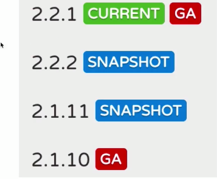
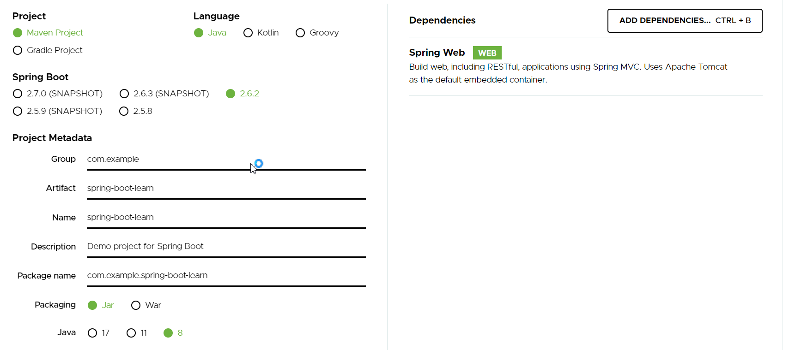
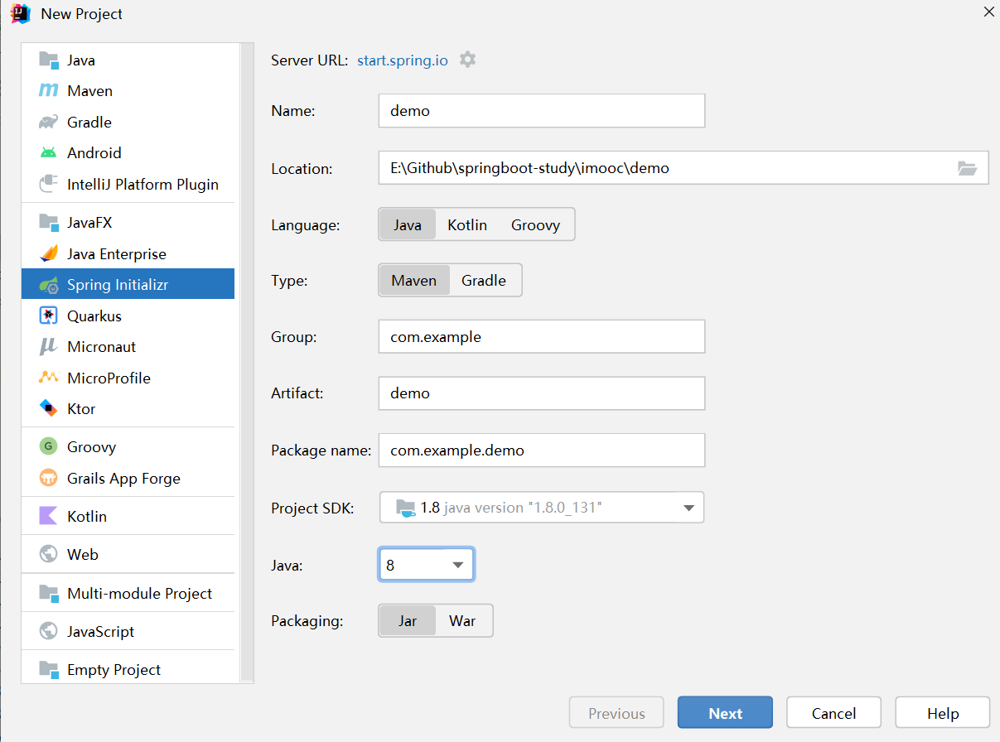
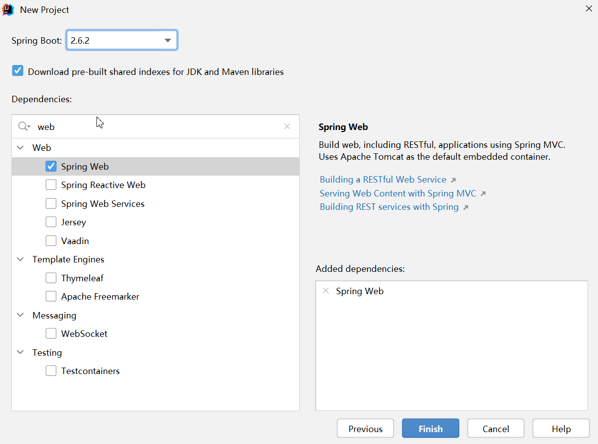
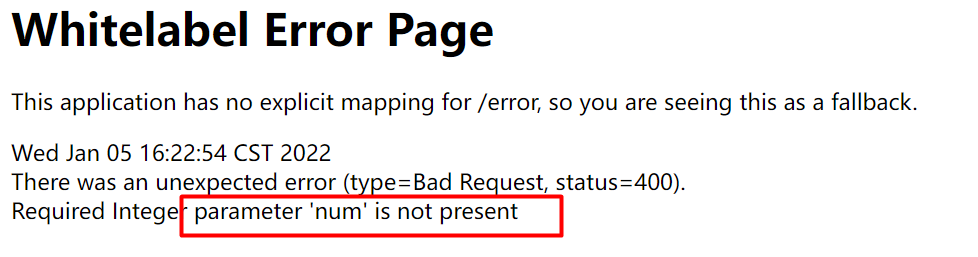
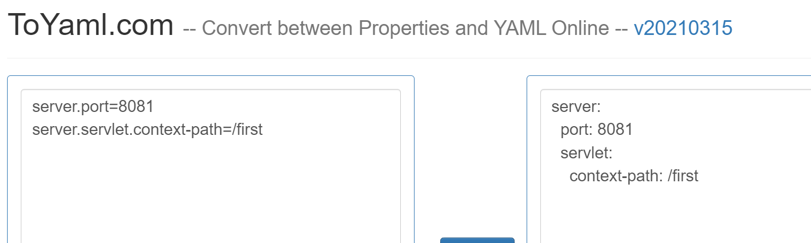

# 介绍

1. Spring Boot概述

2. Spring Boot版本介绍

3. 新建Spring Boot项目演示（官网和IDEA两种方式）

4. 案例开发, 查看与之前开发的区别

---

版本: 

Java 1.8.0_171(大版本一致)

MySQL8.0.12（大版本一致）

Maven 3.3.9（大版本一致）

Spring Boot2.2.1（版本需要严格一致）

# Spring Boot简介

Spring的应用开发流程


spring Boot的开发流程:


## Spring Boot

Spring的缺点: 配置繁琐xml配bean. 配置依赖管理. 项目越来越大, 配置越来越繁琐

Spring Boot:

* 简化初始搭建以及开发过程

* 不再需要定义样板化的配置(大部分一样, 只有少部分不一样的配置, 例如数据库中用户名和密码不同, 其他一致)
* 快速应用开发领域
* 快速支持业务需求, 快速上线

## Spring, Spring MVC和Spring Boot

Spring 最初利用IOC和AOP解耦 -> 按照这种模式搞了MVC框架 -> 写很多样板代码很麻烦, 就有了Spring Boot -> Spring Cloud是在Spring Boot基础上诞生的, 它是一系列框架的集合, 利用Spring Boot开发的便利性, 建立一整套完整的分布式.

Spring Boot建立在Spring的基础之上, 

## Spring Boot特点

* 开箱即用. ssm系统启动就很繁琐, 需要做配置(配置tomcat, 项目打包放到对应的目录下)才能跑起来. Spring Boot中内置

* 约定由于配置. 

## Spring Boot版本

### CURRENT, GA, SNAPSHOT



如何选择版本:

并不是越新越好, 因为其他的组件(MyBatis, Redis等)也需要开发适配spring boot. 选择最稳定的版本

CURRENT: 最新的GA版本

GA(General Availability): 发布版本. 面向大众的可用的稳定版本, 功能完整, 并且稳定, 一旦发布, 代码内容不会更改 -> 选择GA版本

SPANSHOT: 快照, 版本内容可以被修改 -> 不要选择

### Spring Boot2.0

Spring Boot2.0版本更新了什么

* 环境升级:Tomcat8+, java8+, Thymeleaf3, hibernate5.2
* 默认软件优化. 例如: Spring Security, 2.0后检测到其存在后会自动配置, 以前的配置很繁琐
* 新的功能. 例如: 支持http2

# 新建Spring Boot项目

## 使用start.spring.io

[start.spring.io](https://start.spring.io/), 在其中选择



* jar, war: 不同的打包形式. 之前ssm用的是war, 将项目打成war包, 部署到tomcat, 再由tomcat去启动; 这里spring boot中使用jar, 直接使用java来运行, 不需要额外配置tomcat, 因为spring boot中内嵌了tomcat.

* dependencies: 开发web项目, 添加web依赖

选择后选择`Generate`下载后, 在idea中open即可

## idea集成的Spring Initializr

直接在idea中新建





不用从官网上下载, 不用导入

推荐使用idea的spring initializr

## spring boot案例

新建接口, 完成查询功能

### 项目结构解析

* Spring Boot的基础结构共三个文件：入口(SpringBootLearnApplication), 配置文件(application.properties), 测试入口(SpringBootLearnApplicationTests)

* 生成的Application和ApplicationTests类都可以直接运行来启动当前创建的项目


| 目录                              | 说明                |
| --------------------------------- | ------------------- |
| /src/main                         | 项目根目录          |
| /java                             | Java源代码目录      |
| /resources                        | 资源目录            |
| /resources/static                 | 静态资源目录        |
| /resources/templates              | 表示层页面目录      |
| /resources/application.properties | Spring Boot配置文件 |
| /test                             | 测试文件目录        |

### pom文件配置

pom文件修改Springboot版本2.2.1-RELEASE

查看pom文件:

* 规定了spring boot版本

```xml
<!--所有spring都要依赖spring-boot-parent才能进行构建-->
<parent>
    <groupId>org.springframework.boot</groupId>
    <artifactId>spring-boot-starter-parent</artifactId>
    <version>2.2.1.RELEASE</version>
    <relativePath/> <!-- lookup parent from repository -->
</parent>
```

* 项目的名称等信息和java版本

```xml
<groupId>com.example</groupId>
<artifactId>spring-boot-learn</artifactId>
<version>0.0.1-SNAPSHOT</version>
<name>spring-boot-learn</name>
<description>spring-boot-learn</description>
<properties>
    <java.version>1.8</java.version>
</properties>
```

* 依赖

```xml
<dependencies>
    <!--使用一些列starter启动器来描述工程所需要功能-->
    <dependency>
        <groupId>org.springframework.boot</groupId>
        <artifactId>spring-boot-starter-web</artifactId>
    </dependency>

    <dependency>
        <groupId>org.springframework.boot</groupId>
        <artifactId>spring-boot-starter-test</artifactId>
        <scope>test</scope>
    </dependency>
</dependencies>
```

* 插件

```xml
<!--项目构建方式-->
<build>
     <!--以插件的形式来进行构建-->
    <plugins>
        <plugin>
            <groupId>org.springframework.boot</groupId>
            <!--将所有的类和资源打包成一个独立的jar包-->
            <artifactId>spring-boot-maven-plugin</artifactId>
        </plugin>
    </plugins>
</build>
```

# Web项目的三层结构

Controller, Service, DAO

* Controller: 对外暴露接口, 

* Service: 在复杂业务场景下, 对业务逻辑做一层抽象,封装. 保持Controller层的简洁和独立. 抽象出来的Service层可以被多个Controller重复调用, 相当于实现代码复用. 具体的代码写在Service, Controller只写逻辑判断

* DAO: 与数据相关的操作, CRUD

# Controller Demo

## 简单请求

```java
package com.example.springbootlearn;

import org.springframework.web.bind.annotation.GetMapping;
import org.springframework.web.bind.annotation.RestController;

/**
 * 演示传参形式
 */
@RestController
public class ParamController {
    @GetMapping("/firstrequest")
    public String firstRequest() {
        return "firstRequest";
    }
}
```

浏览器访问`http://127.0.0.1:8080/firstrequest`

## 参数接收

@RequestParam. 参数默认, 与函数签名的参数一致

@RequestParam(value = "n"). 参数为n

```java
@GetMapping("/requestparam")
public String requestParam(@RequestParam Integer num) {
    return "requestParam: " + num;
}
```

浏览器访问:`http://127.0.0.1:8080/requestparam?num=1`

## 参数写到url中

使用@PathVariable, 同时注意@GetMapping中的参数

```java
@GetMapping("/pathparam/{num}")
public String pathParam(@PathVariable Integer num) {
    return "param from path: " + num;
}
```

浏览器访问: `http://127.0.0.1:8080/pathparam/1`

## 一个接口多个地址

数组的写法: @GetMapping({"...", "..."})

```java
@GetMapping({"/multiurl1", "/multiurl2"})
public String multiUrl(@RequestParam Integer num) {
    return "param: " + num;
}
```

浏览器访问url: `http://127.0.0.1:8080/stu/multiurl1?num=1` 和 `http://127.0.0.1:8080/stu/multiurl2?num=2`

## 公共前缀

如果要统一前缀, 使用@RequestMapping给每一个接口添加公共前缀

```java
@RequestMapping("/stu")
public class ParamController {}
```

## 参数添加默认值

原本参数不传参会报错



设置传参不是必传

@RequestParam(required = false, defaultValue = "0")

注意这里的defaultValue是String类型

浏览器访问: 

`http://127.0.0.1:8080/required` : 打印默认值0

`http://127.0.0.1:8080/required?num=1`: 打印传入的参数值

# 配置文件简介

application.properties

两种写法: properties和yml

## properties写法

* 配置端口:

```properties
server.port=8081
```
浏览器访问: `http://127.0.0.1:8081/required?num=33`

* 项目的统一前缀

给整个项目建立统一前缀, 这是在庞大项目中必须要用的属性. 两个项目例如电商和教育, 可能有部分功能重叠, 例如用户, 如果不加统一前缀, 可能url会冲突

```properties
server.servlet.context-path=/first
```

浏览器访问: `http://127.0.0.1:8081/first/required?num=33`

## yml写法

yml写法分层级, 冒号后需要有空格

```
* properties:
environments.dev.url=http://imooc.com
environments.dev.name=Developer

* yml：分层级，冒号后需要空格
environments:
	dev:
		url: http://imooc.com
		name: Developer
```

两者可以自由转换, [工具网址](https://toyaml.com/index.html)



推荐使用工具转换 

## 配置自定义属性

### 使用配置文件

自定义属性写在配置文件中, 不在代码中写死.

使用@Value注解

```properties
school.grade=3
school.classnum=6
```

```java
package com.example.springbootlearn;

import org.springframework.beans.factory.annotation.Value;
import org.springframework.web.bind.annotation.GetMapping;
import org.springframework.web.bind.annotation.RestController;

/**
 * 演示读取配置
 */
@RestController
public class PropertiesController {

    @Value("${school.grade}")
    private Integer grade;

    @Value("${school.classnum}")
    private Integer classNum;

    /**
     * 获取年级和班级, 不通过传参, 而是通过配置
     */
    @GetMapping("/gradeclass")
    public String gradeClass() {
        return grade + "-" + classNum;
    }
}
```

---

还是不够方便, 因为在书写@Value注解的时候, ide没有提示, 容易写错

使用对象的方式进行配置

### 使用配置类与配置文件

**注意config类中一定要生成getter, setter方法spring才会注入值**

1. 新建config类

```java
package com.example.springbootlearn;

import lombok.Getter;
import lombok.Setter;
import org.springframework.boot.context.properties.ConfigurationProperties;
import org.springframework.stereotype.Component;
@Getter
@Setter
@Component
@ConfigurationProperties(prefix = "school")
public class SchoolConfig {
    Integer grade;
    Integer classnum;
    Integer test;
}
```

2. Controller中使用

```java
package com.example.springbootlearn;
import org.springframework.web.bind.annotation.GetMapping;
import org.springframework.web.bind.annotation.RestController;
import javax.annotation.Resource;

@RestController
public class SchoolController {

    @Resource
    // @Autowired
    private SchoolConfig schoolConfig;

    @GetMapping("/gradefromconfig")
    public String gradeClass() {
        return schoolConfig.grade + "-" + schoolConfig.classnum + "-" + schoolConfig.test;
    }
}
```

3. 运行


可见在配置文件中的属性输出了

---

如果配置简单, 可以直接使用配置文件, @Value注解.

如果配置类, 在其中定义属性, 同时务必写getter和setter方法 

# Service和DAO的编写

学生信息查询案例


# Ref

* [[明王不动心](https://www.cnblogs.com/yangmingxianshen/)](https://www.cnblogs.com/yangmingxianshen/p/12521628.html)


