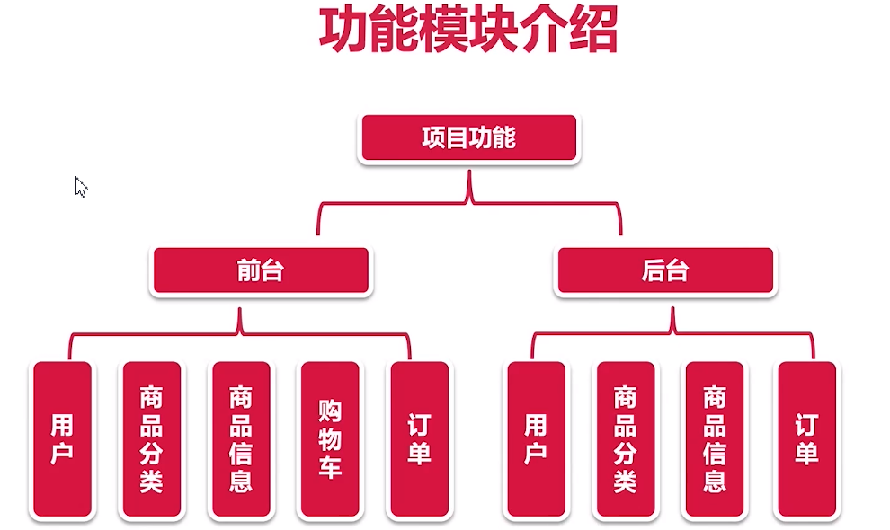

# 介绍

订单, 商品, 用户模块

整个流程

前后端分离. 前端react. 如果前后端一起开发, 例如jsp, 是要在java服务器中一起运行, 无法使用nginx进行性能提升, 因为是同步记载. 使用前后端分离, 异步加载的方式提高效率

---

功能模块:

后台中不需要购物车, 购物车一般在前台处理, 由前台把用户加到购物车的商品汇总到一个订单发送到后台

前台: 

* 用户模块: 注册, 登录, 更新签名, 身份认证(只能修改自己的东西), 登出.

* 商品分类模块: 多级目录, 递归查询,缓存

* 商品模块: 商品搜索, 商品排序, 商品列表, 商品详情, 目录展示

* 购物车模块: 全选全不选, 加入商品, 列表显示, 数量更改, 勾选反选, 删除商品

* 订单模块: 支付二维码, 确认收货, 扫码支付, 订单流程, 取消订单, 订单详情, 个人订单, 下单

后台: 

* 管理员模块: 登录登出, 安全限制, 身份认证

* 商品分类模块: 增加分类, 修改分类, 删除分类, 分类列表

* 商品模块: 批量上下架, 商品列表, 新增商品, 图片上传, 更新删除

* 订单模块: 订单列表, 地址信息, 订单完结, 发货
  

-> 技术专家中的阶段1, 开发单体电商项目. 

此处多了redis应用.

# Ref

Spring Boot电商项目学习

参考:

* [第25~26周  Java主流框架实战-Spring Boot电商项目实战](https://class.imooc.com/java2021#Anchor) -> 2020版本

* [newbee-mall](https://github.com/newbee-ltd/newbee-mall)

* [newbee-plus](https://github.com/newbee-ltd/newbee-mall-plus)

其中newbee-mall中的前后端分离版本

